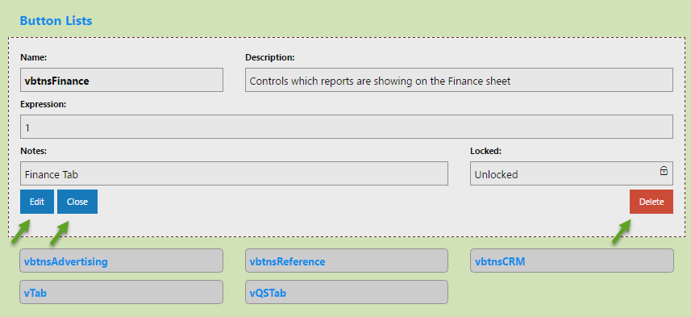
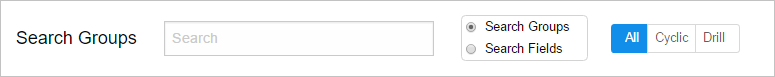
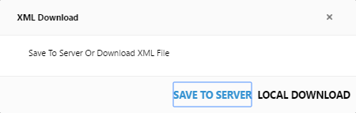
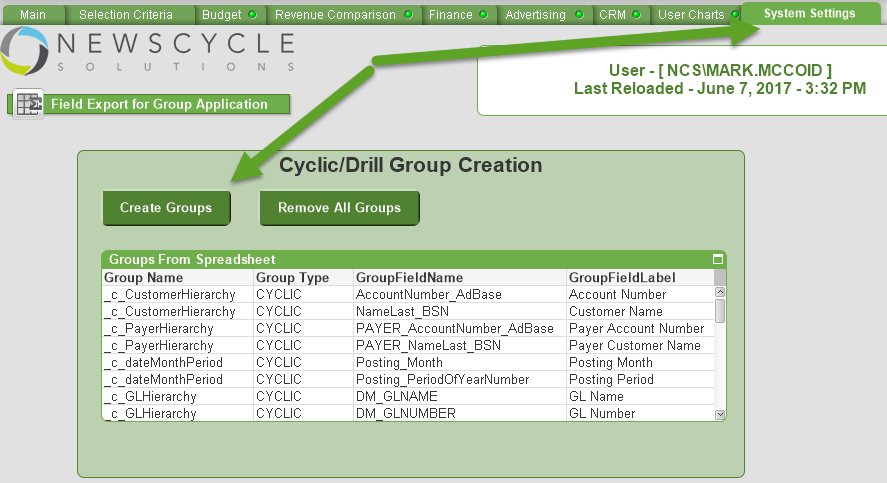
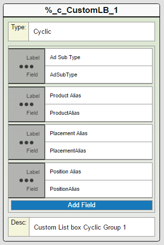

---

[Optional Header]: # "Analytix Administrator's Guide"

- [Introduction](#introduction)
- [Adding Dynamic Date Fields to Charts](#adding-dynamic-date-fields-to-charts)
  - [Dynamic Year and Month/Period Dimensions](#dynamic-year-and-monthperiod-dimensions)
- [Variable Editor](#variable-editor)
  - [Variable Editor Features](#variable-editor-features)
  - [Editing/Creating a Variable](#editingcreating-a-variable)
  - [Exporting to Analytix](#exporting-to-analytix)
    - [Export Variables to XML](#export-variables-to-xml)
    - [Reload Variables into SOURCE… QVW](#reload-variables-into-source-qvw)
  - [GL Buckets](#gl-buckets)
  - [Dynamic Date Selection](#dynamic-date-selection)
  - [Sheet Visibility](#sheet-visibility)
  - [InputBox](#inputbox)
  - [Button Lists](#button-lists)
  - [Formula Modifiers](#formula-modifiers)
- [Group Editor](#group-editor)
  - [Working with the Group Editor](#working-with-the-group-editor)
  - [Editing a Group](#editing-a-group)
  - [Deleting Fields and Groups](#deleting-fields-and-groups)
  - [Adding New Groups](#adding-new-groups)
  - [Searching Groups](#searching-groups)
  - [Exporting Groups](#exporting-groups)
  - [Loading Groups into Analytix Applications](#loading-groups-into-analytix-applications)
  - [Extra List Boxes on Selection Criteria tab using Groups](#extra-list-boxes-on-selection-criteria-tab-using-groups)
- [Creating Reusable Formulas for your Charts](#creating-reusable-formulas-for-your-charts)
  - [Using the Formulas.xls Spreadsheet](#using-the-formulasxls-spreadsheet)
  - [Building Expressions with Formulas and Modifiers](#building-expressions-with-formulas-and-modifiers)
    - [Method 1](#method-1)
    - [Method 2](#method-2)

## Introduction

The Newscycle Solutions Analytix applications have a number of unique properties and conventions that we have used to achieve a dynamic and flexible architecture.

This guide will help the Power User or Administrator of the Analytix system to understand how to work with the Analytix applications to update expressions or add new expressions that use all the power that is contained within.

To best use this guide, the reader should have an understanding of the Qlikview program, as well as an understanding of how to create charts and build expressions in Qlikview.

## Adding Dynamic Date Fields to Charts

SalesFlash.qvw allows you to switch between Fiscal and Calendar years as well as switching between Posting, Insert and Create dates.  When you make these changes, the year and month/period fields change to reflect your selection.

Below explains how to add these fields to charts so that the charts obey the selection of Fiscal/Calendar and Posting/Insert/Create dates.

### Dynamic Year Expression

When you create a chart and you want to do a Year over Year comparison you will need to create an expression for each year you want to compare.

Here is an example expression:

`SUM( {<$(=$(vFiscalOrCalendarYear)) = {$(=$(SelectYear))}>} $(NetRevenue))`

`$(=$(vFiscalOrCalendarYear))` will insert the correct year field based on your selections of Fiscal or Calendar on the Main tab and Insert/Posting/Create on the Selection Criteria tab or in the Quick Select ribbon.

**NOTE:** You can also use Formula Modifiers that are loaded from the Variables.xml file (Create/Edit Variables with the Variable Editor application) to make writing year over year expressions easier.
**Example:** `SUM({<$(mod_CY)>} $(NetRevenue))`

### Dynamic Year and Month/Period Dimensions

To create dimensions that will dynamically change based on you dates selection use the formulas below.

Dynamic Year field ->`$(=$(vFiscalOrCalendarYear)) `

Dynamic Month/Period field -> `$(=$(vFiscalOrCalendarMonthPeriod)) `

Dynamic Month/Period Label -> `='$(vFiscalOrCalendarMonthPeriodLabel)' `

## Variable Editor

Variables allow you to control many functions within Analytix.  We have created many default and system variables.

All variables used in each Analytix can be seen and edited in the Variable Editor.  This allows us (and you) to add variables to use without changing the code, thus making variable creation available to our users while still allowing them to upgrade without losing these variables.

The Variable Editor is in *include\VariableEditor* folder and can be started by double clicking on the ***variable-editor.exe*** file.

Once launched, you will see:

Available Analytix applications are listed in the left-hand menu.  Clicking on one of these items will display that application’s variables.

### Variable Editor Features

1.  Each Variable belongs to a group and they are shown grouped by those groups.  You can filter by a specific group using the drop-down at the top of the screen:

  

2.  Hovering over a variable name will cause a description of that variable to show in a pop up box.

  

3.  Clicking on a variable name will show you full details on that variable and give you the option to ‘Edit’, ‘Delete’ or ‘Close’ the window.

  

4.  Some Variables are “locked”.  These are system variables and should not be changed.

### Editing/Creating a Variable

Whether you are editing an existing variable or are adding a new variable, these are the fields that you will need to have:

1.	**Name** – The actual variable name that will be loaded into the Analytix application.
  2.**Group** – Groups your variable.  You may want to keep User Created Variable in a group like ‘User Created’.
  3.**Description** – This is a short description that will appear in the tool tip when hovering over a variable name.
  4.**Expression** – The expression assigned to the variable when loaded.
  5.**Notes** – Description of what the variable is used for.
  6.**Locked** – Indicates if this field is locked.  Mainly use for system variables.

### Exporting to Analytix

Changing variables in the Variable Editor does not affect the Analytix application directly.  There are two steps that need to happen to have your changes to variables show up in Analytix.

1.	You need to export the application variable XML file.
  2.You need to reload Analytix with the “Reload Variables” switch turned on.

#### Export Variables to XML

Exporting the application variable XML file is done within the variable editor.  Simply click on the “Export” link in the header and then choose the application that you want to export the variable file of.

When you click on the “Create XML for …” link you will be prompted with the following:

Choose “Save to Server”.

This will create or overwrite the application’s XML file in the “\include\spreadsheets” directory.

#### Reload Variables into SOURCE… QVW

You are now ready to proceed with reloading the SOURCE file with the “Reload Variables” switch on.

This example will use **SOURCE_SalesFlash.qvw**, but all the SOURCE files will look and behave the same.

This step must be done on the Analytix server using Qlikview Developer.

1.  Start Qlikview Developer and open the **SOURCE_SalesFlash.qvw** file.  The SOURCE files are usually located in a directory like “C:\Analytix\SOURCE\...”

2.  Once open, you will be on the Main sheet and will see several switches.  “Reload Variables” should be at the top.  Click on it to turn it on:

  

3.  Reload the QVW file by going to the File menu and then choosing Reload.  For large files this could take 30-60 minutes.

4.  When finished, choose File/Save.  Note, the Reload Variable switch WILL be off and that is how we want it.

5.  Choose File/Exit.

### GL Buckets

The GL Buckets that are in the GLMapping.xls spreadsheet will get their names from the variables in the “GL Buckets” group.

To assign a name that you will see in Analytix to your GL Buckets,

1. Open the Variable Editor and choose the **SalesFlash** application.
2. Filter by the “GL Buckets” group list.
   ​
   
3. Next, click on the GL Bucket that you want to name, click on the “Edit” button and **ONLY** change its **Expression** entry to the name you want this bucket to be identified by in Sales Flash.
   ​
   
4. Click “Save”.  Then update any of the other GL Buckets that you are using in the GL Mapping spreadsheet.
5. Lastly don’t forget to export your **SalesFlash** XML file.

### Dynamic Date Selection

There are only two Dynamic Date Selection variables that you could change; these are:

1. **vSC_DateType**– This variable allows you to define the default date type that will be shown on the Selection Criteria page and in the Quick Select ribbon date tabs.  The default is **POSTING**, which will show the posting date list boxes.  Your other options are **INSERT** and **CREATE** which will show the Insert date or Create date respectively.
   ​
   
2. **vFiscalOrCalendarFlag**– Sets the default date year type when the application is started.  The default is Calendar.  Your only other option is Fiscal.  Put a **0 for Calendar** and a **1 for Fiscal**. If you are going to use fiscal, make sure that you have the **AccountingPeriods.xls** spreadsheet filled out.

### Sheet Visibility

Determines whether a sheet will be shown or not.  This gives the site the power to hide our default sheets that come with the application. 1 in the Expression columns will show the sheet; 0 will hide it.

The **vShowAdvancedSheets** variable is unique in that is controls 4 sheets with one variable.  The 4 sheets it controls are:

1. Reference Charts
2. Tables & Fields
3. Formulas
4. Formula Creator

The default is to keep these tabs off.  On the main tab, the user will have the option to turn these on during the session.  I recommend leaving this variable (**vShowAdvancedSheets**) set to 0.

### InputBox

The input box variables will set the default value for any input boxes that are used in the application.  For example, the SalesFlash application has two:

1.	**vinputTopNNN** – this variable is used on the *Advertising sheet -> Winners/Losers* button.  It allows the user to set the initial number of top/bottom performers to show.  The default is 25.
  2.**vinputactiveDays** – this variable is used on the *Advertising sheet -> Inactive customers* button.  It shows the initial number of days without a transaction to be deemed an inactive customer.  The default is 30.

### Button Lists

Many sheets in the Analytix application have buttons down the left side of the screen.  Below you see the button list on the left and notice that this button list is on the Advertising sheet.

We use a variable to keep track of which button on the left is active.

For each Analytix application there is a “Button Lists” variable keeping track of the active button on a given sheet.

The format of the variable is vbtnsSheetName.   The “vbtns” is the prefix and then the “SheetName” will be the name of the sheet that the variable is used on.  In the image above the variable being used is **vbtnsAdvertising**.

If you create your own sheet and want to have a button list, you will need to add a variable to control that sheet’s button list.

For example, let’s say you create a new sheet called “Custom Reports” and you wanted to have your own button list on it.  You would first need to add a variable in the Variable Editor.

Do this by clicking on the “Add New Variable” link in the navigation bar of the Variable Editor.

This is what the final form might look like before you save the variable:

We have chosen the Application that the variable will be created for, put it in the “Button Lists” group and given it the name **vbtnsCustomReports**.

The "Description" gives a bit of text explaining what thevariable is for.

The “Expression” is 1, indicating that the default activebutton will be 1.

 “Notes” are just informational.

Click Save and make sure to Export the XML file and reload the SOURCE QVW so the new variable will be available in your application.

### Formula Modifiers

Formula modifiers are used to help ease the creation of expressions.  They are all prefixed with “mod_”.
The current formula modifiers are:

1.	**mod_CY** – *Current  Year modifier*.  Used when you want an expression to only return data for the current year. Note: Current Year is based upon what the user has selected in the “Select A Year” variable.
  2.**mod_PY**  – *Previous Year modifier*.  Used when you want an expression to only return data for the previous year. Note: Previous Year is based upon what the user has selected in the “Select A Year” variable.
  3.**mod_YTD** & **mod_Prev_YTD** – *Year to Date modifier*.  Used when you want an expression to only return data for dates that fall into the YTD range.

You can use the Formula Modifiers when you are creating expressions.  They are designed to be used within a Set Analysis function.  Here is an example to get revenue for the current year.

`SUM({<$(mod_CY)>} $(NetRevenue)) `

Notice how we have enclosed the formula modifier in the set analysis modifier section.  You can then chain the mod_CY or mod_PY with the mod_YTD or mod_Prev_YTD by separating them with a comma:

`SUM({<$(mod_CY), $(mod_Prev_YTD)>} $(NetRevenue)) `

## Group Editor

Groups can be used in charts to create standard drill down functionality or a cyclic group.  Essentially this gives you the ability to “stack” multiple dimensions in a single column.

The groups are defined using the Group Editor.

The Group Editor is in include\GroupEditor folder

The Group Editor is in *include\GroupEditor* folder and can be started by double clicking on the ***group-editor.exe*** file.

### Working with the Group Editor

Available applications are listed on the left-hand menu.  Clicking on one of these items will display that application’s groups.

Analytix comes with several standard groups already defined, which you may edit to fit your needs.  You may add your own site specific groups to utilize in your own charts.

When you click on an application’s name, you will see the current groups for that application show up in the right-hand pane.

Each of the groups “cards” show you all the information about a group can be edited directly.

The group "card" contains the following columns:

1.	**Group Name** – This is the name that you will use to access the group in Qlikview when building a chart. The naming convention is to prefix cyclic groups with “_c_” and drill down groups with “_d_”.
  2.**Group Fields** – This is the field in the data model that will be part of the group.  Note, there is a Label which is what the user will see and then the actual field from the data model.
  3.**Group Type** – Defines the group type.  Either “Cyclic” or “Drill”.
  4.**Group Description** – Any description that you have about the group

### Editing a Group

To edit the Group Name, Group Type or Group Description simply click on the field.  You will be presented with an editable field.  Enter the new information, and click “Save”.

Once you click save, the change is saved for the group.

To add a new Group Field, simply click on the “Add Field” button and enter a Label and Field to use in the group.

The field order determines in what order the fields will appear in the group in Analytix.  You may rearrange the order of the fields by grabbing the gray handle and dragging and dropping the field in the position you want it in.

### Deleting Fields and Groups

You will notice that when you hover over a field a small “x” is displayed in the left-hand side of that field.  Clicking on this “x” will delete the field.  Note that you will not be prompted, the field will be immediately deleted.

When hovering over a Group card, you will see an “x” in the upper right hand corner of the card.  If you click on this, you will be prompted to confirm the deletion of the group.

### Adding New Groups

To add a new group, click on the “Add New Group” button in the right-hand corner of the application.

This will create an empty Group card.  You can Edit the Name, Type and Description by clicking on those fields and you can add fields by clicking on the Add Field button.

Make sure to change the group name and add at least one field.

The naming convention is to prefix cyclic the group name with “\_c\_” and drill down groups with “\_d\_”.

### Searching Groups

You can use the search bar to search through Groups or Fields and Group Type.

Simply start typing and the groups shown will immediately filter to your search criteria.

### Exporting Groups

Making changes in the Group Editor does not update the groups in your Analytix applications.  Getting the groups to your Analytix Application takes two steps, the first being the export of the group XML file for the given application.

Click on the “Export” option in the Group Editor Navigation bar.  You will see a list of the Analytix Applications:

Next, click on the “Create XML …” button for the application whose groups you have updated.

You will be prompted with the following:

Choose “Save to Server”.

This will create or overwrite the application’s XML file in the “\include\spreadsheets” directory.

### Loading Groups into Analytix Applications

Once you have exported the group XML for the application, you must then load those groups into the Analytix application in question.

This must be done in the Qlikview developer application.

1.  Open the QVW file for the applications whose groups have changed.  This will be the QVW file in the QVW directory.  For example, *\QVW\SalesFlash.qvw*.

2.  Reload the QVW file you opened in step 1.  Choose **“File/Reload”**. This action will load the Group XML file that was exported.

3.  Once the reload is finished, go to the **“System Settings”** tab, click on **“Remove All Groups”** and then **“Create Groups”**.

  

4.  Verify that your groups were added by going to “**Settings/Document Properties…**”, then clicking on the “**Groups**” tab.

  

5.  Navigate to the tab you want users to see when they open this Analytix Application (usually this is the Selection Criteria tab).

6.  Reload the QVW file again.  **“File/Reload”**

7.  Save the QVW file.  **“File/Save”**

### Extra List Boxes on Selection Criteria tab using Groups

If there are some fields not on the Selection Criteria screen that you would like to add, you can use the Group Editor application to add special groups that will be interpreted in the Analytix application as a new list box.

To accomplish this, we created three new list boxes on the "Selection Criteria | Other" tab.

  - LB-SC-Other-CustomLB_1
  - LB-SC-Other-CustomLB_2
  - LB-SC-Other-CustomLB_3

In the above example, the list box labeled “Ad Sub Type” is using the first of these dynamic groups.  The others will only show if a corresponding group has been created in the Group Editor.

The group must be named as follows:
1.	%\_c_CustomLB_1
  2.%\_c_CustomLB_2
  3.%\_c_CustomLB_3

Here is an example definition:

**Note:** You do not need to have any of these defined or you could only have one defined.

## Creating Reusable Formulas for your Charts

### Using the Formulas.xls Spreadsheet

The **formulas.xls** file provide a way for you to create reusable expressions for your chart objects in the Analytix applications.  By defining commonly used expressions as formulas you get the benefit of not only making sure that everyone is using the same expression, but also if you ever need to change the expression definition, you simply update the **formulas.xls** spreadsheet and after the next reload of Analytix all the charts using that formula will be updated.

There are several default formulas that are used within the base Analytix applications.

Note that there is a separate tab for each of the Analytix applications.

The way this works is that each Analytix application will read the formulas.xls file and create variables for each formula that you define.  You can then use those variables as your expressions.

The three columns are:

1.	**FormulaName** – This will become the variable name to be used in your expression.  The default is to preface the name with an underscore (_).  This makes it easier to find in the expression editor.
	.	**Formula** – This is the actual expression that will be used.  Keep in mind that this formula must conform to Qlik expression standards.
	.	**FormulaDescription** – This is the description of the formula.  It is only used to help you and others keep track of what your formulas are being used for.

You may notice some variables used in the construction of the default formulas like `$(mod_CY)`.  Any variable prefaced with **“mod”** has been defined in the **Variable Editor** and is used to modify the expression.  The default items that are included are:

-	**mod_CY** – This is the current year modifier.  If you want your expression to only return transactions that happened in the current year (based on Select A Year variable), use this modifier. For SalesFlash, it will take into account the type of date being used by the user (Insert, Posting or Create)
		**mod_PY** – This is the pervious year modifier. If you want your expression to only return transactions that happened in the previous year (based on Select A Year variable), use this modifier. For SalesFlash, it will take into account the type of date being used by the user (Insert, Posting or Create)
	​	**mod_YTD** – This is the “Year to Date” modifier.  This modifier will make it so that only transactions that fall into the current year to date will show. For SalesFlash, it will take into account the type of date being used by the user (Insert, Posting or Create)
	​	**mod_Prev_YTD** – This is the “Previous Year to Date” modifier.  This modifier will only return transactions that have the Previous YTD flag set to TRUE.  For SalesFlash, it will take into account the type of date being used by the user (Insert, Posting or Create)

### Building Expressions with Formulas and Modifiers

The most common formulas are already built for you in the **Formulas.xls** spreadsheet.  They begin with an underscore (_).

Below are the formulas available in SalesFlash.

| FormulaName        | FormulaDescription                       |
| ------------------ | ---------------------------------------- |
| _NetRevenue        | Net Revenue  with no modifiers - Sums Credits, Debits, Invoices, Debits and Charges |
| _NetRevenue_CY     | Current  Year Net Revenue using SelectYear Variable |
| _NetRevenue_PY     | Previous  Year Net Revenue using SelectYear Variable |
| _NetRevenue_CY_YTD | Current  Year Net Revenue using SelectYear Variable and Checking for YTD |
| _NetRevenue_PY_YTD | Previous  Year Net Revenue using SelectYear Variable and Checking for YTD |
| _Linage            | Linage  with no modifiers                |
| _Linage_CY         | Current  Year Linage using SelectYear Variable |
| _Linage_PY         | Previous  Year Linage using SelectYear Variable |
| _Linage_CY_YTD     | Current  Year Linage using SelectYear Variable and Checking for YTD |
| _Linage_PY_YTD     | Previous  Year Linage using SelectYear Variable and Checking for YTD |

As you can see from the table above we have several formulas defined already, but you can create your own if you like.  You can add them to the **Formulas.xls** spreadsheet on the tab for the application you want the formula to show up in.

Simply add a formula name (preface with an underscore so it is easy to find in the expression editor).  Then add the Formula and Formula description.

Notice how each “\_NetRevenue…” formula builds based on the base formula of “\_NetRevenue”.  If you were ever to change the definition of the “\_NetRevenue” formula, you would need to update each row in the spreadsheet that was based on “\_NetRevenue”.

If you did not want to add an expression to the formulas.xls spreadsheet, but instead just wanted to create it in Analytix, you can still leverage the formulas.

There are two ways to do this.  Each method has its benefits.

#### Method 1

This is the easiest method.  You simply build your own expression.  You can use the formulas as starting points.  To see all the formulas for the application that you are in, go to the main tab and turn on “Show Advanced Sheets”.

This will unhide the “Formulas” sheet.  On it you will see all the formulas.  Simply right click on the “Formula” column that you want to use and copy the cell value.

You can now use this in your expression editor and modify it as you see fit.

If you want to use Set Analysis, simply replace the `{$}` with your preferred Set Analysis.  If you want to use the modifiers defined in the variables spreadsheet, replace the `{$}`with `<$(mod_CY)>` or any other modifier you choose.

Note that the way the modifiers are set up, you can chain them together and add more Set Analysis code.

For example, if you wanted Net Revenue for the current year but only for product X, you could do this:

`SUM({<$(mod_CY), ProductName={'X'}>} AMOUNT) `

#### Method 2

This method is more difficult, but will automatically update if you change the formula it is based on.

This method will only work with the non-modified or Base formulas such as “\_NetRevenue” and “\_Linage”.  These formulas have a special placeholder in their set analysis `{$}`.

You can use this to build your own formula using the modifiers.

The example I'm going to show you is already a formula of its own "\_NetRevenue_CY_YTD", but this will show you how to build formulas if you create new modifiers.

As stated, it is probably easier to simply copy the base formula out of the **formulas.xls** spreadsheet and build the expression without all the stuff below, however if you were to ever update the base formula like "\_NetRevenue", your expressions that were created using Method 1 would not get the new update.

You will be using the Replace function to replace the $ in the base formula and put in the modifiers that are desired.

`$(=Replace('$(_NetRevenue)','$', '<$(mod_CY), $(mod_YTD)>')) `

You can also add your own set analysis in addition to the modifiers:

`$(=Replace('$(_NetRevenue)','$', '<$(mod_CY), $(mod_YTD), ProductName={"Dayton Daily News"}>')) `
