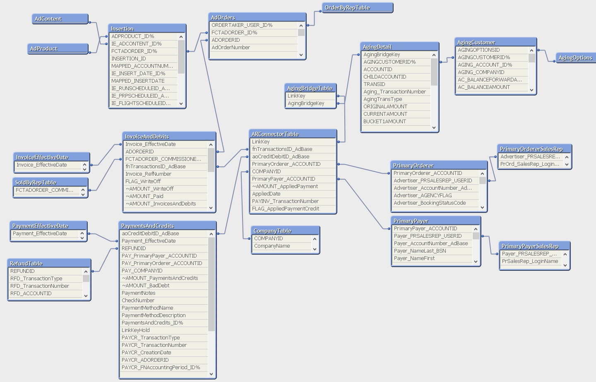

# AR Analytix Developer's Guide

This guide is meant to explain the data model design and implementation of AR Analytix.  There were a number of fields that were "standardized" when designing the data model and these will be explained.

## Field "Normalizations"

There are a couple of fields that are referenced in the Core database using different names in different tables.  In Analytix we have tried to *Normalize* these fields so that they are recognized for what they are meant to describe.  The fields are detailed below.

### Customers

AR Analytix focuses on two types of customers 

- Primary Payers
- Primary Orderers

These customers show up in different fields in the Core tables.  Provided below is a map of the core table/fields to those in AR Analytix.

- FNTRANSACTIONS.AdvertisorAcctID - Primary Orderer
- FNTRANSACTIONS.CustomerAcctID - Primary Payer
- AOCREDITDEBIT.AdvOrPayor - Primary Orderer
- AOCREDITDEBIT.CustomerId - Primary Payer

### Company

Company is another field that is found in a number of different tables in Core.  In AR Analytix, we have chosen to use the **ARConnectorTable**

There is a single company ID in the ARConnectorTable table.  

### How Customers and Company are loaded in the ARConnectorTable

If there is a row in aoPaymentApply then Primary Orderer, Primary Payer and Company come from aoCreditDebit

All other rows in the ARAnalytix **ARConnectorTable** table will come from aoCreditDebit(Payments/Credits) and fnTransactions (Invoices/Debits) that don't have a row in the aoPaymentApply table.

If coming from aoCreditDebit:

- AOCREDITDEBIT.AdvOrPayor - Primary Orderer
- AOCREDITDEBIT.CustomerId - Primary Payer
- AOCREDITDEBIT.CompanyId - CompanyID

If coming from fnTransactions:

- FNTRANSACTIONS.AdvertisorAcctID - Primary Orderer
- FNTRANSACTIONS.CustomerAcctID - Primary Payer
- FNTRANSACTIONS.ProcessCompany - CompanyID

## ARConnectorTable

The *ARConnectorTable* holds ALL Payments/Credits and the Invoices/Debits that they apply to **PLUS ALL** Invoices/Debits and Payments/Credits, whether or not they apply to a payment or have a payment applied to them.

The *ARConnectorTable* has the role of being the table the connects not only the Invoices/Debits to the Payments/Credits, but also connecting these to Company, PrimaryOrder, PrimaryPayer and AgingDetail tables.

## Aging Tables

If a site chooses to load the Aging tables (AgingDetail, AgingCustomer and AgingOptions) from Core, then the **AgingBridgeTable** is needed.  The reason for this is that while the **ARConnectorTable** does hold all Payments/Credits and Invoices/Debits, if a Payment/Credit is applied to an Invoice there will be only one row for the payment and invoice.  In addition the LinkKey (*Company-PayerAccount-Transactionnumber*) Transaction Number portion will be the Invoice number, but in the Aging table you will have a row for the invoice AND a row for the Payment.  There is not linkage of the two in the Aging tables.

We have thus created the **AgingBridgeTable**.  It's function is to create an AgingBrigeKey for every *Company-PayerAccount-TransactionNumber* combination in the Aging tables and then associate these with the appropriate LinkKey.

This means that a payment that has been applied or partially applied to an invoice would have an entry in the **AgingBridgeTable** that would have a LinkKey that linked to the ARConnectorTable.  The associated Invoice, that the payment was applied to, would also have a row in the **AgingBridgeTable**, with the same LinkKey as the Payment.  This allows the Aging charts to find the Payer and Orderer details.

