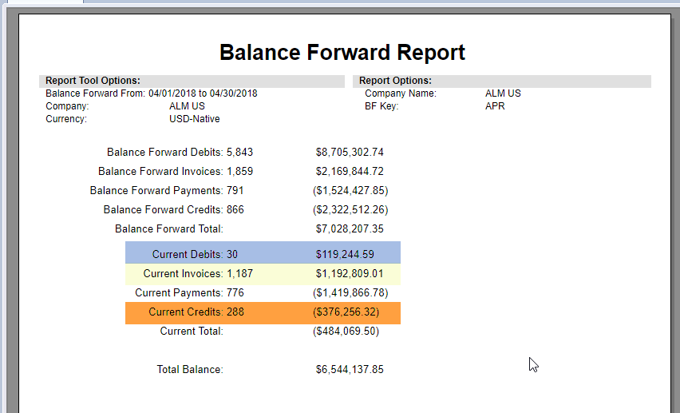
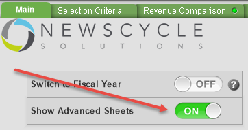
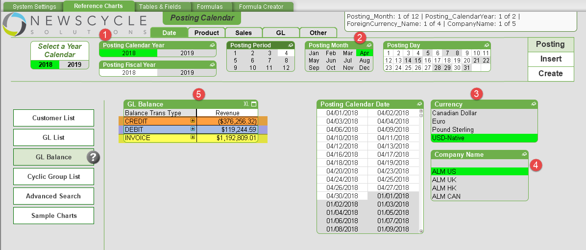

---

[Optional Header]: # "Balancing Analytix to the Core Database"

To balance Analytix to the Core database, we use the Balance Forward Report from Core and compare the Invoice, Debit and Credit amounts to a special report in Analytix.

First run the Balance Forward report from Core.

Next, start the Analytix SalesFlash application.

To access the Balancing chart in Analytix, you must first go to the **Main** tab and turn ON the **Show Advanced Sheets** option:

Then go to the **Reference Charts** tab and click on the **GL Balance** button.

Follow the below steps to make your selection criteria and then review the report.  Note that all the selection criteria should mirror what was selected for the Balance Forward report.

1. Select the Posting Calendar Year 
2. Select the Posting Month
3. Select the currency
4. Select the Company Name(s)
5. View the GL Balance report and compare to the core Balance Forward report.

## What does being in Balance Mean

Being in balance means that the transactions in Analytix for Invoices, Debits and Credits match those in Core.  This is a good thing.  

However, the users running reports in Analytix are still responsible for making sure they are making the correct selections when viewing any Analytix charts.  