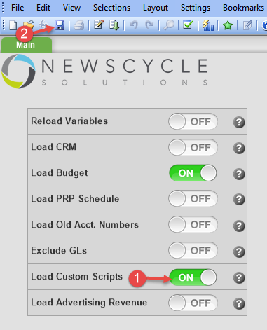
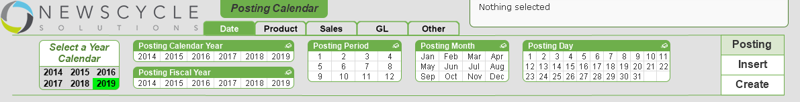
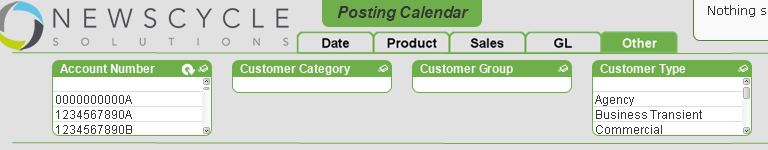

## Customer Goals in SalesFlash - Custom Script

> **Script Location:** ../Include/CustomScripts/SalesFlash
>
> **Script Name:** CustomerGoals.qvs
>
> **Supporting Files:** CustomerGoals.xlsx

This custom script will load Customer goal data from the **CustomerGoals.xlsx** file and add a field called **CUSTGOAL_AMOUNT** to the *RevenueTable*.  

### Usage: 

To use this custom script, you will need to copy the **CustomerGoals.qvs** and **CustomerGoals.xlsx** files into the **"../include/CustomScripts/SalesFlash"** directory.  

Next, open the **CustomerGoals.xlsx** file and update it to reflect your customer goals.  You will need your customers account number, the month/period that the goal is for in the format **YYYYMM** and the amount of the goal for the given month/period.

To activate the loading of customer scripts in Analytix, you will need to open the SOURCE_Salesflash.qvw file and 

1. Set the **"Load Custom Scripts"** switch to *on*.
2. Save the file

### Notes:

Given that we are loading this information using the Customer Account Number and a Date, if any search criteria other than Customer and Date information is added, you will no longer see the Customer Goal Amount data.

This means that you can narrow your filter by any information in the Primary Orderer table or Date tables.

This means that you can change criteria in any of the Date list boxes:

Or any of the list boxes for the Primary Orderer:

