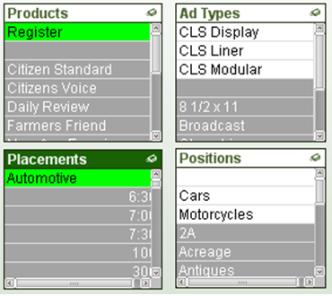
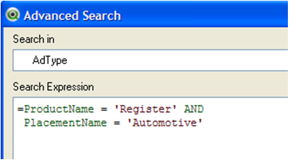
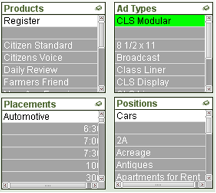

## Introduction

The **Advanced Search** functionality of Qlikview is very powerful, but can be confusing also.  

There are two ways to "run" an Advanced Search.  The easiest is to start your typical search with an equal sign.

> If you start your text search with an equal sign = , you may enter an advanced search expression involving search criteria for associated fields and full boolean logic. After the equal sign you may type any valid QlikView layout expression. The expression will be evaluated for each filed value in the search field. All values for which the search expression returns a non-zero value will be selected.

The other, is to right click on a list box and choose the **Advanced Search** option

> The Advanced Search dialog provides a convenient way of formulating complex search queries to be applied on QlikView fields. Unlike the standard search box that appears when starting a search by typing when a list box is active, the result of the search is not interactively visible in the layout until submitting the search by pressing the Go button. The dialog can be kept open while working in the QlikView layout. The dialog is fully sizeable in order to facilitate editing of large and complex expressions.

## Common Misunderstanding

Below is an example that points out a common confusion point with the Advanced Search functionality.

**Example:**

I want all Ad Types that are available with 

**Product** = *'Register'* and **Placement** = *'Automotive'*.

If I explicitly select Product and Placement with the above values, three Ad Types are left available in the Ad Type list box.

If I use Advanced Search on the AdType field using 

**ProductName** = *'Register'* AND **PlacementName** = *'Automotive'*

Only ONE Ad Type is selected.

 

Why is the Advanced Search result different?  Because with the Advanced Search you are asking a slightly different question.

By clicking on Product and Placement we are saying give me all transactions that have a Product of Register and a Placement of Automotive.   This leaves all transactions with the selected Product and Placement available in our data set.  The Ad Type list box then displays the Ad Types that are attached to those available transactions.

By using the Advanced search on Ad Type using the Product and Placement fields, we are saying give me only Ad Types whose transactions only have a Product of Register and Placement of Automotive.  This is a very fine and restrictive search for if an Ad Type has one transaction that is Product Register and Placement Automotive and another with a Product of Daily, then that Ad Type cannot be returned in this Advance search. 