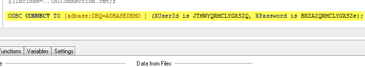
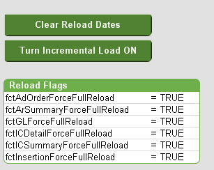
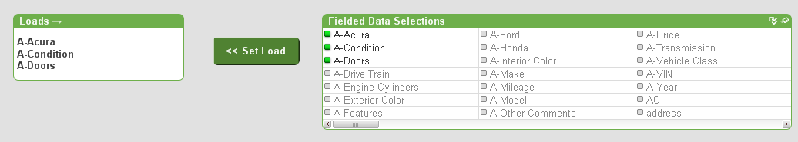
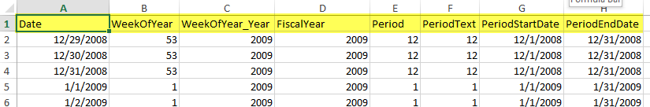
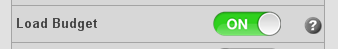
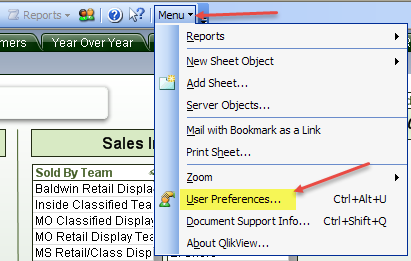

---


[Optional Header]: # "Analytix Setup"

- [Setting up DB Connection Files](#setting-up-db-connection-files)
  - [Creating DB Connection Files](#creating-db-connection-files)
  - [Encrypting BIConnection and CoreConnection ODBC Strings](#encrypting-biconnection-and-coreconnection-odbc-strings)
- [QVD Maintenance using the QVD_ALL.qvw file](#qvd-maintenance-using-the-qvdallqvw-file)
  - [QVD Incremental Load Maintenance](#qvd-incremental-load-maintenance)
  	- [Setting up for Incremental Loads](#setting-up-for-incremental-loads)
  	- [Out of Sync QVDs](#out-of-sync-qvds)
  	- [The EASY Way to “Resync” your QVDs](#the-easy-way-to-resync-your-qvds)
  - [dmDate Tab Settings](#dmdate-tab-settings)
  - [CombinedRevenue Tab Settings](#combinedrevenue-tab-settings)
  - [Fielded Data](#fielded-data)
  - [Client Relationships](#client-relationships)
- [Spreadsheets](#spreadsheets)
- [Variable Editor](#variable-editor)
- [Group Editor](#group-editor)
- [SOURCE Files](#source-files)
  - [SOURCE File Switches](#source-file-switches)
  - [Custom Scripts](#custom-scripts)
- [Change User Export Preferences in Analytix](#change-user-export-preferences-in-analytix)


<div style="page-break-after: always;"></div>

## Setting up DB Connection Files

---

 To let Analytix know which BI and CORE databases to pull its data from, you need to set up the **BIConnection.txt** and **COREConnection.txt** files which are located in the Analytix root directory.

### Creating DB Connection Files

There are template text files for each kind of connection.

The files consist of the following:

```
ODBC CONNECT TO [BIodbc_name] (UserId is theUsername, Password is thePassword);
SET DatabaseVendor = "ORACLE";
//SET DatabaseVendor = “SQLSERVER";
```


If your database is using NT Authentication you can justhave:

` ODBCCONNECT TO [**BIodbc_name**];`

You will also need to make sure the correct **DatabaseVendor** variable is set.  In the sample BIConnection.txt and
COREConnection.txt files, the **DatabaseVendor** variable is set to ORACLE and the other line is commented out using “//”.

If you’re database is housed on an Oracle server, you should leave only this line:

`SET DatabaseVendor = "ORACLE";`

If you’re database is housed on a SQL Server database, then you should only have this line:

`SET DatabaseVendor = "SQLSERVER";`

### Encrypting BIConnection and CoreConnection ODBC Strings

The BIConnection.txt and COREConnection.txt files contain an ODBC connection string.  You can easily update these files to point to any of your ODBC strings just by entering the DSN Name and then the username and password:

 `ODBC CONNECT TO [BIodbc_name] (UserId is theUsername, Password is thePassword);`

However, if you do not want the username and password exposed in this text file you can create an encrypted, or as Qlikview calls it “Scrambled”, Connect User Credentials.

Here is what you need to do:

First you must check a setting in User Preferences (Settings/User Preferences...) that turns the scramble function on and off.  The default is to scramble, but please do a quick look and make sure this option is checked.


Go to *General* tab and make sure there is a check mark in the “**Scramble Connect User Credentials**”

Now to scramble the Username and Password you will need to do the following in the Qlikview Developer application:

1. Create a new empty document.

2. Then choose File/Edit Script

3. Go to the end of the script and click on the "Connect..." button:
   ​
   

4. Choose your ODBC Connection, put in the username and password, click OK.

5. It will then put an encrypted ODBC Connection statement in the script.

   

6. You can just copy this connection string and paste it into your **BIConnection.txt** file.

7. Repeat the above steps for the Core Connection ODBC Connection information.

<div style="page-break-after: always;"></div>

## Manual Loading of Analytix

---

Usually Analytix will be set to load on a schedule through Qlikview Server.  However, there are times when you may want to load Analytix manually.

There is a hierarchy in the loading of Analytix files.  

First the **QVD_ALL.qvw** must be loaded.  It will create the needed *QVD* files for the rest of the load.

Next, you will load the files in the  `SOURCE` directory.  You may load them all or if you are just needing a single QVW file loaded, then just load that file.  

Note that each of the QVW files in the `SOURCE` directory will be paired with a corresponding file from the `QVW` directory.

- SOURCE_SalesFlash.qvw &#129106; SalesFlash.qvw
- SOURCE_AdvertisingAnalytix.qvw &#129106; AdvertisingAnalytix.qvw
- SOURCE_ARAnalytix.qvw &#129106; ARAnalytix.qvw
- SOURCE_Contract.qvw &#129106; Contracts.qvw

Once the SOURCE file(s)  are loaded, you may load the corresponding files in the `QVW` directory.

### Loading a QVW file with Qlikview

To actually run the load script for a QVW file, you will need to have Qlikview Developer installed and licensed.  If you have not purchased a dedicated Qlikview Developer license, you may "lease" a license from your installed Qlikview server.  See [Licensing Qlikview Developer Client](../support/qlikview-license-management.html#licensing-qlikview-developer-client)

Once Qlikview Developer is licensed, you may proceed with the load process.

To load a QVW file:

1. Start the Qlikview Developer application
2. Click on **File/Open**(Ctrl/O) and choose the QVW file that you want to load/reload
3. Once the file has opened, click on **File/Reload** (Ctrl/R)
4. Once the file has finished reloading, click **File/Save** (Ctrl/S)

You will perform the above steps for each file that you want to reload.  For example, if you wanted to reload the SalesFlash.qvw with current data you would reload the following files:

1. QVD\QVD_All.qvw
2. SOURCE\SOURCE_Salesflash.qvw
3. QVW\Salesflash.qvw

<div style="page-break-after: always;"></div>

## QVD Maintenance using the QVD_ALL.qvw file

---

The QVD_ALL.qvw file is located in the QVD directory and it is the Analytix application responsible for loading all the QVD files needed by Analytix.

QVD stands for Qlikview Data and can be thought of as a proprietary data store for the Analytix applications.

There are a number of large tables that are needed in each of the Analytix applications and would normally require each application to read that table from the database, but instead of hitting the database multiple times we hit it once and load the appropriate QVD.  Then the Analytix applications access the QVD to get the data from that table.

The main benefit is speed. The QVD file can be read by Qlikview 10X faster than reading the database.

 ### QVD Settings - Main Page

For the most part, the QVD_ALL.qvw file will work fine with the defaults, but there are a few setting that you will want to verify work for your site.

On the main page there are a number of settings:

1. **Rolling Periods** – This setting will tell Analytix how much data you want to load.  The default is 48 rolling periods.

   

   **NOTE:** If you set the number of rolling periods to a number that would extend to dates that don’t exist in your dmDate table, errors will be caused and QVDs will not be build.

2. **Select QVDs to Build & AdBase Version** – The defaults for both of these items should work fine for most sites.  If however, you only want to load certain QVDs for whatever reason or change the AdBase version, you can do this here.
   Simply choose the QVDs that you want to build and the AdBase version that you want to use and click on the “Set Load>>” button.  This will move the selected items into the boxes on the right.  If you are doing this in your production QVD_ALL.qvw, you must remember to reset the values so that everything loads properly when the full load happens.

   

3. **Incremental Load **– If you are running AdBase v3.0 or greater, Analytix can be set to populate the QVD files incrementally.  See below for details on using this feature.

### QVD Incremental Load Maintenance

If you are running AdBase v3.0 or greater, Analytix can beset to populate the QVD files incrementally.

QVDs are usually reloaded fully every time Analytix is refreshed.  For some QVD files this can mean reading millions of rows over again when only a few thousand may have changed.

The incremental load tackles this problem by reading a new field that was added to the fact tables in BI. This field is **LastPopulateDate** and it lets Analytix know when a row was either added or updated.  We then use this information in Analytix to only load new rows into the existing QVD file as well as update those rows that were updated and remove rows from the QVD that were deleted from the database.

**NOTE:** Incremental loads will only save you time if your QVD_ALL is taking between 45 minutes to an hour to run.

The following Analytix QVD files are able to use the incremental load feature.

- fctAdOrder.qvd
- fctInsertion.qvd
- fctInsertChargeSummary.qvd
- fctInsertChargeDetail.qvd
- fctARSummary.qvd
- fctGL.qvd

Each of these files has two parameters that will allow you to control when an incremental load happens.

The default is that the incremental load is turned off.

#### Setting up for Incremental Loads

To change the default settings of fully reloaded QVDs to Incremental you will go to the Main tab in the QVD_ALL.qvw application.



To set your QVDs to load incrementally, simply click on the“Turn Incremental Load ON” button.  This will set the reload flags to FALSE which indicates to the application to reload incrementally.

Be aware that setting these flags to FALSE does not guarantee that your files will be incrementally loaded.  There are a couple of things that will affect this.

1. If the QVD file itself does not exist in the QVD directory, then that file will be reloaded fully not incrementally.
2. If the Reload Date for the QVD does not exist on its tab in QVD_ALL, then that file will be reloaded fully not incrementally.

#### Out of Sync QVDs

If you ever feel that your QVDs are out of sync or if have made any changes to the BI tables that might cause problems with the increment load and want to get a fresh, full reload click on the “Clear Reload Dates”button.  On the next reload of the QVD files,this will force them all to be fully reloaded. After this full reload your QVDs will automatically revert back to being loaded incrementally.

 

Now when the load runs, it will do a full rebuild of that QVD.

#### The EASY Way to “Resync” your QVDs

If you feel that all QVDs need to be rebuilt.  The easiest way to make that happen is to delete all the QVD files in the QVD directory that have the extension .QVD.

DO NOT Delete all the files, JUST the ones ENDING in .QVD.


This will force a full rebuild also.

### dmDate Tab Settings

The only option on the dmDate tab is “Use Account Periods”.


This option will use the *AccountingPeriods.xls* file in the *\Include\Spreadsheets* folder.  If you have a fiscal year or accounting periods that do not follow the calendar year, then you will need to keep this option on and update the *AccountingPeriods.xls*.

If you do not use fiscal or accounting periods, you should still leave this option on, as the default information in the *AccountingPeriods.xls* spreadsheet has periods that match the months.

### CombinedRevenue Tab Settings

The **“GL Rep from AdOrder”** setting will override the rep that is in the **fctARSummary** table with the rep on the **fctAdOrder** table.  This can be useful if you are using rep setter to change the reps on orders that have already been invoiced and locked down.

The default is OFF.


### Fielded Data

The fielded data tab allows you to choose which fielded data items you want to load into Analytix.  Currently **SalesFlash** will be the only application that this fielded data will be loaded into.

By default no fielded data will be loaded.

To set fielded data up to load, go to the Fielded Data tab and turn the “Load Fielded Data” On:


This will display a list of all your available fielded data fields.  Simply click on the fields you want included and then click on “<< Set Load” to mark these fields to be loaded.




**NOTE:** Only load the fielded data that you need.  The more you choose to load the slower it will make your reloads.

### Client Relationships

There are a few options when loading the client relationships.  By default “Parent as Child” and “Non Parent as Child” are on.  Very rarely will you want to use “Grandparent as Child”.


**Parent as Child** - This setting allows you to include the parent/agency as a child of himself.
In Analytix this will cause the parent/agency's sales to be included in totals when grouping or filtering by parents/agencies. Also, the Relationship_Type is coded as 'PSEUDO PARENT/CHILD'

**Non Parent as Parent** - Creates a Parent/child relationship for every client that isn't already in a P/C Relationship.  The P/C relationship created is with himself.
Example: Cust1 is not a Parent OR a Child (i.e. is not in any relationship in AdBase).
If this switch is set to ON, then ALL customers meeting this criteria (not being in a relationship) will have a relationship created with Cust1 as Parent and Cust1 as Child.
Also, the Relationship_Type is coded as 'PSEUDO PARENT/CHILD'

**Grandparent as Child** - Creates a Grandparent/Parent/child relationship with the grandparent as the parent and child also.  The G/P/C relationship created is with himself.
Thought is, if the Grandparent has transactions, they will not be seen in a report unless he is a parent/child of himself because we link the orders to the child records.

<div style="page-break-after: always;"></div>

## Spreadsheets

---

There are several spreadsheets that you can update to enhance the Analytix applications.  There are a few rules to follow when updating these spreadsheets to meet your needs.

1.  **Do not change** the labels/headers.  This is the first row in the spreadsheet.

    


2.  **Do not change** the worksheet name.

    


3.	**Do not change** the file format.  If it is XLS, leave it as XLS, if it is XLSX, then leave it as XLSX.

If any of the above rules are not followed, then Analytix will not load.

Below are the spreadsheets and how they are used.  Not all spreadsheets need to be modified as they come with default values.

1. **AccountingPeriods.xls** – This spreadsheet allows you to setup your fiscal year and periods to be exactly as you want.  It maps every day of year with the following:

   - **WeekOfYear** – The week of the year
   - **WeekOfYear_Year** – This is the year associated with the week of year.  This is because sometimes the week of year will run into the following calendar year in some fiscal calendars.  Not used much as FiscalYear will perform the same function.
   - **FiscalYear** – The Fiscal Year.
   - **Period** – The numeric period.
   - **PeriodText** – A textual representation of the Period.  In most sites, this is the same as the Period.
   - **PeriodStartDate** – Start date of the period.
   - **PeriodEndDate** – End date of the period.

   The default spreadsheet maps the fiscal year and periods to the calendar months and years.  You can turn off the loading of this spreadsheet in the QVD_ALL.qvw application on the dmDate tab.  The default is on.
   If you have specific fiscal periods, please edit this spreadsheet to match your fiscal periods

2. **Holidays.xls** – This spreadsheet maps a calendar date to a Holiday.  It is prefilled with the common holidays from 2000-2020.  You may edit it and add any additional holidays that you would like.

   

3. **GLMapping.xls** - This spreadsheet is specific to the SalesFlash application.  It is very important and should be updated before you go live.
   ​
   It allows you to map your GL Numbers to up to 6 groupings.  For example, you may have certain GLs that are a Print product and others that are Digital or Preprint.  You can use a grouping to map all those GLs to a new field in SalesFlash.

   

   The spreadsheet has a column called GLACCOUNTNUMBER, this is the column where you will put all of your GL Numbers.  Then you will see columns named GL_BUCKET_1 through GL_BUCKET_6.  These are your "GL Breakouts" or "GL Groupings".
   ​
   Do not change the header labels here.  You will update the names of these groupings in the **VariableEditor**.
   You do not need to use all six groupings.  Just fill in the groupings that you need.

4. **SalesFlashBudget.xls** – If you want to load budget information into SalesFlash, you will add it to this spreadsheet.  You will be able to track budget by GL Number and Period/Month.  You also have the option to put a forecast amount in the spreadsheet, however this is optional.
   ​
   The loading of this spreadsheet is controlled in the SOURCE_SalesFlash.qvw file.  There is a switch that lets you turn on and off the loading of this spreadsheet.

   

   ​

5. **SystemSheets.xls** - Currently this houses one tab, the **GLExcludeList** worksheet.  Enter any GL Number in this sheet if you DO NOT want to see that GL or any revenue associated with it in SalesFlash.  Site will use this to keep converted balances from getting loaded into SalesFlash.
   ​
   **NOTE:** You will need to turn this feature on in SOURCE_SalesFlash.qvw:

   

6. **Formulas.xls** – This spreadsheet is where we store the common expressions for the Analytix charts.  Using and expanding formulas is covered in the **Analytix Administrators Guide**.

7. **AdvancedSearchHelp.xls** – This spreadsheet contains Advanced Search expressions to help users make advanced selections without having to know the complex syntax of Set Analysis.  The items in this spreadsheet are displayed on the “Reference Charts” sheet -> “Advanced Search” button.

<div style="page-break-after: always;"></div>

## Setting up Security (Optional)

Analytix is already secure by using Active Directory login information so that only licensed users are able to access the Analytix Applications.

However, you may want to limit those users who do have access to Analytix to only see certain data within each application.

Before starting down this path, be sure to read the [Qlikview Docs on Section Access](../assets/downloads/qlikviewdocs/qlikview_introduction_to_section_access.pdf) docs before starting to make changes.

**Section Access** is implemented in Analytix such that that each application has a folder that holds the section access script and any needed data in the `./Include/SecurityScripts` directory.

There is a folder for each Analytix application in this directory.  Inside each folder you will find a script (*SalesFlashSecurity.qvs, ARAnalytixSecurity.qvs, etc.*) that you will edit to include your Section Access code.


Upon installation of Analytix, there is only commented out starter code in these security QVS files.  As soon as there is code in these files, they will be injected into the main QVW files.

## Variable Editor

---

This application will allow you to view and edit all variables that are used by Analytix.  You will also be able to add new variables if the need arises.

See the [Analytix Admin Guide](analytix-admin-guide.html#variable-editor) for usage details, but do note that if you add or modify a variable or variable value, you will need to use the Variable Editor to make the change.  Once the change has been made and you have exported the XML file, you will need to manually reload the source file with the “Reload Variables switch” turned on.

<div style="page-break-after: always;"></div>

## Group Editor

---

The Group Editor will allow you to view and edit all Cyclic and Drill Down groups in Analytix.  See the [Analytix Admin Guide](analytix-admin-guide.html#group-editor) for usage details.

You will be able to Edit, Add and Remove groups from Analytix.

Just like the Variable Editor, any changes to Groups within Analytix must be done using the Group Editor. Once the change has been made and you have exported the XML file, you will need to manually reload the source file and following the instructions in the [Group Editor documentation](analytix-admin-guide.html#group-editor) to get the updates into Analytix.

<div style="page-break-after: always;"></div>

## SOURCE Files

---

All Analytix application have a corresponding Source file in the SOURCE directory.  The source file contains the main scripting for the application.  It also has a number of switches that you can use to control what gets loaded into the final application.

You should not change any code in these files, but there are two ways for you to affect the load:

1.	**Switches** – There are a number of switches that will turn on and off features.
	.	**Custom Scripts** – You may write your own custom scripts and the source file will load these for you.

### SOURCE File Switches

The following switches are available in the SOURCE_SalesFlash.qvw file.

1.	**Reload Variables** - Load initial variable values from Variables spreadsheet (variables.xls).  The variables spreadsheet contains the on/off values for these switches, so if you turn “Reload Variables” on it may reset some of the other switches.  If that is the case, you should change them in the variables.xls file, but you also may simply reset your switches from the interface and save the QVW file.
	.	**Load CRM** - If this is turned to ON, the CRM process will load the following:
  - Opportunity table
  - User Goals as defined in Ad Sales
  - Customer Goals as defined in Ad Sales
  - Tasks and Meetings
			**Load Budget** - If this is turned to ON, the Budget spreadsheet will be loaded and the Budget tab will show in SalesFlash.qvw
		​	**Load PRP Schedule** - Loads information from the Core table aoPRPSchedule.  Currently just PRP Invoice Text.  Links to RevenueTable on the PRPScheduleID_AdBase
		​	**Load Old Acct. Numbers** - If this is turned to ON, Analytix will load any "OLD" account numbers that you imported into CORE from your old system.
		​	**Exclude GLs** - If turned on, this will exclude any GLs that are located in the GLExcludeList worksheet in the SystemSheet.xls file.  All revenue data associated with these GLs will also be excluded.
		​	**Load Custom Scripts** - If turned on, any *.qvs files located in the
  “..\Include\CustomScripts\SalesFlash\“ directory will be loaded.

---

### Custom Scripts

If there is a reason that you need to inject some scripting into the SOURCE files, you may do this by creating a file with the extension of *.qvs in the “..\Include\CustomScripts\SalesFlash” directory, with the scripting inside of it.
If the Load Custom Scripts switch is on, SOURCE_SalesFlash.qvw will load all files (in alphanumeric order) into the QVW.

There is a separate directory under the *CustomScripts* directory for each application.

**NOTE:** Make sure you test your script before putting into production.

<div style="page-break-after: always;"></div>

## Change User Export Preferences in Analytix

---

When exporting to Excel it is important to also have your selection criteria exported in the Excel file.  Enabling this feature is different depending on which browsers your users are using.

### Using the IE Plugin

If your end users are using Internet Explorer with the Qlikview IE Plugin, you can setup your exports to include a *selection stamp*.  

1. Open Analytix in a browser and drop down the Menu Toolbar and select User Preferences.

   

2. The User Preferences dialog box will display.  Click on the Export tab and the make sure there is a check mark in the “On BIFF Exports” checkbox.  This checkbox is located in the lower right corner of the dialog.

   

3. Click OK.

### Using Ajax (Other Browser)

Whereas the IE plugin requires the user to enable this feature, when using a browser in the Ajax mode, you must enable this feature on the server.

This means that all users will get *selection stamps* in their exports.

You must first be on the Qlikview server running the service "Qlikview Server".

1. Stop the service "Qlikview Server"s
2. Open the **settings.ini** file located in `C:/ProgramData/QlikTech/QlikViewServer`
3. Add the parameter `SelectionStampInBIFFExport=1` in the section labeled **[Settings 7]**
4. Save the File
5. Restart the service "Qlikview Server"