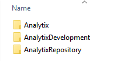
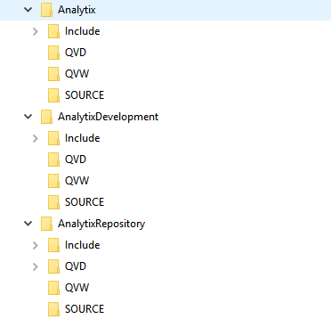

## Overview

Source control for Analytix is optional.  If it is to be used you will need to do some initial setup.

> If you do use Source Control, then you **MUST** use it for all changes.  If you do not, then your repository and production folders will get out of sync.

Source control is useful if one or more developers will be making changes to the QVW files making up Analytix.  With multiple developers, it will keep them from overwriting each others changes.

The source control procedures will entail checking out files for development work and then checking them back in when development for a particular chart or source code change is finished.

This process will be facilitated through the use of the Analytix_SourceControl.QVW application.  

This application is located in the following directory `AnalytixRepository/Include/SystemQVW`

In brief, the procedure will include the following steps:

1.	Check out a file to make changes to. 
2.	Make the needed changes to the QVW file. 
3.	Check the file back into the repository.
4.	Let any users who you want to test the change know that it is available for testing.
5.	After approved, release the file to production.

Keep in mind that Newscycle Solutions only recommends making changes to the files located in the QVW directory and in that case only updating the interface and not the scripting.

## Initial Setup

Make sure you have the latest version of the Analytix Source Control application by downloading it and copying it to the `Include/SystemQVW` directory only in the **AnalytixRepository** directory.

[Download AnalytixSourceControl.zip](../assets/downloads/AnalytixSourceControl.zip)

There are three directories required to use the Source Control application.  

- Analytix
- AnalytixDevelopment
- AnalytixRepository

Your production Analytix is most likely located in a directory called Analytix.  You will need to create the other two directories at the same level as the production directory.

Next, copy the contents of the Analytix directory to the **AnalytixDevelopment** and the **AnalytixRepository** directories.

Your structure will now look like this:

The next step will be to go into the **AnalytixRepository** directory and open every QVW file in the *QVW*  and *SOURCE* directories and [remove all the data](../support/qlikview-reduce-data.html) in each of these files.  The repository must not have data in the QVW files because every time you check a file out, source control makes a copy of the file to keep for history.

>  **Important Step** - you must create an ***Archive***  and ***Docs*** directory  in the QVD, QVW and SOURCE directories that are in the **AnalytixRepository** directory.  If these directories don't exist, the source control application will not work.

I also recommend deleting the **Analytix_SourceControl.QVW** file that is in the Analytix and AnalytixDevelopment directories.  

## Step 1 - Checking a File Out

The first step in checking out a file is to open the Analytix_SourceControl.QVW application.  

> Only use the Analytix_SourceControl.qvw application that is in the AnalytixRepository directory
>
> `AnalytixRepository/Include/SystemQVW`

Once open, navigate to the Check OUT tab.

You can only select ONE file for checkout at a time.

Select the file you want by clicking on the filename, which will select it.  Then click on the "**Check Out**" button.

The source control application will then do the following:
1.	Copies the currently selected file to the Archive directory.  There is an Archive directory in each of the repository sub directory: QVD\Archive, QVW\Archive, SOURCE\Archive.
2.	Copies the currently selected file to the corresponding Development sub directory i.e. AnalytixDevelopment\QVD, AnalytixDevelopment\QVW, AnalytixDevelopment\SOURCE.
3.	Renames the Analytix file in the Repository directory, appending the user’s login name and a .OUT extension.  This is so that the source control application knows what files are checked out.
4.	Performs a reload of the source control application so the available files list is updated.

After the “Check Out” button has been pressed, an empty copy (from the repository) of the file needed for development will be sitting in the corresponding directory in the Development directory ready to be edited.

## Step 2 - Development

Once checked out, you may open the file from the Development directory and make changes to the Analytix application.

Remember that the final state you leave the Analytix application in when you save is what the end user will see when opening the file.  So remember the following:

1. Remember that the expanded and/or collapsed state of a chart is how the end user will see it.  Also, the way you have collapsed a chart is how the end user will see it expand.  For example if you collapse one dimension at a time, the end user will have to expand one dimension at a time.
2. Always **Clear** your selections before saving.  Make sure you also have cleared any locked selections.
3. Unless otherwise determined by your site, all application should start on the **Selection Criteria** tab.
4. **IMPORTANT!!** - [Reduce the data](../support/qlikview-reduce-data.html) (File/Reduce Data/Remove All Values).  This will remove all data and put the file in a state to check back in.

## Step 3 - Check a File In

Once the changes have been made to a file, you will want to check it back into the repository.  Again, remember to remove all data from the QVW file before checking it in.

Open the Analytix_SourceControl.QVW application and navigate to the Check IN tab.

> Be sure that the file in the Development directory has been reduced (data removed).

You will now select ONE file for check in. 

Then click on the “Check IN” button.  You will be asked to leave a comment on the change.  Note that you cannot use the return character in your comments.  If you do, anything after the first return will not be saved in the comments.

The source control application will then do the following:

1.	Saves comments to a file in the Docs directory. A dialog box will pop up and you must enter some comments about the changes that you have made.  You may cancel at this point and stop the Check in process.  Put in comments that reference the Tab you were on and the Chart you created and/or worked on.  If on a tab with buttons reference the button that was pressed before creating the chart.  Format as follows:
  **Tab Name\Button Name\Chart name – what was done**
2.	Copies the currently selected file from the Development sub directory to the corresponding Repository sub directory.
   ` AnalytixDevelopment\QVW\SalesFlash.qvw => AnalytixRepository\QVW\SalesFlash.qvw, `
3.	Deletes the file in the Repository directory that has the .OUT extension.
4.	Perform a reload of the source control application so the files list is updated.

After the “Check In” button has been pressed, the check in is complete, but remember that the file in the development directory has no data.  If you want users to test the changes in the development directory, you will need to reload it.  If not, the next step is to move the changed file to production.

## Step 4 - Release to Production

When you are ready to move your changes to the production environment, navigate to the “**Check Out**” tab and click on “**Release to Production**”.

This will perform the following steps:

1.	Enters a comment in the applications comment file with the text “RELEASED TO PRODUCTION”
2.	Renames the application in the production directory by appending a .BAK extension.
   AdvertisingAnalytix.qvw becomes AdvertisingAnalytix.qvw.BAK
3.	Copies the application to the Production directory

**Note**  - The file in the Production directory will have **no data**, so you must reload the file using the QMC.  Be aware of this when releasing to production, as your end users will be looking at an empty application until the reload is finished.  That is why we recommend releasing a file to Production at the end of the day or early in the morning.

Regardless of when you release a file to production, make sure to kick off a reload in the QMC.

## Performing a Reload using the QMC

To make sure our latest changes are available to the end users through Qlikview Access Point, we must perform a reload using the QMC.  

To do this:

1. Start the QMC (Start/Qlikview/Qlikview Management Console).
2. On the Status/Tasks panel, navigate to the correct “directory” (will usually be SOURCE_Dev)
3. Push the play button.

