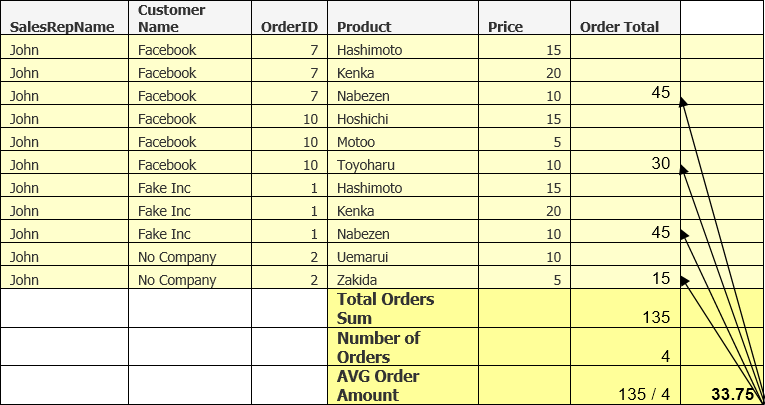
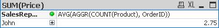
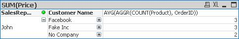
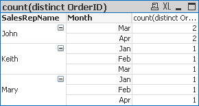
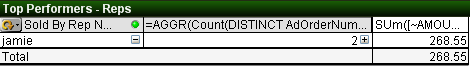
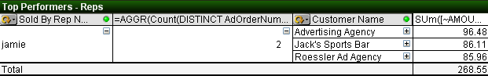
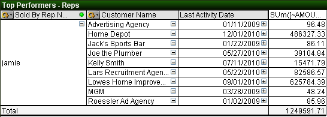

[Optional Header]: # "AGGR Function Training"


---

- [Introduction](#introduction)
- [AGGR Function Breakdown](#aggr-function-breakdown)
- [Average Customer Order](#average-customer-order)
- [Using Multiple Dimensions in the AGGR Function](#using-multiple-dimensions-in-the-aggr-function)
- [Using AGGR() as a Calculated Dimension](#using-aggr()-as-a-calculated-dimension)
- [A Useful AGGR() Dimension Example](#a-useful-aggr()-dimension-example)
- [Use AGGR() to Create a List Box](#use-aggr()-to-create-a-list-box)
- [Other Cool Stuff You Can Do With AGGR()](#other-cool-stuff-you-can-do-with-aggr())

## Introduction

The AGGR() function allows you to perform what Qlikview calls “Advanced Aggregations”.  What this amounts to is being able to aggregate (Sum, Count, etc) values within an expression by another field.

To aggregate means to do something to a set of values, usually summing or counting them.

If you are familiar with SQL, you can think of the AGGR function as allowing you to before a Group By statement on your Expression/Query.

Here is the definition of the AGGR() function from the Qlikview help file:

> There is a special function for advanced aggregations:
>
> **AGGR ( [ distinct | nodistinct ] [{set_expression}] expression {, dimension} )**
>
> Returns a set of values of *expression* calculated over *dimensions*. The result can be compared to the expression column of a 'local chart', evaluated in the context where the **aggr** function resides. Each *dimension* must be a single field. It cannot be an expression (calculated dimension).
>
> If the *expression* argument is preceded by the **nodistinct** qualifier, each combination of dimension values may generate more than one return value, depending on underlying data structure. If the *expression* argument is preceded by the **distinct** qualifier or if no qualifier is used at all, each combination of dimension values will generate only one return value.
>
> By default, the aggregation function will aggregate over the set of possible records defined by the selection. An alternative set of records can be defined by a set expression.
>
> By using this function in calculated dimensions it is possible to achieve nested chart aggregation in multiple levels. 
>
> When used in chart expressions it is possible to achieve sum-of-rows totals in a pivot table.
>
> **Examples:**
>
> **aggr( sum(Sales), Country )** 
>
> **aggr( nodistinct sum(Sales), Country )** 
>
> **aggr( sum(Sales), Country, Region )** 
>
> **count( aggr( sum(Sales), Country ))** 

 

## AGGR Function Breakdown

Let’s first breakdown the parts of the function and how to set it up, then we will dive into how to put it to use.

At its most basic level, there are only two parts to the function.

1. The Expression &#129106; AGGR(**TheExpression**, TheDimension) – the expression is telling the AGGR() function what we are going to be aggregating  and how to aggregate it (sum it up, count it, etc).

2. The Dimension &#129106;  AGGR(TheExpression, **TheDimension**) – the dimension is telling the AGGR() function over what field we are to perform the aggregation.  

To further explain how a simple AGGR() function will work, let’s work with the following simple dataset.

| **CutomerName** | **Revenue** |
| --------------- | ----------- |
| Sears           | 5           |
| Sears           | 10          |
| Sears           | 15          |
| Apple           | 5           |
| Apple           | 30          |
| Microsoft       | 10          |
| Microsoft       | 30          |
| Microsoft       | 20          |

We want to know the Total Revenue for each Customer.  The AGGR() function we would write to achieve this is as follows:

**AGGR(**SUM(Revenue), CustomerName**)**

The above function would return an array of values back to Qlikview.  The revenue summed up for each customer.

Next we will discuss how we use those returned values within a chart.

In a Qlikview chart, the aggregation happens based on the dimensions in your chart.  So if you have a chart with a dimension of Sales Rep and an Expression Summing the Revenue you will get totals for each Sales Rep:


Now, if we add another expression using the AGGR() function:

**AGGR(**SUM(Price), SalesRepID**)**


You notice we get the same answer.  I’m showing you this so that you understand what the AGGR() function is doing.  It is doing the same thing as the dimensions in a chart; defining the groups to aggregate over.

The above example is not useful, it is just to show how the AGGR() function works.

Let’s look at an example of how the AGGR() function will let you do something that would be much more difficult without it.

<div style="page-break-after: always;"></div>

## Average Customer Order

Let’s say that you want to find out the Average Order Amount.  You initial thought would be to use the AVG function to get this:


But let’s look at the data model:


Notice that the Price is not in the orders table, but in the OrderDetails table.  This means there can be multiple products per order.   Our expression AVG(Price) is actually giving us Average line item price.

This is where the AGGR() function will save us.  Let’s look at the results using the following:

AVG(AGGR(SUM(Price), OrderID))


Here is a breakdown of what the AGGR() function is doing:




First the AGGR() function sees that we want to get the SUM(Price) for each OrderID, which ends up being the Order Total.  An array of Order Totals is returned to the AVG function which sums up the returned values and divides that total by the number of OrderIDs (4).  

Here is another question that would be difficult to answer without the AGGR() function:

What is the average number of products in the orders? 

For Qlikview to get this answer, it needs to Count the number of products in each order and then divide the sum of these counts by the number of orders.

To do this, we simple need to use the AGGR() function:

AVG(**AGGR(**COUNT(Product), OrderID)**)**

In this example, the AGGR() function is sending an array of the number of products in each order to the AVG function which then calculates the average based on the number of “counts” returned.

Here is the result:



When creating expressions with the AGGR() function we also need to be aware of the dimensions that we are using.  In the above chart we can see that the result we are getting is showing us the average number of products in all orders that John has sold.

Let’s now look at what happens when we keep the same expression and add the Customer dimension.



Notice that the average changed.  This is because now we are calculating the average over a different data set.  The data set is now broken out by customer and now the AVG function is acting on that dataset.


<div style="page-break-after: always;"></div>

## Using Multiple Dimensions in the AGGR Function

The last AVG example we are going to look at is the following question:

What are the average number of orders per month?

The initial thought would be the following expression:

AVG(**AGGR(**Count(Distinct OrderID), Month**)**)

Which give use the following:





I’ve included the full data in a table so we can see that the answer our AGGR() function gives us is incorrect.

This is because we are using Month to “Group” our counts by, but we have Sales Rep as our dimension in the chart.  You get the wrong answer because the month is in a One to Many relationship with the Sales Rep, meaning if we have a month, it could be associated with multiple sales reps.

So, AGGR() comes to our rescue on this one by allowing us to “Group by” more than one dimension.

To get the right answer we use the following expression:

AVG(**AGGR(**Count(Distinct OrderID), `SalesRepID`, `Month`**)**)


You are not limited to a set number of dimensions in the AGGR() function.  The important thing to understand is that the dimensions you use in your chart DO have an effect on any expressions using the AGGR() Function.  So be aware of this when constructing your charts.

<div style="page-break-after: always;"></div>

## Using AGGR() as a Calculated Dimension

Another great feature of the AGGR() function is that you can use it in a calculated dimension and actually aggregate items in a dimension field.

Most of the time what you do in a dimension field with the AGGR() function could also be accomplished as an expression, but with it as a dimension, the column can be hidden by the user.

First, let’s take a look at an easy example.  Let’s say you wanted a count of all ads for a customer as a dimension column.

**AGGR(**Count(DISTINCT AdOrderNumber), NameLast_BSN**)**

Here is what it look like in a chart:


So the AGGR() function is returning an array which consists of the count of Ad Order Numbers grouped by the customer name.

We can see this more clearly if we just show the Sales Rep and our AGGR() function:


We still have three rows because that is what the AGGR() function is returning.  One thing to note is that if there were two customers that had the same number of orders, they would be included on the same line.

The example below makes this example a bit easier to understand.   

You can see that if you are just looking at the AGGR() function you only see one row showing that some customer(s) have 2 Ad Orders.  When you expand the AGGR() function, you see that I have put the customer name as the next dimensions and can see that there are actually 3 customers with 2 orders.





<div style="page-break-after: always;"></div>

## A Useful AGGR() Dimension Example

Here is what I think is a cool AGGR() function to use as a calculated dimension.

How about getting the Last Activity date for a customer?  Meaning, when was the last time a customer placed an ad with you?  You could call it their **Last Activity Date.**

Here is the simple AGGR() function:

DATE(**AGGR(**MAX({1} Insert_CalendarDate),AccountNumber_AdBase**)**)

The expression **MAX({1} Insert_CalendarDate)** is saying to return the largest (MAX) Insert Calendar Date associated with our Ad Transactions.  The **{1****}** is Set Analysis that tells the expression to ignore any selections that may be active.  

Next, the AGGR() function is going to do this MAX calculation for each Account Number, thus returning the last insert date for each customer.  

We wrapped this with the Date() function to convert this into a proper looking date instead of a date serial number.

Here is what it looks like in a chart:



This is pretty powerful, but we can make it even better!

One thing you will notice if you do this on your own data is that some customers may have a Last Activity Date in the future.  This is because we books ads for future dates and they are valid insertions, but just have not happened yet.

Some people may prefer to only show Last Activity Dates that are less than or equal to today’s date.  To do this we just need to modify our Set Analysis code.

```
DATE(AGGR(MAX({1 <Insert_CalendarDate = {"<$(=today())"}>} 
Insert_CalendarDate),AccountNumber_AdBase))
```

The extra Set Analysis, `<Insert_CalendarDate = {"<$(=today())"}>`, is telling the expression to only look at Calendar Dates less than today’s date.  

You can refer to the Set Analysis documentation for more details, but with it, you can refine the above formula to your specifications.

<div style="page-break-after: always;"></div>

## Use AGGR() to Create a List Box

Another very useful way to use the AGGR() function is to use it to create a very cool list box.

What if you wanted to have a list box that would let your users select all the Customers with 10 or more sales in the current month?

```
=IF(
 AGGR(COUNT({<Insert_CalendarDate={">=$(=MonthStart(Today()))
 		<=$(=MonthEnd(Today()))"}>}DISTINCT AdOrderNumber),
  AccountNumber_AdBase)>=10, 
 '10 Or More Sales', 
 'Less than 10 Sales')
```


The above Set Analysis code works, but it is a bit complicated for what we wanted.  An easier way to get the same results would be to use the following:

```
=IF(
AGGR(COUNT({<Insert_Month={$(=Month(Today()))}>}DISTINCT AdOrderNumber),
AccountNumber_AdBase)>=10, 
 '10 Or More Sales', 
 'Less than 10 Sales')
```


The Set being returned by the Set Analysis code only includes transactions that have an insert day falling into the current month.

One thing to note is that when I create one of these “Custom List Boxes”, I don’t use the list box control.  I prefer to use the **Chart** set as a **straight table**.

This way you can also have an expression giving more information about the calculated dimension.

In my example I put a count of the number of customers that fell into each group.


You can see that 4 customers had 10 or more sales and 7 had less than 10 sales.

<div style="page-break-after: always;"></div>

## Other Cool Stuff You Can Do With AGGR()

You can also use the AGGR() function as a calculated dimension to look inside and order and find out what orders are running certain combinations of products.

For example, let’s say that you wanted to track upsells.  In the example below, we want to look at ads that either have Atex Home **and** Greenfield Times as Product Name or ads that have Atex Home **and** Car & Driver for products.

```
=IF(AGGR(SUM(DISTINCT
	IF(ProductName='Atex Home Magazines', 1,
	IF(ProductName='The Greenfield Times', 10))),AdOrderNumber) = 11,
Dual('Atex Home + Greenfield Times',1),
IF(AGGR(SUM(DISTINCT
	IF(ProductName='Atex Home Magazines', 1,
	IF(ProductName='Car & Driver', 10))),AdOrderNumber) = 11,
Dual('Atex Home + Car & Driver',2),
null())
)
```

 


Let’s break apart one of the AGGR() functions in the calculated dimension:

```
AGGR(SUM(DISTINCT
	IF(ProductName='Atex Home Magazines', 1,
	IF(ProductName='The Greenfield Times', 10))),
AdOrderNumber)
```

What this statement is doing is looking at each row of every order and checking to see what the ProductName is.  If it is ‘Atex Home Magazines’, then a 1 is returned, if it is ‘The Greenfield Times’ then a 10 is returned.

Now, the AGGR is taking those 10’s and 1’s, using a distinct keyword, so at the most only one of each will be returned and then summing those up.

So for each Ad Order, that AGGR() function is going to return a 1 (Atex Home); a 10 (Greenfield Times); an 11 (Both Atex Home and Greenfield Times) or NULL neither Atex Home or Greenfield times.

You’ve probably noticed that we have wrapped that AGGR() function in an IF statement to check what this return value is and if it is equal to 11 (Both Atex Home and Greenfield Times) then we return the text ‘Atex Home + Greenfield Times’.

```
IF(AGGR() Function 1 = 11,
//THEN
Dual('Atex Home + Greenfield Times',1),
//ELSE
   IF(AGGR() Function 2 = 11,
     //THEN
      Dual('Atex Home + Car & Driver',2),  
//ELSE
null()))
```


Notice that this is set up as an IF…THEN…ELSE IF… THEN ….ELSE.

What this means is that once an ad meets an IF criteria, it won’t be checked against any other IF statements.  So, even though an ad could definitely fall into multiple groups, the way we have constructed the above IF statement, won’t allow that to happen, which is probably a good thing.

This example is just to get your brain thinking outside of the box with the AGGR() function.  It is an extremely powerful tool that will help you achieve that perfect report!