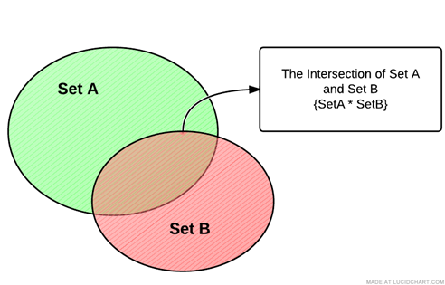
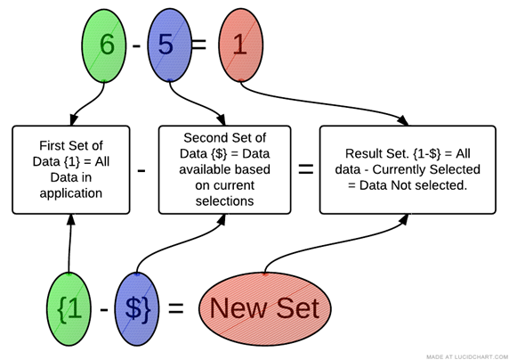

[Optional Header]: # "The Power of Set Analysis"

---

- [What is Set Analysis](#what-is-set-analysis)
- [Set Analysis Syntax](#set-analysis-syntax)
  - [Set Identifiers](#set-identifiers)
  - [Set Operators](#set-operators)
  - [Set Modifiers](#set-modifiers)
- [Set Modifiers with Set Operators](#set-modifiers-with-set-operators)
- [Removing a Selection](#removing-a-selection)
- [Complex Set Operations](complex-set-operations)
- [Set Modifiers with Dollar Sign Expansion](#set-modifiers-with-dollar-sign-expansion)
- [Element Functions - P() and E()](#element-functions---p()-and-e())
- [How to Put a Formula on the Left Side](#how-to-put-a-formula-on-the-left-side)
- [Set Analysis Examples](#set-analysis-examples)

## What is Set Analysis

When you create an expression with an aggregation function such as **SUM(Sales)**, that expressions sums only the available transactions available in the current set, which is defined by the current selections that a user has made.

Below, the diagram is trying to give you a visual handle on data within Qlikview.  When you open up Advertising Analytix and before any selections are made, all your charts are operations on “ALL DATA” in the application.  When you start making selections, that data becomes smaller and more refined.

In the example below, you can see that if you select the Year 2010, our charts will only be using a subset of “ALL DATA” in the application.  If we make another selection on Product, so that we are now looking at Year = 2010 and Product = ‘Atex’, our data set has just become more refined.

The way to we filter the data within a Qlikview application is by making a selection in a list box or chart that limits the values in a certain field, i.e. Year = 2010.

This is very powerful, but the data subset created by making selections applies to everything in our application.  This means that once we filter by 2010, no Qlikview objects can access any other year of data until we change our selection criteria.

Set Analysis lets us break through this barrier by allowing us to define a whole new set of data regardless of the current selections already made.

Most of the time we will still want to recognize the selections that have already been made, but no longer will we be constrained by them.  

The above diagram illustrates how you can use Set Analysis to move outside of the current selection within an expression easily.  

---

## Set Analysis Syntax

First of all, when we write Set Analysis code, we call it a **Set Expression**.  A set expression is used in aggregation functions to define the set of data those aggregation functions will operate over. 

Be warned, the set syntax can get complicated, so even if you get results back ALWAYS check the data being returned to verify that your set expression is returning the data that you want it to return.

The set expression can be thought of as consisting of three parts:

1. Identifiers – designates our starting data set.

2. Operators – allows us to combine multiple data sets (defined by set expressions) and return a set as a result.

3. Modifiers – syntax that modifies the contents of a set by filtering field values.

Set Expression Identifiers

Let’s take a look at a simple set expression within an aggregation function:

SUM(**{1}** Revenue)

The set expression is contained within the curly braces {} within the aggregation function.  The 1 inside the curly braces is a set identifier.  It is defining the set that is going to be passed to the aggregation function.  

---

### Set Identifiers

**{1}** – represents the full set of data within the application.  Using the 1 identifier is telling the aggregation function to disregard any selections that have been made and look at the whole data set.

**{$}** – represents the records of the current selection.  Using the $ alone as a set expression is equivalent to not using a set expression at all. 

**{$1}** – represents the records of the Previous selection.  Supposed to be equivalent to pressing the Back button. Use this with caution.  I won’t say it is faulty, but the rules upon which it operates are not easy to tell.  

**{$_1}** – represents the records in the Next selection.  Supposed to be equivalent to pressing the forward history button.

**{BookMarkName}** – represents the records in the bookmark name used.  You may also use the Bookmark ID if you know it.  

Here is how you would use these identifiers in aggregation functions.

SUM(**{1}** Revenue)  -- Sum the revenue ignoring any selections made.  This would be the same as clicking on the clear button.

SUM(**{BM01}** Revenue) – Sum the revenue for the transactions that are in the set of data defined by the BM01 bookmark.  If this bookmark had the criteria Year = 2010 and Product = ‘Atex’, only those transactions meeting that criteria would be included in the calculation.

---

## Set Operators

Set operators use sets as operands and return a set as a result.  You can draw an analogy between an arithmetic equation and the set operators.

First, here are the operators and their function:

In the examples below think of SetA and SetB as Bookmarks that each corresponds to a set of data.  

**+     Union operator.**  Returns a set consisting of records that belong to ANY of the two operands

 

 

 

 

**-      Exclusion operator.**  As a binary operation (using two operands/sets), returns the set of records that belong only to the first of the two operands.  You can think of this as the mathematical MINUS, but acting on sets of data. Removing records from the first set that exist in the second set.

***     Intersection operator.** Returns the set consisting of records that belong to both sets of data.

 

**/     Symmetric difference (XOR) operator.**  This returns a set consisting of records that belong to either Set A or Set B but **NOT BOTH**.  So in the diagram below, the records that are intersecting between the sets are excluded from the resultant set.

---

### Set Operator Syntax

The syntax for these operators is shown in the following example.  Note that this type of selection was never possible in Qlikview before the introduction of Set Analysis.

**SUM({1 - $} Revenue)**

The above example is using the exclusion operator and results in a set of all the records not currently selected.  The **1** indicates all of the data within the application, whereas the **$** indicates the data available based on the current selection.  When you take away this data from whole data set of the application you are left with, data that was not selected in our current selections.

Another Example using a Bookmark:

**SUM({$\*BM01} Revenue)**

This example is returning a set of data that is the intersection of the Current Selection and Bookmark BM01.  To visualize this, let’s say these are our data sets:

**$** **&#129106; Year = 2010**

**BM01** **&#129106; Product = ‘Atex’**

Then the intersection {$*BM01} would be transactions that are the Atex Product falling in the year 2010. 

The figure below is trying to draw an analogy between a standard arithmetic statement and a Set Analysis statement.

You are not limited to just two operands; you can do something like this:

**SUM(1-($+BM01) Revenue)**

Notice that I am using standard brackets () to designate the order of operations on my sets.  If you ever have more than two operands, use brackets () to make the order of operations clear.

In the above example, we first Union the Current Selection with Bookmark BM01 and then Exclude that from the full data set of the application.

---

## Set Modifiers

Now we get to the real power of Set Analysis.  The set modifiers allow us to modify our set of data by filtering by fields.  Remember that when we are talking about modifying a selection, we are only talking about the selection that applies to the set of data we are working with in our current Set Analysis expression.

The modifier syntax is enclosed by < and > with a set expression.  The modifier itself consists of one or several field names, each followed by selection criteria.

**SUM({$<ProductName={’Atex’}> } Revenue)**

Let’s break apart this set expression 

**{$<ProductName={’Atex’}> }** – Full set expression

**{$  }** – This is giving us our initial set of data to work with.  Notice we are using the $ Set Identifier, which means our initial set of data is whatever is available given our current selections.

**<ProductName={’Atex’}>** – This is the Set Modifier section.  This is further modifier our initial set of data by limiting it to only records that have a ProductName equal to Atex.  Note the angle brackets <> enclosing the set modifier and also notice that the field value ‘Atex’ is enclosed in curly brackets {}.

The $ set identifier is options, so you may rewrite the above example as:

**SUM({<ProductName={’Atex’}> } Revenue)**

The above example will return Revenue for all records with a ProductName of Atex.  Note, that this becomes a new selection on ProductName.  If there were any other selections on ProductName, they will be disregarded.

If you simply want to add a product selection to your current selection in that field you would use the following syntax. (See [Set Modifiers with Set Operators](#set-modifiers-with-set-operators))

**SUM({$<ProductName=ProductName + {’Atex’}> } Revenue)**

If a selection is in the current selections ($), then the above example will return a data set containing whatever selections are currently made plus ‘Atex’.  If no selections are present in ProductName, then you will get a return data set of all products, meaning that the above will act the same as SUM($(NetRevenue) ) if no selections are present in the ProductName.

### Multiple Modifiers Fields

If you want to limit based on multiple fields, just separate the other fields with a comma as below:

**SUM({$<ProductName={’Atex’}, Year={2010}> } Revenue)**

### Multiple Modifiers Field Values

Next, what if you want to have multiple field values in your modifier:

**SUM({$<ProductName={’Atex’, ‘Mactive’}, Year={2010, 2009}> } Revenue)**

### Wild Card Searches

You can do a wildcard search using the * character.  You must enclose the field value in double quotes.

Also, the search is case Insensitive and will search over excluded values.  This means that if you have a selection made of ProductName = ‘Mactive’, the below example will still return transactions.

**SUM({<ProductName={“\*Atex*”}> } Revenue)**

### Empty Sets

Using the Set Modifiers you can also get **Empty Sets**.  This means that you will get a set of records not associated with the field used in your set modifier.

**SUM({<ProductName={}> } Revenue)**

The above example is how you designate an empty set.  The set returned will only contain records that DO NOT have a product linked to them.   

Be aware that they the BI database is structured (dimensional model), there are no empty set for the dimensions.  The reason for this is because every transaction’s link from a fact table to a dimension is not allowed to be NULL (empty).  So, if we have a transaction without a product, then we link it to what we call a NULL row in the dimension table.  Hence, that transaction would not be considered to be without a product.

So, be careful when using this syntax.

### Removing Selections

If you want to use the $ as the initial set of data, but want to make sure that even if a certain field has a selection in it, that it will be removed, you will need the following syntax.

**SUM({$<ProductName=> } Revenue)**

This will return revenue with all the current selections intact, BUT if there was a selection on ProductName, it will be removed.

### Date and Number Modifiers

Date and numbers have a unique syntax that is very powerful.

**SUM({$<Insert_CalendarDate={’>10/20/2009<11/20/2009’}> } Revenue)**

This will return all records that fall within the date range given.

Here is another example:

**SUM({$<Year={’>=2009’}> } Revenue)**

Notice that you put the equality signs inside the set modifier values {‘’}. 

---

## Set Modifiers with Set Operators

You can get some powerful results by combining set modifiers with set operators.

We’ve seen this example previously, but let’s go over it again…Let’s say you want to add a selection criterion to a field’s current selection.   For example, I want to make sure that no matter what is selected in the ProductName field, the field value ‘Atex’ is always part of my criteria:

**SUM({$<ProductName=ProductName + {’Atex’}> } Revenue)**

The above example will not only give you transactions for whatever values have been explicitly selected in ProductName, but also, the transactions with ‘Atex’ as a ProductName.

You can use any of the [Set Operators](#_Set_Operators:) to modify your selection.

In the example below all transactions with the current ProductName selections are returned, but since we are using the exclusion operator, we are excluding any transactions that have a ProductName equal to ‘Atex’.

**SUM({$<ProductName=ProductName - {’Atex’}> } Revenue)**

The above two selections have allowed us to base our set analysis selection to be based on the current selection in a field and then add field values as we needed.  The syntax was:

**{$< FieldName =FieldName + {’Field Value’}> }**

For those of you who like shorthand notation, you can shorten these types of statement s to:

**{$< FieldName +=  {’Field Value’}> }**

**{$< FieldName -=  {’Field Value’}> }**

**{$< FieldName \*=  {’Field Value’}> }**

**{$< FieldName /=  {’Field Value’}> }**

So our example above would become:

**SUM({$<ProductName += {’Atex’}> } Revenue)**

---

## Removing a Selection

There will be times when you want to remove a selection criterion from your selection.  For example, we want remove the ProductName selection before Summing the Revenue:

**SUM({$<ProductName => } Revenue)**

So this is equivalent to not having any ProductName’s selected and having SUM(Revenue) for your expression.

This is very different from the following:

**SUM({$<ProductName = {}> } Revenue)**

This is indicating that you should only SUM revenue for transactions that have NO ProductName associated with them.

---

## Complex Set Operations

There are an unlimited number of ways that you can use the features of Set Analysis to get at the information you need.  In the below example, Revenue will be summed for all Accounts that have BOTH of the Products across all transactions.  

**SUM({**<**AccountNumber_AdBase={"=COUNT({<ProductName={'Atex Home'}>} AccountNumber_AdBase) > 0"}** 
 *
 **{"=COUNT({<ProductName={'Atex Style Magazine'}>} AccountNumber_AdBase) > 0"}, ProductName=**>**}** **Revenue)** 

---

## Set Modifiers with Dollar Sign Expansion

Dollar sign expansion is used to access variables and Qlikview functions within our set analysis expressions.  The syntax if fairly simple:

$(VariableName)

$(=FunctionName())

When you put a variable name within the $(), it will return that value within that variable.  If you want to get a function to return a value, you must precede the function name with an equal sign.

**SUM({$<Insert_CalendarYear = { $(=Year(Today()))}> } Revenue)** 

In the above example “**$(=Year(Today())”** is calling the Today() function, passing it to the Year function which will return the current year based on today’s date. 

You can also perform mathematical operations on these values.  Here we take one away from the current year giving us previous year:  “**$(=Year(Today())-1)”** 

---

## Element Functions - P() and E()

Let’s say you want to filter your data so that you only have customers selected who have run and ad on a specific date.

For example, I want to see all the revenue from all customers who ran an ad on “01/01/2018”.  Not how much revenue was generated on “01/01/2018”, but instead all the revenue for Customers who ran an ad on that day.

To do this by using our list boxes, we would first select the Insert Date of “01/01/2018”, then select the possible values in the Customer Account Number list box, then lastly, deselect the Insert Date.

If we want to handle all this selection within an expression we can do it using Element Functions.

These are P() and E().

The P() function lets you get the element set of possible values and E() giving you the element set of excluded values.

**SUM({$<AccountNumber_AdBase=P({1<Insert_CalendarDate = {“01/01/2018”}>} AccountNumber_AdBase)> } Revenue)**

 The P() function is going to filter on all possible Account Numbers that have a Insert Date of 01/01/2018 and then allow us to SUM the revenue for all those accounts, but not limited to their revenue just on 01/01/2018.

Another example, but using the E() function:

**SUM({$<AccountNumber_AdBase=E({1<Insert_CalendarDate = {“01/01/2018”}>} AccountNumber_AdBase)> } Revenue)**

Using the E() function will give us the opposite.  It will filter on Account Number but will include only Accounts that did not have a transaction on 01/01/2018.

---

## How to Put a Formula on the Left Side

One rule that we have to follow when writing Set Analysis expressions is that you must have a field name on the left side of the set expression:

**SUM({$<GL_Number ={0000} $(NetRevenue))**

But what if we wanted to create a set that included all GL_Numbers that end in 0000.  Well, you would normally do something like this Right(GL_Number, 4)=0000, but our set Analysis rules says that we can do this!

Well, we can use the trick below to get by this rule.

**SUM({$<GLNumber ={“=RIGHT(GLNumber, 4)=0000”}>} $(NetRevenue))**

Here we are using the right hand side of the equation to only return the GL Numbers that we want:

**“=RIGHT(GLNumber, 4)=0000”**

The result is that Qlikview returns only GLNumbers that have the last 4 digits of 0000.

---

## Set Analysis Examples

Here are some example of Set Analysis in use:

**SUM({$<SoldBy_RepLoginName={"=SUM({1<Insert_CalendarYear={2010}>} $(NetRevenue)) > 100000"}>} $(NetRevenue))**

The above example shows just how powerful set analysis can be.  It will return the Revenue for the whatever the current selection is, but with a new selection in the SoldBy_RepLoginName field: only reps who, during Insert Year 2010, sold more than $100,000 will be included.

That example shows us that we can nest expressions within our set analysis expressions to get some truly powerful results.

Here are some common examples that we use often in Analytix.  Year over Year comparison examples.

First is the current year example comparing against today’s year.

**SUM({$<Insert_CalendarYear = { $(=Year(Today()))}> } Revenue)**

Next is the previous year example comparing against today’s year minus one.

**SUM({$<Insert_CalendarYear = { $(=Year(Today())-1)}> } Revenue)**

First is the current year example comparing against today’s year.

The next example will give us only color charges for the current year:

**SUM({$<Insert_CalendarYear = { $(=Year(Today()))},ChargeCategory={'ColorItem'}> } Revenue)**

---

## Conclusion

As you can see set analysis is very powerful, but can get confusing as you build larger and more complex expressions.

As you explore these capabilities, make sure that you are testing your expression to ensure that it is returning the data that you expect to see.