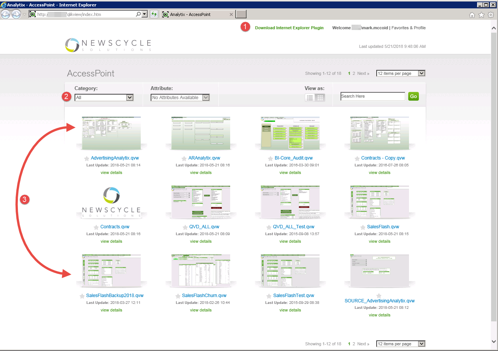
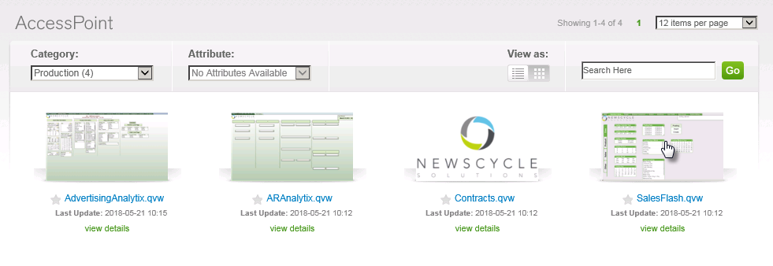
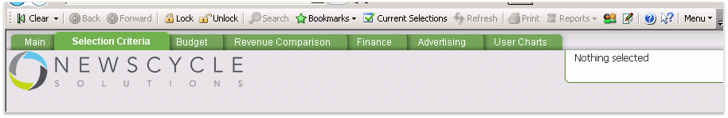
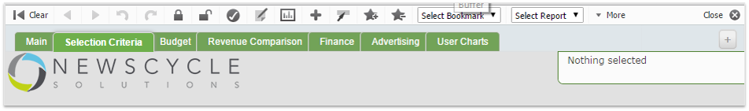
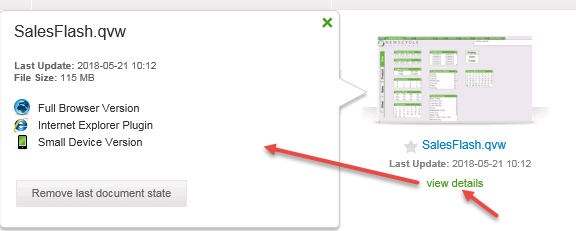
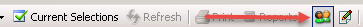
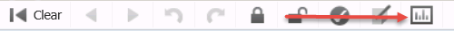
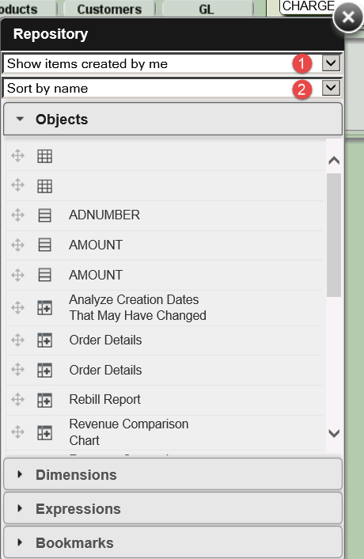

---

- [How to Access Analytix](#how-to-access-analytix)
  - [Analytix URL](#analytix-url)
  - [AccessPoint Home Page](#accesspoint-home-page)
- [The IE Plugin](#the-ie-plugin)
- [Opening an Analytix Application](#opening-an-analytix-application)
- [Difference between Plugin and Full Browser Version](#difference-between-plugin-and-full-browser-version)

----

## How to Access Analytix

Analytix is a web based application. This means that you will access the Analytix application using a web browser.

It is recommended that you use Microsoft's IE 11 browser as there is a plugin that can be installed to make working with Analytix a bit easier.

With that said, it is not required that you use the plugin or IE 11.  You may use any modern browser to access Analytix.  Please note that all documentation and screenshots of the Analytix applications are based on the plugin in an IE 11 browser.

### Analytix URL

As with any other website, you will need a URL to get to the home page for Analyix.  This can be obtained from your network administrator or whoever is in charge of getting Analytix setup for your company.

The URL will be in the format of:

**http://dnsname/qlikview** OR

**http://ipaddress/qlikview**

The IP Address format will be a series of number (10.25.26.100).  You site administrator may also choose to map this IP address to a DNS Name to make it easier for you to remember the URL.

Either way will get you to the proper place.

Once you have entered the proper URL, you will be redirected to the Analytix homepage.  This homepage is called AccessPoint.

Before you are able to see AccessPoint you will be presented with a login dialog.  Since Analytix is a secure application, you will need to provide login information to get to it.

Your site administrator will provide you will login details, however, for most installations the login will be the same login you use to get to your AdBase servers (Citrix or other option).

Make sure that you enter your user name in the format of **DOMAIN\Username**, not just your username.  The domain is very important.

---

### AccessPoint Home Page

Once you have authenticated, you will be able to see the AccessPoint home page.

It will look something like this:

The main items you need to be aware of are:

1. **The Plugin** - If you are using IE 11 (you should be), here is the link for the Internet Explorer plugin.
2. **Category** - This will allow you to only the Analytix applications that you want to see.  Never leave the category set to "All".  Most sites will have a "Production" category for their main applications.
3. **Analyix Applications** - These are all of your Analytix application.

---

## The IE Plugin

As stated before, it is recommended that you use Internet Explorer 11 with the IE Plugin installed.

To install the plugin simply click the download link and install the downloaded EXE as any other windows application.  **Note**: Some companies restrict their users ability to install programs.  if this is the case, then you will need to contact your IT department to install the plugin.

After the plugin is install, you will need to reload the AccessPoint homepage.  When you do, you should see a status message at the bottom of your browser window or popup message asking you to give the IE Plugin permission to run.  You must say yes for the plugin to work.

---

## Opening an Analytix Application

Before you open an Analytix application, you really should select a category.  Your system admin will tell you which category your production Analytix resides in, however it most likely will be called **Production**.

Once you have chosen the "Production" category, you will see the following:

To open an application, either click on the image of the application or click on the named link of the application that you want to open.

This will open the application in either the plugin or as a "Full Browser Version" which is the application without the plugin.

If you use the plug in, the screen will look like the image below.  Note that the toolbar has color icons.

***Plugin version***

If you are using the full browser version, then the toolbar will be in black and white.

***Full Browser Version***

### Choosing Plugin or Full Browser Version

If you click on the **view details** link under each application, you will see a popup box with some additional information.

You will see the different options available to you for opening the application.  If you are in IE with the plugin installed, then you will have the "Internet Explorer Plugin" option available.  All other browsers will have the "Full Browser Version" and possibly the "Small Device Version".

Simply click on the option you wish to use to open Analytix.  If you have the IE Plugin version available, that is the suggested option to use.

The "Remove last document state" button is only useful when opening Analytix in the "Full Browser Version".  This will reset your Analytix session so you start out on the "Selection Criteria" screen when opening Analytix.

## Difference between Plugin and Full Browser Version

There are a few significant differences when you are not using the plugin to view Analytix.

1. **Document State** - The Full Browser Version retains the last document state when you quick your browsing session.  For example, if you are on the Advertising Tab and have 10 products selected and then exit your browser, when you open Analytix again using the Full Browser Version, you will be back on the Advertising tab, with those 10 products selected.  This is in contract to the IE plugin where every time you start Analytix, you have no selections and are on the Selection Criteria tab.
2. **Chart Creation** - If you are creating charts, the IE plugin greatly simplifies this process.
3. **Bookmark and Object Access** - Accessing and sharing bookmarks and objects differ depending on if you are using the plugin or not.

### Bookmark/Object Access 

#### IE Version

If using the Plugin in Internet Explorer, the easiest way to access your bookmarks will be by pressing the F2 key or clicking on the Server Objects icon in the toolbar.

This will open the **Server Object Pane**, where you will be able to see all of your Bookmarks and Objects as well as all shared Bookmarks and Objects.

#### Full Browser Version

To access your bookmarks in the full browser version, you will need to find an empty area of the screen and right-click, then choose **Repository** or click on the Repository icon in the toolbar.

The Repository allows you to view your own and shared bookmarks and objects.

There are two drop downs in the repository dialog. 

1. Allows you to choose to see Your items or Shared items or both.
2. Allows you to choose the sorting of Objects and Bookmarks.