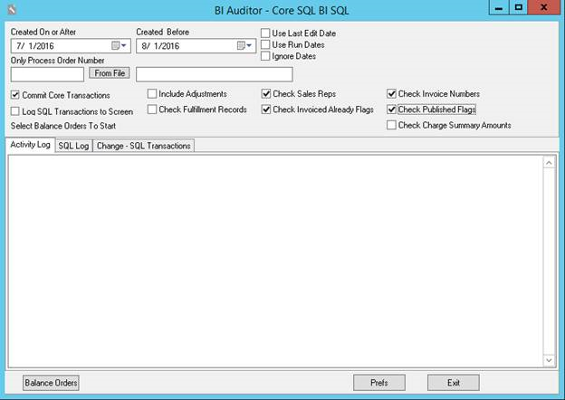

---

[Optional Header]: # "Running The BI Auditors"

There are two auditors that need to be run:

1. **BI AR Auditor** – This auditor will verify Invoices, Debits, Credits, and Payments in fctGL and fctARSummary tables.
2. **BI Auditor** – This auditor will verify the booked ads found in the fctInsertion tables.

It is recommended to run both auditors on a weekly basis and a monthly basis.  For example, if you run the auditors every Friday, you will run it from the previous Friday to the current Friday.  Then at the end of the Month or Period, I will run it for a full Month/Period.

The Auditors will create “FIX” files in the Temp directory and these are the files that contain the information that BI can use to load the records that need to be “Fixed”.

The fix files can be found in the “Temp” directory.  It will look something like this:

These fix files will be run through the BI Populator where they will be reprocessed and update the records in error.

**NOTE:** It is **very important** that you log into the BIPopulator with a different user than the one used to run the continuous BIPopulator.

## BI Auditor Settings

Make sure that the “Created Before” date is today’s date or before, not a future date. 

 To run the auditor and produce the Fix file, simply click the “Balance Orders” button.

If you only want to audit a single Order Number, you may put that into the “Only Process Order Number” input box.  Whenever there is an order number in this box, the dates will be ignored.

The “Prefs” button will allow you to choose the directory that the Fix files will be created in. It is recommended to point this to the Temp directory that your other NCS log files are stored.

## BI AR Auditor Settings

Make sure that the “Created Before” date is today’s date or before, not a future date.

 

To run the auditor and produce the Fix file, simply click the “Balance AR” button.

If you only want to audit a single Transaction Number, you may put that into the “Only Process Transaction Number” input box.  Whenever there is an transaction number in this box, the dates will be ignored.  

The “Check Balances” button runs a quick high level check of the state of each transaction type and displays the results in the Activity Log window.  Note that no fix file is generated.  This is for informational purposes only.

The “Prefs” button will allow you to choose the directory that the Fix files will be created in. It is recommended to point this to the Temp directory that your other NCS log files are stored.

## Running the BI Populator

Once all fix files have been created, they must be run through the BI Populator so that the BI database is updated.

**NOTE:** It is **very important** that you log into the BIPopulator with a different user than the one used to run the continuous BIPopulator.

Once in the BI Populator, the first thing you must do is tell the populator which fix files to use. To do this, go to the “Object Id Filters” tab:

Check the “Get Invoice Ids from file” checkbox, click the“Browse” button and choose the invoice fix file for the current date. Do this for Debits, Payments, Credits and Ad Orders.

Go back to the “Execution Criteria” page and make sure youhave checked the following check boxes:

1. Process GL Data – This will tell the populator to process GL Data and since we have given it “fix” files to process, it will only process that data.
2. Process ad orders – Same as above, but this time the populator will be populating Ad Orders and again, since we have specified a“fix” file, it will only process those orders.
3. User specific log file – This is only so that we differentiate this populator log from your main populator log file.  It will append the user who logged into the BI Populator to the log file name.

Also make sure that the “Execute periodically” check box is Unchecked. We only want to process these files once.

Lastly, click on the “Populate” button to process your fix files.

 