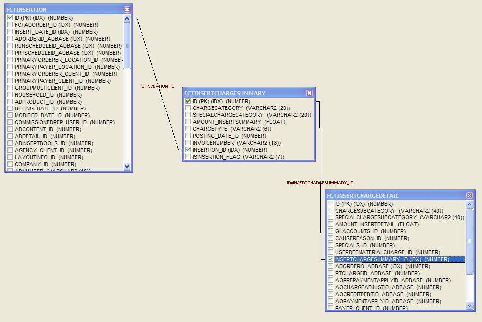

[Optional Header]: # "BI Database Core Mapping"

- [**The BI Database**](#the-bi-database)

- [**AdOrder Data Mart**](#adorder-data-mart)
  - [fctAdOrder](#fctadorder)
- [**Insertion Data Mart**](#insertion-data-mart)
- [**ChargeTypes in the Advertising Data Mart**](#chargetypes-in-the-advertising-data-mart)
- [**Spread Logic in the Advertising Data Mart**](#spread-logic-in-the-advertising-data-mart)
  - [fctInsertion](#fctinsertion)
  - [fctInsertChargeSummary](#fctinsertchargesummary)
  - [fctInsertChargeDetail](#fctinsertchargedetail)
  - [fctSalesComm](#fctsalescomm)
- [**GL Data Mart**](#gl-data-mart)
- [**GL Relationship to Advertising Side of BI**](#gl-relationship-to-advertising-side-of-bi)
- [**Calculating Linage from fctGL**](#calculating-linage-from-fctgl)
- [**Joining fctApply to fctARSummary**](#joining-fctapply-to-fctarsummary)
  - [fctARSummary](#fctarsummary)
  - [fctGL](#fctgl)
  - [fctPreApply](#fctpreapply)
  - [fctApply](#fctapply)
- [**Contract Data Mart**](#contract-data-mart)
- [**Contract Information**](#contract-information)
  - [fctContract](#fctcontract)
  - [fctContractFulfillment](#fctcontractfulfillment)
- [**Dimension Tables**](#tables)
  - [dmAdProduct](#dmadproduct)
  - [dmUser](#dmuser)
  - [dmClient](#dmclient)
  - [dmRelationshipAgency.](#dmrelationshipagency)
  - [dmRelationshipParent](#dmrelationshipparent)
  - [bridgeMultiClient](#bridgemulticlient)
  - [dmDate](#dmdate)
  - [dmAdOrderBools](#dmadorderbools)
  - [dmAdOrderStatus](#dmadorderstatus)
  - [dmAdPromotion](#dmadpromotion)
  - [dmAdOrderDetail 49](#dmadorderdetail)
  - [dmCompany](#dmcompany)
  - [bridgeMultiSpecials](#bridgemultispecials)
  - [dmSpecias](#dmspecias)
  - [bridgeMultiMaterials](#bridgemultimaterials)
  - [dmMaterialCharge](#dmmaterialcharge)
  - [dmLocation](#dmlocation)
  - [bridgeOrderRoles](#bridgeorderroles)
  - [dmAdInsertBools](#dmadinsertbools)
  - [dmAdContent](#dmadcontent)
  - [dmAdDetail](#dmaddetail)
  - [dmLayoutInfo](#dmlayoutinfo)
  - [dmLogos](#dmlogos)
  - [bridgeLogos](#bridgelogos)
  - [dmAdLineage](#dmadlineage)
  - [bridgePRPDistribution](#bridgeprpdistribution)
  - [dmPRPDistribution](#dmprpdistribution)
  - [dmGLAccounts](#dmglaccounts)
  - [dmCauseReason](#dmcausereason)
  - [dmCollections](#dmcollections)
  - [dmBusinessArea](#dmbusinessarea)
  - [dmDigitalMediaCampaign](#dmdigitalmediacampaign)
  - [dmDigitalMediaFlight](#dmdigitalmediaflight)
  - [dmDigitalMediaUnit](#dmdigitalmediaunit)
  - [dmGLInvoiceDetail](#dmglinvoicedetail)
  - [dmGLTransaction](#dmgltransaction)
  - [dmContractDetails](#dmcontractdetails)
  - [dmContractTemplate](#dmcontracttemplate)
  - [dmContractBools](#dmcontractbools)
  - [dmRateHolder 66](#dmrateholder)
  - [bridgeContractClient 67](#bridgecontractclient)
  - [bridgeRepPercentage](#bridgereppercentage)
  - [bridgeClientAlias](#bridgeclientalias)
  - [dmClientAlias](#dmclientalias)

 

#  The BI Database

The BI database is designed using dimensional database modeling principles.  By designing the database in this way we have created a database that presents data in a way that is easy to understand which makes it easy to query and get the data out.

A dimensional model is based on a star schema format.  

 

The diagram above demonstrates why it is called a star schema.  

There is usually one central table called a **Fact Table**.  The fact table stores the transactions of the business.  In the BI database we prefix these table names with FCT.

The tables surrounding the fact table and joining to it are called **Dimension Tables**.  The dimensions describe the transactions that are in the fact table.  In the BI database we prefix these table names with DM.

In addition to the Fact and Dimension tables there are also some **Helper Tables** called Bridge tables.  Their names are prefixed with the word BRIDGE.

For example, if the fact table held Insertion transactions, then the dimensions would describe those transactions.  Things like Products, Insert Dates, Customer, etc. 

As you view the BI database you will notice that is split into four data marts.  

- Ad Order
- Insertion
- Contracts
- GL

A single dimension table may be linked to multiple fact tables in different data marts.  This can allow interaction between the data marts. 

As you navigate through the BI database here are a few rules that will help you understand how it is set up: 

1. Fact tables have the prefix of FCT before their table name.  So the AdOrder fact table is called **fctAdOrder**

2. Dimension tables have the prefix of DM before their table name. So the AdProduct dimension is called **dmAdProduct.**

3. If the field ends in _ID, it is a link to a dimension table in the BI database.  To find which dimension, look at the word before the _ID and add a dm to the beginning.  For example, Insert_**Date**_ID.  If I take the word before the _ID (Date) and add dm to it, I get **dmDate.**  This is the dimension table that the Insert_Date_ID is linking to.

   > NOTE:  Fields ending in _ID can not be used in queries to join to similar Core IDs.  They may represent the same entity, but the number will be different. For example, Company_ID in fctInsertion is not the same ID number as CompanyID in aoAdOrder.  Again, they may point to the same Company, but the IDs will be different. 

4. If the field ends in _AdBase, it is a link to an ID in the Core database.  In this document, in the Core description field we will have the following text to indicate that this is a Core ID:  Link to CORE &#129106;
         This means that you may use these fields to actually join to fields in the      Core database.
         For example, the AdOrderId_AdBase field in fctAdOrder can be used to join      to aoAdOrder as follows:
                   SELECT * 
                   FROM fctAdOrder, aoAdOrder
                   WHERE      fctAdOrder.AdOrderId_AdBase = aoAdOrder.ID

         

5. Most of the fields in the Fact tables will be ID fields linking to other dimensions.

6. Most of the data marts will not have only one fact table, but will have multiple fact tables that are linked together to fully describe the transactions for that data mart.

---

# AdOrder Data Mart

The Ad Order data mart has the following tables:

**Fact tables**

- [fctAdorder](#fctAdOrder)

**Dimensions**

- [dmClient](#dmClient)
- [dmRelationshipParent](#dmRelationshipParent)
- [dmRelationshipAgency](#dmDate)
- [dmAdOrderBools](#dmAdOrderBools)
- [dmOrderStatus](#dmAdOrderStatus)
- [dmDate](#dmDate_1)
- [dmUser](#dmUser)
- [dmAdPromotion](#dmAdPromotion)
- [dmAdOrderDetail](#dmAdOrderDetail)
- [dmCompany](#dmCompany)
- [dmLocation](#dmLocation)
- [dmSpecials](#dmSpecials)
- [dmMaterialCharge](#dmMaterialCharge)

 

**Helper Tables**

- [bridgeMultiMaterials](#bridgeMultiMaterials)
- [bridgeMultiClient](#bridgeMultiClient_1)
- [bridgeMultiSpecials](#bridgeMultiSpecials)
- [bridgeOrderRoles](#bridgeOrderRoles)

 

 

## fctAdOrder

| **BI Field Name**            | **CORE Field/Logic**                                         |
| ---------------------------- | ------------------------------------------------------------ |
| AdOrderID_AdBase             | Link to CORE &#129106;  aoAdOrder.ID                         |
| Create_Date_ID               | Link to [dmDate](#dmDate_1) &#129106;  aoAdOrder.CreateDate  |
| ADOrderNumber                | aoAdOrder.AdOrderNumber                                      |
| GroupMultiClient_ID          | Link to [BridgeMultiClient](#bridgeMultiClient_1).GroupMultiClient_ID   The [bridgeMultiClient](#bridgeMultiClient_1)   table allows an insertion to be linked to more than just the Primary Orderer   and Payer. |
| Household_ID                 | Link to dmHousehold.ID   The Household table was designed to be used to store the   history of address changes of a customer. Currently it is populated, but not   used in any of our reports or Analytix. |
| PrimaryPayer_Client_ID       | Link to [dmClient](#dmClient).ID   AoOrderCustomers where PrimaryPayerFlag is TRUE |
| PrimaryPayer_Location_ID     | Link to [dmLocation](#dmLocation)   Address information linked to the Primary Payer above. |
| PrimaryOrderer_Client_ID     | Link to [dmClient](#dmClient)   AoOrderCustomers where PrimaryOrdererFlag is TRUE |
| PrimaryOrderer_Location_ID   | Link to [dmLocation](#dmLocation)   Address information linked to the Primary Orderer above. |
| Commissionedrep_User_ID      | Link to [dmUser](#dmUser) &#129106;  Sold By Rep in AdBooker, aoAdOrder.SellerID |
| OrderTaker_User_ID           | Link to [dmUser](#dmUser) &#129106;  aoAdOrder.RepID         |
| CreditApprover_User_ID       | Link to [dmUser](#dmUser) &#129106;   aoAdOrder.CreditOverID |
| KillUser_User_ID             | Link to [dmUser](#dmUser) &#129106;  aoAdOrder.KillID        |
| Killed_Date_ID               | Link to [dmDate](#dmDate) &#129106;  aoAdOrder.KillDate      |
| Expired_Date_ID              | Link to [dmDate](#dmDate_1) &#129106;  aoAdOrder.ExpireDate  |
| FirstInsert_Date_ID          | Link to [dmDate](#dmDate_1) &#129106;  aoAdOrder.RunDateFirst |
| LastInsert_Date_ID           | Link to [dmDate](#dmDate_1) &#129106;  aoAdOrder.RunDateLast |
| Modified_Date_ID             | Link to [dmDate](#dmDate_1) &#129106;  aoAdOrder.LastEditDate |
| OrderTaken_Date_ID           | Link to [dmDate](#dmDate_1) &#129106;  Always set to the date that the record was added to BI |
| Expedited_Date_ID            | Link to [dmDate](#dmDate_1) &#129106;  aoAdOrder.DateExpedited |
| CreditApproved_Date_ID       | Link to [dmDate](#dmDate_1) &#129106;  aoAdOrder.CreditOverTime |
| AdOrderBools_ID              | Link to [dmAdOrderBools](#dmAdOrderBools)                    |
| AdOrderStatus_ID             | Link to [dmAdOrderStatus](#dmAdOrderStatus)                  |
| AdPromotion_ID               | Link to [dmAdPromotion](#dmAdPromotion)                      |
| Company_ID                   | Link to [dmCompany](#dmCompany)   Derived from aoAdOrder.CompanyID |
| GroupMultiSpecials_ID        | Link to [bridgeMulitSpecials](#bridgeMultiSpecials)          |
| ProductOfOrigin_AdProduct_ID | aoAdOrder.ProductOfOriginID                                  |
| AdOrderDetail_ID             | Link to [dmAdOrderDetail](#dmAdOrderDetail)                  |
| GroupOrderRoles_ID           | Link to [bridgeOrderRoles](#bridgeOrderRoles)                |
| GroupMultiMaterials_ID       | Link to [bridgeMultiMaterials](#bridgeMultiMaterials)        |
| GroupRepPercentage_ID        | Link to [bridgeRepPercentage](#bridgeRepPercentage)          |
| CreateTime                   | Time portion of the Create Date.  Stored as number of seconds past Midnight. |
| KilledTime                   | Time portion of the Kill Date.  Stored as number of seconds past Midnight. |
| ModifiedTime                 | Time portion of the Modified Date.  Stored as number of seconds past Midnight. |
| TotalInsertions              | aoAdOrder.RunDateCountTotal                                  |
| PONumber                     | aoOrderCustomers.PONumber                                    |
| AdOrder_Counter              | 1 if a valid adorder , 0 if a “fake” ad order. To find a   count of ads you would use the following query:    SELECT SUM(AdOrder_Counter)    FROM fctAdOrder |
| TotalCreditDebitAmount       | All Credits and Debits for Order totaled.   See [Here](#fctInsertion) for Credit/Debit   Info |
| TotalAdAmount                | Total Amount for rows in rtChargeEntryElem with a charge   category of Insertion Charge |
| TotalPreprintAmount          | Total Amount for rows in rtChargeEntryElem with a charge   category of Preprint Charge |
| TotalColorAmount             | Total Amount for rows in rtChargeEntryElem with a charge   category of Color Charge |
| TotalMaterialAmount          | Total Amount for rows in rtChargeEntryElem with a charge   category of Material Charge |
| TotalTypographicalAmount     | Total Amount for rows in rtChargeEntryElem with a charge   category of Typographical Charge |
| TotalDiscountAmount          | Total Amount for rows in rtChargeEntryElem with a charge   category of Discount Charge |
| TotalSpecialDiscount         | Total Amount for rows in rtChargeEntryElem with a charge   category of Special Discount Charge |
| TotalPremiumAmount           | Total Amount for rows in rtChargeEntryElem with a charge   category of Premium Charge |
| TotalTaxAmount               | Total Amount for rows in rtChargeEntryElem with a charge   category of Tax Charge |
| TotalCNTadjustmentAmount     | Total Amount for rows in rtChargeEntryElem with a charge   category of Discount, Contract Discount, or Contract Adjustment |
| TotalAGYCommissionAmount     | Total Amount for rows in rtChargeEntryElem with a charge   category of Discount, Agency Commission Discount, Adjustment Charge or Agency   Commission Adjustment. |
| TotalRoundingAmount          | Total Amount for rows in rtChargeEntryElem with a charge   category of Discount or General Rounding Charge |
| TotalNetAmount               | Total Amount for all rows in rtChargeEntryElem for give   Ad. |
| PriceRangeName               | aoAdOrder.PriceRange                                         |
| PlacedByName                 | aoOrderCustomers.PlacedBy                                    |
| BlindBoxNumber               | aoAdOrder.BlindBoxID &#129106;  aoBlindBox                   |
| OriginalPriceQoute           | aoAdOrder.OriginalPriceQuote   The original price when the order was first saved |
| LastPopulateDate             | Date that the BI Populate last “touched” this record.  Used primarily in Analytix to allow for   incremental updates. |

 

# Insertion Data Mart

The Insertion data mart has the following tables:

 

**Fact tables**

- [fctInsertion](#fctInsertion)
- [fctInsertChargeSummary](#fctInsertChargeSummary)
- [fctInsertChargeDetail](#fctInsertChargeDetail)
- [fctSalesComm](#fctSalesComm)

 

**Dimensions**

- [dmClient](#dmClient)
- [dmRelationshipParent](#dmRelationshipParent)
- [dmRelationshipAgency](#dmDate)
- [dmAdInsertBools](#dmAdInsertBools)
- [dmDate](#dmDate)
- [dmUser](#dmUser)
- [dmCompany](#dmCompany)
- [dmLocation](#dmLocation)
- [dmAdContent](#dmAdContent)
- [dmAdDetail](#dmAdDetail)
- [dmAdProduct](#dmAdProduct)
- [dmLayoutInfo](#dmLayoutInfo)
- [dmLogos](#dmLogos)
- [dmAdLineage](#dmAdLineage)
- [dmPRPDistribution](#dmPRPDistribution)
- [dmMaterialCharge](#dmMaterialCharge)
- [dmGLAccounts](#dmGLAccounts)
- [dmSpecials](#dmSpecials)
- [dmCauseReason](#dmCauseReason)
- [dmBusinessArea](#dmBusinessArea)
- [dmDigitalMediaCampaign](#dmDigitalMediaCampaign)
- [dmDigitalMediaFlight](#dmDigitalMediaFlight)
- [dmDigitalMediaUnit](#dmDigitalMediaUnit)

 

**Helper Tables**

- [bridgeMultiClient](#bridgeMultiClient_1)
- [bridgeLogos](#bridgeLogos)
- [bridgePRPDistribution](#dmPRPDistribution)

 

There are three fact tables in this data mart.  Below is how you will join them together.

 

Here is the SQL.

 

SELECT   FCTINSERTION.ID,

         FCTINSERTCHARGESUMMARY.INSERTION_ID,
    
         FCTINSERTCHARGESUMMARY.ID,
    
         FCTINSERTCHARGEDETAIL.INSERTCHARGESUMMARY_ID

  FROM   FCTINSERTION, FCTINSERTCHARGESUMMARY, FCTINSERTCHARGEDETAIL

 WHERE   (FCTINSERTION.ID = FCTINSERTCHARGESUMMARY.INSERTION_ID)

         AND (FCTINSERTCHARGESUMMARY.ID =
    
                 FCTINSERTCHARGEDETAIL.INSERTCHARGESUMMARY_ID)

 

# ChargeTypes in the Advertising Data Mart

 

When credits are loaded into the advertising side of BI they can fall into one of two CHARGETYPE buckets.  CHARGETYPE is a field in the *fctInsertChargeSummary* table.

 

**CREDIT** – Shows only credits that were targeted to an ad or insertion.  These include credits that Invoice Generator created because of a Trans ID in *rtChargeEntryElem* as well as credits is *aoChargeAdjust* (These are credits a user creates to target the GL of the credit to match the revenue GL for order).  
 Also those credits in *aoPrepayment* apply are marked as ChargeType CREDIT.  (The *aoPrepaymentapply* table is where we store the prepayment data for an order.)

 

**REV CR** (Revenue Credit) – Shows credits that were “physically” used to “pay” down an order.

 

So when viewing CREDIT transactions we are seeing credits that are created and then applied to a specific order or insertion by the user.

 

The REV CR transactions are credits that applied to an order to reduce its cost.  This can happen through balance utility, ad booker or any other application that applies existing credits to an order.

 

In Analytix we exclude all REV CR charges because including them will, in some cases, cause double dipping.  This happens when a credit is created and applied to a specific order and that order is already paid.  When this happens, a CREDIT transaction is created in BI and then when that credit is actually applied to pay down an order a REV CR transaction is created.

 

So, when we view all CREDIT charge types in BI, we see all credits targeted to specific orders, however we will not ever see credit that were created on a customers account.  These credits will show up as REV CR charge types when they are applied to an order.

 

The other two charge types are:

 

**CHARGE** – indicates that this record is a part of the charge that the rating engine has determined for this ad.

 

**DEBIT** – indicates a Debit that has been applied to this ad.

# Spread Logic in the Advertising Data Mart

 

Certain revenue that is stored in the BI database will be spread across other insertions and charge types within an ad.  This spread algorithm was designed to spread an amount, like order level charges and credits across all other charges and distribute a weighted amount to each.  

 

The reason for this was so that and order level charge would not show up all on one day when querying for revenue.

 

For example, if you have an Ad that runs for 10 days and costs $100 dollars a day.  You would have 10 insertion rows in fctInsertion and 10 rows in fctInsertChargeSummary showing $100 for each day.

 

 

|                | **Ad Charge**     | **Order   Level Charge Not Spread** | **Day Total**              |
| -------------- | ----------------- | ----------------------------------- | -------------------------- |
| **Day   1**    | $          100.00 | $100                                | $              200.00      |
| **Day   2**    | $          100.00 |                                     | $              100.00      |
| **Day   3**    | $          100.00 |                                     | $              100.00      |
| **Day   4**    | $          100.00 |                                     | $              100.00      |
| **Day   5**    | $          100.00 |                                     | $              100.00      |
| **Day   6**    | $          100.00 |                                     | $              100.00      |
| **Day   7**    | $          100.00 |                                     | $              100.00      |
| **Day   8**    | $          100.00 |                                     | $              100.00      |
| **Day   9**    | $          100.00 |                                     | $              100.00      |
| **Day   10**   | $          100.00 |                                     | $              100.00      |
| **Ad   Total** |                   |                                     | **$             1,100.00** |
|                |                   |                                     |                            |
|                | **Ad Charge**     | **Order   Level Charge  Spread**    | **Day Total**              |
| **Day   1**    | $          100.00 | $10                                 | $              110.00      |
| **Day   2**    | $          100.00 | $10                                 | $              110.00      |
| **Day   3**    | $          100.00 | $10                                 | $              110.00      |
| **Day   4**    | $          100.00 | $10                                 | $              110.00      |
| **Day   5**    | $          100.00 | $10                                 | $              110.00      |
| **Day   6**    | $          100.00 | $10                                 | $              110.00      |
| **Day   7**    | $          100.00 | $10                                 | $              110.00      |
| **Day   8**    | $          100.00 | $10                                 | $                110.00    |
| **Day   9**    | $          100.00 | $10                                 | $              110.00      |
| **Day   10**   | $          100.00 | $10                                 | $              110.00      |
| **Ad   Total** |                   |                                     | **$             1,100.00** |

 

Look at the spreadsheets above.  The first shows how the ad would look if we didn’t spread the order level charge and the second shows how it looks when we spread the charge.  You can see that the ad total is the same on both, but if you were to query just day 1 of the ad, you get different results.

 

Here is how the algorithm figures the weights:

Assume we are spreading a $50 Order Level charge across an ad with 3 revenue entries

 

| Amount To Spread | 50              |                                        |                     |                                 |                  |
| ---------------- | --------------- | -------------------------------------- | ------------------- | ------------------------------- | ---------------- |
|                  |                 |                                        |                     |                                 |                  |
| **Date**         | **Amount**      | **Calc   Weight   Line Amt/Total Amt** | **Calced   Weight** | **%   Needed of Amt To Spread** | **Spread   Amt** |
| 4/1/2009         | $     10.00     | 10/30                                  | 0.333333            | 33%                             | 16.67            |
| 4/2/2009         | $     15.00     | 15/30                                  | 0.500000            | 50%                             | 25.00            |
| 4/3/2009         | $      5.00     | 5/30                                   | 0.166667            | 17%                             | 8.33             |
| **Total**        | **$     30.00** |                                        | **1.000000**        | **100%**                        | **50**           |

 

 

1. Add      all the revenue amounts together that we are going to spread the order      level charge across.  (Amount      Column)
2. Divide      each line item amount by the total amount to get a weighted percentage of      how much of the spread amount to allocate to this line item.
3. Multiply      the Spread Amount by the calculated percentage found in step 2 to get the      spread amount allocation.

 

 

 

## fctInsertion

| **BI Field Name**          | **CORE Field/Logic**                                         |
| -------------------------- | ------------------------------------------------------------ |
| fctAdOrder_ID              | Link to [fctAdorder](#fctAdOrder).ID                         |
| Insert_Date_ID             | Link to [dmDate](#dmDate).ID.     Date that this insertion ran.  Derived from aoAdRunDates. |
| AdOrderID_AdBase           | Link to CORE &#129106;  aoAdOrder.ID                         |
| RunScheduleID_AdBase       | Link to CORE &#129106;  aoAdRunSchedule.ID                   |
| PRPScheduleID_AdBase       | Link to CORE &#129106;  AoPrpRunSchedule.ID                  |
| PrimaryOrderer_Client_ID   | Link to [dmClient](#dmClient).ID   AoOrderCustomers where PrimaryOrdererFlag is TRUE |
| PrimaryOrderer_Location_ID | Link to [dmLocation](#dmLocation).ID   Address information linked to the Primary Orderer above. |
| PrimaryPayer_Client_ID     | Link to [dmClient](#dmClient).ID   AoOrderCustomers where PrimaryPayerFlag is TRUE |
| PrimaryPayer_Location_ID   | Link to [dmLocation](#dmLocation).ID   Address information linked to the Primary Payer above. |
| GroupMultiClient_ID        | Link to [BridgeMultiClient](#bridgeMultiClient_1).GroupMultiClient_ID   The bridgeMultiClient table allows an insertion to be   linked to more than just the Primary Orderer and Payer. |
| Household_ID               | Link to dmHousehold.ID   The Household table was designed to be used to store the   history of address changes of a customer. Currently it is populated, but not   used in any of our reports or Analytix. |
| AdProduct_ID               | Link to [dmAdProduct](#dmAdProduct).ID                       |
| Billing_Date_ID            | NULL (Not Populated)                                         |
| Modified_Date_ID           | Link to [dmDate](#dmDate_1)   &#129106;  aoAdOrder.LastEditDate |
| CommissionedRep_User_ID    | Link to [dmUser](#dmUser) &#129106;  Sold By Rep in AdBooker |
| AdContent_ID               | Link to [dmAdContent](#dmAdContent)                          |
| AdDetail_ID                | Link to [dmAdDetail](#dmAdDetail)                            |
| AdInsertBools_ID           | Link to [dmAdInsertBools](#dmAdInsertBools)                  |
| Agency_Client_ID           | NULL (Not Populated)                                         |
| LayoutInfo_ID              | Link to [dmLayoutInfo](#dmLayoutInfo)                        |
| Company_ID                 | Link to [dmCompany](#dmCompany)   Derived from aoAdOrder.CompanyID |
| AdLineage_ID               | Link to [dmAdLineage](#dmAdLineage)                          |
| GroupDistributionCode_ID   | No longer Used                                               |
| AdNumber                   | aoAdInfo.AdNumber                                            |
| JointAdNumber              | aoAdOrder.JointAdNumber                                      |
| NumColumns                 | aoAdContent.NumColumns                                       |
| AdWidth                    | aoAdContent.AdWidth                                          |
| AdDepth                    | aoAdContent.AdDepth                                          |
| AdDepthAgates              | Calculated using AdDepth                                     |
| AdDepthMillimeters         | Calculated using AdDepth                                     |
| AdDepthInches              | Calculated using AdDepth                                     |
| ColumnAgates               | NumColumns * AdDepthAgates                                   |
| ColumnMillimeters          | NumColumns * AdDepthMillimeters                              |
| ColumnInches               | NumColumns * AdDepthInches                                   |
| NumLines                   | aoAdContent.NumLines                                         |
| WordCount                  | aoAdContent.WordCount                                        |
| InsertTime                 | Time portion of the Insert Date.  Stored as number of Seconds past Midnight |
| Preprint_Count             | Total number of Preprints for this insertion                 |
| Preprint_Count_Expected    | aoPreprintInfo.CountExpected                                 |
| Preprint_Dealers_Count     | Total Dealer Count                                           |
| Preprint_Subs_Count        | Total Subscriptions Count                                    |
| Preprint_Nonsubs_Count     | Total Nonsubs Count                                          |
| Preprint_DirectMail_Count  | Total Direct Mail Count                                      |
| NumberOfTearsheets         | Number of Tear sheets requested/sent                         |
| Insertion_Counter          | 1 if a valid insertion , 0 if a “fake” insertion.  Fake insertions are sometimes used by the   populator.  One example would be a   material charge without any insertions.    To show this in the BI database, we need to create a “fake” insertion   record. |
| Revenue                    | Total Revenue for this insertion as found in   rtChargeEntryElem |
| AdjRevenue                 | Adjustment Revenue, i.e. Charge Type of Credit or Debit,   that apply to this insertion. |
| Tax                        | Tax Revenue that applies to this insertion.  ChargeCategory of TaxCharge |
| AdjTax                     | Charges out of AdjRevenue that have a ChargeCategory of   TaxCharge |
| Initial_RunSchedule_Count  | aoAdRunSchedule.InitialInsertionsOrdered                     |
| SAU_ColumnInches           | Calculation is as follows:   DepthInch = theAdDepth / 1440;   WidthInch = theAdWidth / 1440;   SauWidth = WidthInch / 1.833;   **SAU_ColumnInches** =   SauWidth * DepthInch; |
| GroupLogos_ID              | Link to [bridgeLogos](#bridgeLogos)                          |
| ExternalAdNumber           | aoAdInfo.ExternalAdNumber                                    |
| ExternalPRPNumber          | aoPreprintInfo.ExternalNumber                                |
| PickupNumber               | aoAdInfo.PickupNumber                                        |
| DoubleTruckColumns         | aoPageType.AdditionalCols                                    |
| ColumnInchesText           | Column Inches for the text of an Ad                          |
| ColumnMillimetersText      | Column Millimeters for the text of an Ad                     |
| ColumnAgatesText           | Column Agates for the text of an Ad                          |
| ColumnInchesGraphics       | Column Inches for the graphics of an Ad                      |
| ColumnMillimetersGraphics  | Column Millimeters for the graphics of an Ad                 |
| ColumnAgatesGraphics       | Column Agates for the graphics of an Ad                      |
| ColumnInchesBorder         | Column Inches for the border of an Ad                        |
| ColumnMillimetersBorder    | Column Millimeters for the border of an Ad                   |
| ColumnAgatesBorder         | Column Agates for the border of an Ad                        |
| GroupPRPDistribution_ID    | Link to [bridgePRPDistribution](#bridgePRPDistribution)      |
| DigitalMediaCampaign_ID    | Link to [dmDigitalMediaCampaign](#dmDigitalMediaCampaign)    |
| DigitalMediaFlight_ID      | Link to [dmDigitalMediaFlight](#dmDigitalMediaFlight)        |
| FlightScheduleID_AdBase    | aoInFlight.ID                                                |
| DigitalMediaUnit_ID        | Link to [dmDigitalMediaUnit](#dmDigitalMediaUnit)            |
| DigitalMediaQtyDelivered   | aoInFlight.QuantityDelivered                                 |
| LastPopulateDate           | Date that the BI Populate last “touched” this record.  Used primarily in Analytix to allow for   incremental updates. |

 

 

## fctInsertChargeSummary

| **BI Field Name**     | **CORE Field/Logic**                                         |
| --------------------- | ------------------------------------------------------------ |
| Posting_Date_ID       | Link to [dmDate](#dmDate_1)                                  |
| Insertion_ID          | Link to [fctInsertion](#fctInsertion_).ID                    |
| ChargeCategory        | Type of charge see the rtChargeEntryElem Excel Spreadsheet   for full details.   AdInsertCharge   PreprintAdInsert   ColorItem   MaterialItem   MiscelaneousItemCharge   TypographicalItem   Premium   Discount   MessageOnly   ContractAdjustment   TaxCharge   AdjustmentCharge   InternetCharge |
| SpecialChargeCategory | NULL (Not Populated)                                         |
| Amount_InsertSummary  | rtChargeEntryElem.Amount – based on the Charge Category   for the insertion this insert summary record is linked to. |
| ChargeType            | CHARGE   CREDIT   REV CR   DEBIT   [See above for details](#ChargeTypes_in_the) |
| InvoiceNumber         | fnTransactions.TransNum                                      |
| IsInsertion_Flag      | Set to TRUE if the Category Code represents an insertion   charge as opposed to a discount charge, typography charge, etc. |
| LastPopulateDate      | Date that the BI Populate last “touched” this record.  Used primarily in Analytix to allow for   incremental updates. |
| Doc_Date_ID           | Link to [dmDate](#dmDate_1) &#129106;  fnTransactions.DocDate |

#  

## fctInsertChargeDetail

| **BI Field Name**          | **CORE Field/Logic**                                         |
| -------------------------- | ------------------------------------------------------------ |
| ChargeSubCategory          | Type of Detail charge. See [rtChargeEntryElem Excel Spreadsheet](./bi-resources) for details. |
| SpecialChargeSubCategory   | NULL (Not Populated)                                         |
| InsertChargeSummary_ID     | Link to [fctInsertChargeSummary](#fctInsertChargeSummary).ID |
| Payer_Client_ID            | Link to [dmClient](#dmClient)&#129106;  rtChargeEntryElem.PayorID |
| CauseReason_ID             | Link to [dmCauseReason](#dmCauseReason)                      |
| Specials_ID                | Link to [dmSpecials](#dmSpecials)                            |
| UserDefMaterialCharge_ID   | Link to [dmMaterialCharge](#dmMaterialCharge)                |
| GLAccounts_ID              | Link to [dmGLAccounts](#dmGLAccounts)                        |
| AdOrderID_AdBase           | Link to CORE &#129106;  aoAdOrder.ID                         |
| RTChargeID_AdBase          | Link to CORE &#129106;  rtChargeEntryElem.ID                 |
| AOPrePaymentApplyID_AdBase | Link to CORE &#129106;  aoPrePaymentApply.ID                 |
| AOChargeAdjustID_AdBase    | Link to CORE &#129106;  aoChargeAdjust.ID                    |
| AOCreditDebitID_AdBase     | Link to CORE àaoCreditDebit.ID                               |
| AOPaymentApplyID_AdBase    | Link to CORE &#129106;  aoPaymentApply.ID                    |
| Amount_InsertDetail        | Amount of Charge                                             |
| Spread_Flag                | TRUE if this row is the result of a spread.                  |
| InvoicedAlready_Flag       | Indicates whether the charge  has been invoiced or not.      |
| AppliedOnChargeSubCategory | rtChargeEntryElem.AppliedOnCategorySubcode translated to   SubCategory name in the Rate Code Breakouts.xls spreadsheet. |
| NumUnits                   | Number of Units used in rating.   rtChargeEntryElem.NumUnits |
| UnitType                   | Unit type for number of units above.   rtChargeEntryElem.UnitUnit |
| RateInfo_ID                | Link to dmRateInfo                                           |
| ContractID_AdBase          | Link to CORE &#129106;  rtChargeEntryElem.ContractID         |
| LastPopulateDate           | Date that the BI Populate last “touched” this record.  Used primarily in Analytix to allow for   incremental updates. |

## fctSalesComm

The fctSalesComm table contains the BI version of the core table AoInsertionSalesComm.

 

| **BI Field Name**     | **CORE Field/Logic**                                         |
| --------------------- | ------------------------------------------------------------ |
| Insertion_Id          | Link to [fctInsertion](#fctInsertion_).ID                    |
| AdOrderId_AdBase      | Link to CORE &#129106;  aoInsertionSalesComm.AdOrderId       |
| SaleRrep_User_ID      | Link to [dmUser](#dmUser)   aoInsertionSalesComm.SalesRepId  |
| SalesCommId_AdBase    | Link to CORE &#129106;  aoInsertionSalesComm.Id              |
| Percentage            | aoInsertionSalesComm.Percentage   Percent associated with this sales rep |
| DefaultEntry          | aoInsertionSalesComm.DefaultEntryFlag   True if entry was added by default due to no business   areas |
| UserEntry             | aoInsertionSalesComm.UserEntryFlag   True if entry is user entered (not derived from business   area) |
| BusinessAreaId_AdBase | Link to CORE &#129106;  aoInsertionSalesComm.BusinessAreaId  |
| SalesTeamId_AdBase    | aoInsertionSalesComm.SalesTeamId                             |

#  

# GL Data Mart

The GL data mart has the following tables:

 

**Fact tables**

- [fctARSummary](#fctARSummary)
- [fctGL](#fctGL)
- [fctPreApply](#fctPreApply)
- [fctApply](#fctApply)

 

**Dimensions**

- [dmClient](#dmClient)
- [dmRelationshipParent](#dmRelationshipParent)
- [dmRelationshipAgency](#dmDate)
- [dmCollections](#dmCollections)
- [dmDate](#dmDate_1)
- [dmUser](#dmUser)
- [dmCompany](#dmCompany)
- [dmLocation](#dmLocation)
- [dmCauseReason](#dmCauseReason)
- [dmGLAccounts](#dmGLAccounts)
- [dmGLInvoiceDetail](#dmGLInvoiceDetail)
- [dmGLTransaction](#dmGLTransaction)

 

**Helper Tables**

- [bridgeMultiClient](#bridgeMultiClient_1)

# GL Relationship to Advertising Side of BI

 

There are times when you may want to try and get information from some GL tables and also some information from the advertising side.  

 

This is possible, but you must understand how these two data marts can be joined.

 

Before trying to join these two data marts, look at the field list in fctGL.  We understood the need for Advertising information on the GL (things like Product info and linage) and have added many of these field to fctGL already.

 

If you find that you must join these data marts together, realize that you will only be able to join tables to pull attributes of an order or insertion.

 

This is to say that there is NOT a one to one relationship between the rows in fctGL and fctInsertion or even a single charge on the advertising side.  One insertion is made up of multiple charges on the advertising side and when these charges are invoiced they are grouped together into GL Buckets and rows are written to fctGL.  

 

# Calculating Linage from fctGL

 

When calculating linage from fctGL you must only sum rows that have the insertion counter set to 1.

 

**Example Query**

SELECT TransactionNumber,

       SUM(ColumnInches)

FROM fctGL

WHERE Insertion_Counter = 1

GROUP BY TransactionNumber

 

# Joining fctApply to fctARSummary

fctApply contains information that link payments and credits to the invoices and debits that they are associated with.

 

**Example Query**

SELECT  InvoicesDebits.TransactionNumber,

        CreditsPayments.TransactionNumber,
    
        fctApply.amountapplied,
    
        fctApply.applieddate

FROM fctARSummary InvoicesDebits,

     fctApply,
    
     fctARSummary CreditsPayments

WHERE InvoicesDebits.id = fctApply.InvoiceDebit_ARsummary_ID

AND CreditsPayments.id = fctApply.CreditPayment_ARsummary_ID

 

## fctARSummary

fctARSummary contains one row for every Invoice, Debit, Credit and Payment in the Core database.  So many of these fields have a different source depending on the type of transaction.   

 

| **BI Field Name**       | **CORE Field/Logic**                                         |
| ----------------------- | ------------------------------------------------------------ |
| Realized_date_Id        | Link to [dmDate](#dmDate_1)   **Invoices/Debits**   – fnTransactions.TransDate    **Payments/Credits**   – aoCreditDebit.EffectiveDate |
| Causereason_Id          | Link to [dmCauseReason](#dmCauseReason)   aoCustomerCD       |
| ARPayer_client_Id       | Link to [dmClient](#dmClient_)    **Invoices/Debits**   – fnTransactions.CustomerAcctId &#129106;  Customer   **Payments/Credits** –   aoCreditDebit.CustomerID &#129106;Customer |
| AROrderer_client_Id     | Link to [dmClient](#dmClient_)   **Invoices/Debits**   – fnTransactions.AdvertisorAcctId &#129106;  Customer   **Payments/Credits** –   aoCreditDebit.AdvOrPayor &#129106;Customer |
| AROrderer_location_Id   | Link to [dmLocation](#dmLocation)                            |
| ARPayer_location_Id     | Link to [dmLocation](#dmLocation)                            |
| glTrans_ID              | Link to [dmGLTransaction](#dmGLTransaction)   Indicates the type of transaction - Credit, Debit, Payment   or Invoice |
| Company_ID              | Link to [dmCompany](#dmCompany)   **Invoice/Debits**   -fnTransactions.ProcessCompany   **Payment** –   aoPayments.CompanyID   **Credit** –   aoCustomerCD.CompanyID |
| TransactionNumber       | **Invoices/Debits**   – fnTransactions.TransNum   **Credits/Payments**   –aoCreditDebit.TransNumber |
| StatementNumber         | **Invoices/Debits –** fnTransactions.StatementNumber         |
| AdOrderNumber           | **Credit/Debits** -   AoCustomerCD.ApplyAdOrderId   **Invoices** –   fnTransactions.RefNumber |
| aoCreditDebitId_AdBase  | **Debits/Credits/Payments**   &#129106;  AoCreditDebit.ID    |
| GLInvoiceDetail_ID      | Link to [dmGLInvoiceDetail](#dmGLInvoiceDetail)              |
| Enteredby_User_ID       | Link to [dmUser](#dmUser)    **Debits/ Credits**   – aoCustomerCD.CreatingUser   **Invoices** –    **Payments** –   aoPayments.CreatingUser |
| CommissionedRep_User_ID | Link to [dmUser](#dmUser)    **Payments** –   aoPayments.CreatingUser   **Debits/ Credits**   – aoCustomerCD.SalesRep |
| fnTransactionId_AdBase  | **Invoices/Debit**   - fnTransactions.ID                     |
| groupRepPercentage_ID   | Link to bridgeRepPercentage.groupRepPercentage_ID            |
| Amount_ARSummary        | **Payments** –   aoCreditDebit.Amount * -1   **Credits** –   AbsoluteValue(aoCreditDebit.Amount) * -1   **Invoices/Debits**   – fnTransactions.InvTotalCost |
| TotalAmountApplied      | **Payments –**   aoCreditDebit.Amount - aoPayments_AmountNotApplied   **Credits –**    aoCreditDebit.Amount – aoCustomerCD.AmountNotApplied   **Invoices/Debits**   –   fnTransactions.InvAmountPaid |
| FullyAppliedOrPaid_Flag | Boolean indicating if a Debit or Invoice is unpaid or a   Credit or Payment has not been fully applied   If Amount_ARSummary = TotalAmountApplied then set to TRUE |
| ARSummary_Counter       | Counter field; always equal to 1                             |
| Collections_Date_ID     | Link to [dmDate](#dmDate_1)    fnTransactions.DateSentToCollections |
| Collections_ID          | Link to [dmCollections](#dmCollections)                      |
| Closed_Date_ID          | Link to [dmDate](#dmDate_1)    aoCreditDebit.ClosedDate      |
| Amount_Writeoff         | fnTransactions.WriteoffAmount                                |
| Amount_Collections      | Collections amount   fnTransactions.CollectionsAmount        |
| Amount_BadDebt          | Bad debt amount   aoCreditDebit.BadDebtAmount                |
| LastPopulateDate        | Date that the BI Populate last “touched” this record.  Used primarily in Analytix to allow for   incremental updates. |
| BatchNumber             | FnBatchInstance logical name (payment, credit only)   Invoices/Debits – 1   Payments/Credits – FnBatchInstance.LogicalName |
| DisputeInvoiceId_AdBase | **Credits –** AoCustomerCD.DisputedInvoiceId                 |
| Doc_Date_ID             | Link to [dmDate](#dmDate_1)    fnTransactions.DocDate        |
| ReferenceNumber         | Reference number from AoPayments                             |

 

## fctGL

One row for each transaction made against a GL Account.  These can be Credits, Debits, Invoices or Payments.

 

| **BI Field Name**         | **CORE Field/Logic**                                         |
| ------------------------- | ------------------------------------------------------------ |
| Realized_Date_ID          | Link to [dmDate](#dmDate_1)   **Invoices/Debits**   – fnTransactions.TransDate    **Payments/Credits**   – aoCreditDebit.EffectiveDate |
| Client_ID                 | Link to [dmClient](#dmClient_)   **Invoices/Debits**   – fnTransactions.CustomerAcctId &#129106;  Customer   **Payments/Credits** –   aoCreditDebit.CustomerID &#129106;Customer |
| Location_ID               | Link to [dmLocation](#dmLocation)                            |
| GLAccounts_ID             | Link to [dmGLAccounts](#dmGLAccounts)   **Invoices/Debits**   – fnTransLineDist.AccountId   **Payments/Credits** –   aoTransactionAcctMap.AccountId |
| Causereason_ID            | Link to [dmCauseReason](#dmCauseReason)   aoCustomerCD       |
| TransactionNumber         | **Invoices/Debits**   – fnTransactions.TransNum   **Credits/Payments**   –aoCreditDebit.TransNumber |
| GLTrans_ID                | Link to [dmGLTransaction](#dmGLTransaction)   Indicates the type of transaction - Credit, Debit, Payment   or Invoice |
| GLLineItemId_AdBase       | **Invoices/Debits**   – fnTransLineDist.ID   **Payments/Credits** –   AoTransactionAcctMap.ID |
| Company_ID                | Link to [dmCompany](#dmCompany)   **Invoice/Debits**   -fnTransactions.ProcessCompany   **Payment** –   aoPayments.CompanyID   **Credit** –   aoCustomerCD.CompanyID |
| DebitCreditCode           | Indicates Accounting Credits and Debits   CR = Credit; DR = Debit |
| TransAmount               | // Trans amount.       float64_m   theTransAmount, theAmount, theCreditAmount, theDebitAmount;       if ( (   theFunctionCode == ARPopulatePayment_e ) \|\| ( theFunctionCode ==   ARPopulateCredit_e ) )       {           theAmount =   theAoTransactionAcctMap_p->get_theAmount();           theCreditAmount   = theAoTransactionAcctMap_p->get_theCreditAmount();             theDebitAmount = theAoTransactionAcctMap_p->get_theDebitAmount();       }       else       {           if (   theFnTransLineDstDetail_p != NULL )                 theAmount = theFnTransLineDstDetail_p->get_theAmount();           else                 theAmount = theFnTransLineDist_p->get_theAmount();             theCreditAmount = theFnTransLineDist_p->get_theCreditAmount();             theDebitAmount = theFnTransLineDist_p->get_theDebitAmount();       }           // Convert   positive credits to debits, negative debits to credits, etc.       if (   theFnTransLineDstDetail_p != NULL )       {             theTransAmount = -( theAmount );       }       else       {           if( (   theDebitAmount == 0.0 ) && ( theCreditAmount == 0.0 ) && (   theAmount != 0.0 ) )           {               if(   theAmount < 0.00 )                     theDebitAmount = fabs( theAmount );               else                     theCreditAmount = fabs( theAmount );           }           if(   theDebitAmount < 0.0 )           {               theCreditAmount   = fabs( theDebitAmount );                 theDebitAmount = 0.0;           }           if(   theCreditAmount < 0.0 )           {                 theDebitAmount = fabs( theCreditAmount );                 theCreditAmount = 0.0;           }                 theTransAmount = theDebitAmount - theCreditAmount;       } |
| GL_Counter                | Counter field; always equal to 1                             |
| ARSummary_ID              | Link to [fctARSummary](#fctARSummary).ID                     |
| Apply_ID                  | Link to [fctApply](#fctApply).ID                             |
| Insert_Date_ID            | Link to [dmDate](#dmDate_1)                                  |
| RunScheduleId_adbase      | Link to CORE &#129106;  AoAdRunSchedule.ID                   |
| PRPScheduleId_adbase      | Link to CORE &#129106;  AoPrpRunSchedule.ID                  |
| Insertion_Counter         | Used here to determine which rows to use in a linage   calculation.  [See here for details.](#Calculating_Linage_from) |
| NumColumns                | aoAdContent.NumColumns                                       |
| AdWidth                   | aoAdContent.AdWidth                                          |
| AdDepth                   | aoAdContent.AdDepth                                          |
| AdDepthAgates             | Calculated using AdDepth                                     |
| AdDepthMillimeters        | Calculated using AdDepth                                     |
| AdDepthInches             | Calculated using AdDepth                                     |
| ColumnAgates              | NumColumns * AdDepthAgates                                   |
| ColumnMillimeters         | NumColumns * AdDepthMillimeters                              |
| ColumnInches              | NumColumns * AdDepthInches                                   |
| NumLines                  | aoAdContent.NumLines                                         |
| WordCount                 | aoAdContent.WordCount                                        |
| Preprint_Count            | Total number of Preprints for this insertion                 |
| Initial_Runschedule_Count | aoAdRunSchedule.InitialInsertionsOrdered                     |
| Preprint_Count_Expected   | aoPreprintInfo.CountExpected                                 |
| Preprint_Dealers_Count    | Total Dealer Count                                           |
| Preprint_Subs_Count       | Total Subscriptions Count                                    |
| Preprint_Nonsubs_Count    | Total Nonsubs Count                                          |
| Preprint_DirectMail_Count | Total Direct Mail Count                                      |
| SAU_ColumnInches          | SAU column inches                                            |
| AdProduct_ID              | Link to dmAdProduct                                          |
| AdContent_ID              | Link to dmAdContent                                          |
| AdInsertbools_ID          | Link to dmAdInsertBools                                      |
| GLType                    | The GL type.  (See   FnGLTypeEnumType enum.)                 |
| AdDetail_ID               | Link to dmAdDetail                                           |
| LineType                  | Line type                                                    |
| DoubleTruckColumns        | aoPageType.AdditionalCols                                    |
| ColumnInchesText          | Column Inches for the text of an Ad                          |
| ColumnMillimetersText     | Column Millimeters for the text of an Ad                     |
| ColumnAgatesText          | Column Agates for the text of an Ad                          |
| ColumnInchesGraphics      | Column Inches for the graphics of an Ad                      |
| ColumnMillimetersGraphics | Column Millimeters for the graphics of an Ad                 |
| ColumnAgatesGraphics      | Column Agates for the graphics of an Ad                      |
| ColumnInchesBorder        | Column Inches for the border of an Ad                        |
| ColumnMillimetersBorder   | Column Millimeters for the border of an Ad                   |
| ColumnAgatesBorder        | Column Agates for the border of an Ad                        |
| FlightScheduleId_AdBase   | Link to CORE &#129106;  AoInFlight.ID                        |
| AdLineage_ID              | Link to [dmAdLineage](#dmAdLineage).                         |
| AdDepthCentimeters        | Ad Depth in Centimeters                                      |
| ColumnCentimeters         | Column Centimeters                                           |
| LastPopulateDate          | Date that the BI Populate last “touched” this record.  Used primarily in Analytix to allow for   incremental |

#  

## fctPreApply

One row is created each time a payment has an AoPrepaymentApply record belonging to it.  Pre payment rows are created when a payment or credit is applied to an order which has not yet been invoiced.

 

| **BI Field Name**          | **CORE Field/Logic**                                         |
| -------------------------- | ------------------------------------------------------------ |
| AdOrderId_AdBase           | Link to CORE &#129106;  aoPrePaymentApply.AdOrderID   Ad Order ID prepay is associated with. |
| CreditPayment_ARSummary_ID | [fctARSummary](#fctARSummary) ID if credit or   payment. Link to fctARSummary |
| AppliedDate                | aoPrePaymentApply.DateApplied                                |
| AmountApplied              | aoPrePaymentApply.ApplyAmount                                |
| AmountPosted               | aoPrePaymentApply.AmountPosted                               |
| TaxPortion                 | aoPrePaymentApply.TaxPortion                                 |
| Applied_Counter            | Counter field; always equal to 1                             |

#  

## fctApply

One row is created each time an invoice has a credit, debit or payment applied to it.

            

| **BI Field Name**          | **CORE Field/Logic**                                         |
| -------------------------- | ------------------------------------------------------------ |
| Invoicedebit_ARSummary_ID  | Link to [fctARSummary](#fctARSummary).ID   This links to an Invoice or Debit record in   fctARSummary.  [See here for details.](#Joining_fctApply_to) |
| CreditPayment_ARSummary_ID | Link to [fctARSummary](#fctARSummary).ID   This links to an Credit or Payment record in   fctARSummary.  [See here for details.](#Joining_fctApply_to) |
| AdOrderId_AdBase           | Link to CORE &#129106;  aoPaymentApply.AdOrderId             |
| AppliedDate                | aoPaymentApply.AppliedDate                                   |
| AmountApplied              | aoPaymentApply.Amount                                        |
| Applied_Counter            | Counter field; always equal to 1                             |

#  

# Contract Data Mart

The Contract data mart has the following tables:

 

**Fact tables**

- [fctContract](#fctContract)
- [fctContractFulfillment](#fctContractFulfillment)

 

**Dimensions**

- [dmClient](#dmClient)
- [dmContractDetails](#dmContractDetails)
- [dmContractTemplate](#dmContractTemplate)
- [dmContractBools](#dmContractBools)
- [dmRateHolder](#dmRateHolder)
- [dmUser](#dmUser)
- [dmCompany](#dmCompany)

 

**Helper Tables**

- [bridgeMultiClient](#bridgeMultiClient_1)
- [brdigeContractClient](#bridgeContractClient)

# Contract Information

 

There are times when you may want to try and get information from some GL tables and also some information from the advertising side.  

 

## fctContract

One row for each contract instance.

            

| **BI Field Name**            | **CORE Field/Logic**                                         |
| ---------------------------- | ------------------------------------------------------------ |
| ContractDetails_ID           | Link to dmContractDetails.ID                                 |
| ContractSignup_Date_ID       | Link to dmDate   coContractInstance.SignupDate               |
| ContractTemplate_Id          | Link to dmContractTemplate.ID                                |
| groupContractClient_ID       | bridgeContractClient.groupContractClient_ID    Business Group Key link to the businesses that are part of   the contract; Link to |
| CcontractStart_Date_ID       | Link to dmDate.ID   coContractInstance.StartDate             |
| ContractEnd_Date_ID          | Link to dmDate.ID   coContractInstance.EndDate               |
| GracePeriod_Date_ID          | Link to dmDate.ID   coContractInstance.GracePeriodEndDate    |
| EarlyExpire_Date_ID          | Link to dmDate.ID   coContractInstance.EarlyExpireDate       |
| ContractBools_ID             | Link to dmContractBools.ID                                   |
| RateHolder_ID                | Link to dmRateHolder.ID                                      |
| ContractSalesrep_User_ID     | Link to dmUser.ID   coContractInstance.SalesRepOverride      |
| Company_ID                   | Link to dmCompany.ID   coContractTemplate.CompanyID          |
| TotalFulfillmentUnits1       | Accumulated units towards fulfillment of VAR1                |
| TotalFulfillmentUnits2       | Accumulated units towards fulfillment of VAR2                |
| PercentFulfilled1            | TotalFulfillmentUnits1 / theFulfillmentGoal1                 |
| PercentFulfilled2            | TotalFulfillmentUnits2 / theFulfillmentGoal2                 |
| AmountExpectedToDate         | Not populated &#129106;  Set to 0                            |
| PercentExpectedToDate        | Not populated &#129106;  Set to 0                            |
| Contract_Counter             | Counter field; always equal to 1                             |
| PerfTrendAmount              | coContractInstance.PerfTrendAmount   Short Rate/Rebate amount projected |
| PerfTrendLastChecked_Date_ID | Link to dmDate.ID   coContractInstance.PerfTrendLastChecked  |
| PerfTrendLastCheckedTime     | Number of minutes past 12 AM   coContractInstance.PerfTrendLastChecked |
| PerfStopNowAmount            | coContractInstance.PerfTrendStopNowAmount   Short Rate/Rebate amount if contract stopped now |
| PerfStopLastChecked_Date_ID  | Link to dmDate.ID   coContractInstance.PerfTrendStopNowLastChecked |
| PerfstopLastCheckedTime      | Number of minutes past 12 AM   coContractInstance.PerfTrendStopNowLastChecked |
| LastPopulateDate             | Date that the BI Populate last “touched” this record.  Used primarily in Analytix to allow for   incremental |
| Refaccount_Client_ID         | Link to dmClient.ID   coContractInstance.RefAccountId        |
| Refuser_User_ID              | Link to dmUser.ID   coContractInstance.RefUserId             |
| Createdate_Date_ID           | Link to dmDate.ID   coContractInstance.CreateDate            |
| Createuser_User_ID           | Link to dmUser.ID   coContractInstance.CreateUserId          |

 

## fctContractFulfillment

One row for each Ad Insertion that is to be counted towards fulfillment of the contract.

            

| **BI Field Name**           | **CORE Field/Logic**                                         |
| --------------------------- | ------------------------------------------------------------ |
| AdOrderId_AdBase            | Link to CORE &#129106;  coFulfillmentRec.RefAdOrder          |
| RunscheduleId_AdBase        | Link to CORE &#129106;  coFulfillmentRec.RefAdRunSchedule    |
| CofulfillmentRecId_AdBase   | Link to CORE &#129106;  coFulfillmentRec.Id                  |
| Insert_Date_ID              | Link to [dmDate](#dmDate_1).ID   Link to CORE &#129106;  coFulfillmentRec.EffectiveDate |
| ContractDetails_ID          | Link to [dmContractDetails](#dmContractDetails).ID           |
| AdNumber                    | aoAdInfo.AdNumber   If Preprint then   aoPreprintInfo.PreprintNumber |
| AppliedFulfillmentUnits1    | coFulfillmentRec.Var1Fulfillment                             |
| AppliedFulfillmentUnits2    | coFulfillmentRec.Var2Fulfillment                             |
| Company_ID                  | Link [dmCompany](#dmCompany).ID                              |
| ContractFulfillment_Counter | Counter field; always equal to 1                             |
| aocreditdebitId_AdBase      | Link to CORE &#129106;  aoCreditDebit.Id   From coFulfillmentRec.CreditDebitId |
| CauseReason_ID              | Link to [dmCauseReason](#dmCauseReason).ID                   |
| LastPopulateDate            | Date that the BI Populate last “touched” this record.  Used primarily in Analytix to allow for   incremental |
| prpScheduleId_AdBase        | Link to CORE &#129106;  coFulfillmentRec.RefPRPRunschedule   |

 

 

 

# Dimension Tables

## dmAdProduct

The dmAdProduct table contains various product related attributes for the ad insertion.  

 

| **BI Field Name**    | **CORE Field/Logic**                                         |
| -------------------- | ------------------------------------------------------------ |
| ProductAlias         | rtAliasProduct.Name                                          |
| ProductName          | aoProducts.Name                                              |
| ProductDescription   | aoProducts.Description                                       |
| ProductCategory      | ProductCategory.Name                                         |
| WebCategory          | NULL (Not Populated)                                         |
| AdType               | aoAdType.Name OR   aoPrePrintTypes.Name for Preprints        |
| AdSubType            | aoAdSubType.Name                                             |
| PlacementAlias       | rtAliasPlacement.Name                                        |
| PlacementName        | aoPlacements.Name                                            |
| PlacementDescription | aoPlacements.Description                                     |
| PositionAlias        | aoPositionAlias.Name                                         |
| PositionName         | aoAdPositions.Name                                           |
| PositionDescription  | aoAdPositions.Description                                    |
| Edition              | aoAdRunSchedule.EditionID &#129106;  aoEditions.Name         |
| Zone                 | aoAdRunSchedule.ZoneID &#129106;  aoZones.Name               |
| PositionID_AdBase    | aoAdPositions.ID                                             |
| EditionID_AdBase     | aoEditions.ID                                                |
| ZoneID_AdBase        | aoZones.ID                                                   |
| CheckSum             | Internal BI Populator Use                                    |
| ProductID_AdBase     | aoProducts.ID                                                |
| AdTypeID_AdBase      | aoAdType.ID OR   aoPrePrintTypes.ID for Preprints            |
| AdSubTypeID_AdBase   | aoAdSubType.ID                                               |
| PlacementID_AdBase   | aoPlacements.ID                                              |
| AdCategory           | aoPlacCategory.Name                                          |
| ProductCompany_ID    | Link to [dmCompany](#dmCompany)   aoProductDef.Company.CompanyID &#129106;  ShCompanies.Name |
| DivisionName         | aoProductDef.DivisionID &#129106;  CfDivision.Name           |
| UseWithCrossSellFlag | aoProductDef.UseWithCrossSellFlag                            |
| SubClass3ID_AdBase   | aoAdRunSchedule.Level3ID &#129106;  aoSubClassLevel3.ID      |
| SubClass3Name        | aoAdRunSchedule.Level3ID &#129106;  aoSubClassLevel3.Name    |
| SubClass3Description | aoAdRunSchedule.Level3ID &#129106;  aoSubClassLevel3.Description |
| SubClass4ID_AdBase   | aoAdRunSchedule.Level4ID &#129106;  aoSubClassLevel4.ID      |
| SubClass4Name        | aoAdRunSchedule.Level4ID &#129106;  aoSubClassLevel4.Name    |
| SubClass4Description | aoAdRunSchedule.Level4ID &#129106;  aoSubClassLevel4.Description |

 

## dmUser

The dmUser table contains information from the UsrUsers table and related tables describing the Sales Reps and other users of the AdBase system.

 

**Reps in BI**

 

There are many links from various BI tables to the [dmUser](#dmUser) table.  This covers reps like Order Taker User, Credit Approver User, etc.  However, there are two main types of Sales Reps within BI that are used most often.

 

- Primary      Rep – This is the sales rep that is associated with a customer.  This rep is set in Customer Manager.  This rep is found in [dmClient](#dmClient).PrimarySalesRep_User_ID
- Sold      By Rep – This sales rep is set in Ad Booker when an order is placed.  This rep usually defaults to the primary      rep, but can be changed by the person entering the order.  This rep is found in      fctInsertion.Commissionedrep_User_ID.

 

Both of the above reps are located in the dmUser table.  For example, let’s say we have a user “JDoe” in the dmUser table.  This User can be a Primary Rep for a number of customers and at the time he can also be listed as a Sold By Rep for a number of ads that exist in the database.

 

A setting in System Admin &#129106; Tools/System Level Information &#129106;Other Settings tab called “Update Existing dmUser Entry” is used to control what happens when a user is moved to a new sales team, region, territory or company.

 

 

 

 

**Option 1**

When this option is checked, any change made to the sales rep’s Team, Region, Territory or Company within system admin is reflected by updating the existing row in the dmUser table.  

 

**Option 2**

If this option is not checked, then when a change is made to a sales rep’s Team, Region, Territory or Company a new row is created in dmUser for that sales rep, but his old row still exists.

 

**What Does This Mean**

These options effect how the Sold By rep’s transactions are able to be reported.

 

Every transaction (ad taken) has a Sold By sales rep attached to it.  This is a field that is set in Ad Booker.  

 

Option 1 will effectively let the Sold By sales rep’s transactions “move” with him when he moves to a new sales team, territory or region.  

 

**For Example:**

Rep JDoe is on Team Alpha in ’07 and in Dec ’07 he sold 10 ads in which he was the rep in the Sold By field in Ad Booker.  If we were to run a report for Dec ’07 for Team Alpha, Rep JDoe’s sales would be included in the total.    

 

If in Jan ’08 Rep JDoe was moved to Team Beta and Option 1 was set in System Admin, the same report, Dec ’07 for Team Alpha, Rep JDoe’s sales would NO longer be included in the total.  

 

However if Option 2 was selected in System Admin, the above report would be the same both before and after Rep JDoe was moved to Team Beta.  

 

Be aware the Rep JDoe always is the Sold By rep on the ads.  This just allows you to choose what Team, Region, Territory or Company those ads should show up in.

  

Here are the dmUser fields.

 

| **BI Field Name**   | **CORE Field/Logic**                                         |
| ------------------- | ------------------------------------------------------------ |
| UserLinkId          | NULL (Not Populated)                                         |
| UserNumber          | UsrUsers.UserID                                              |
| UserLoginName       | UsrUsers.LoginName                                           |
| User_Client_ID      | NULL (Not Populated)                                         |
| Namefirst_User      | UsrUsers.UserFName                                           |
| Namelast_User       | UsrUsers.UserLName                                           |
| Address1_User       | UsrUsers.Address1                                            |
| City_User           | UsrUsers.City                                                |
| State_User          | UsrUsers.StateID &#129106;  StateName.StateName_A            |
| Zipcode_User        | UsrUsers.Zip                                                 |
| Country_User        | UsrUsers.CountryID &#129106;  CountryName.CountryName_A      |
| Salesteam_User      | UsrUsers.SalesTeamNameID &#129106;  SalesTeamName.TeamName   |
| Salesregion_User    | UsrUsers.SalesRegionID &#129106;  SalesRegionName.RegionName |
| Salesterritory_User | UsrUsers.SalesTerritoryID &#129106;  SalesTerritoryName.TerritoryName |
| Company_ID          | Link to dmCompany &#129106;  derived from UsrUsers.CompanyID |
| Userstart_Date_ID   | Link to [dmDate](#dmDate) &#129106;  Set to the date that the record was loaded into BI. Always the same as   Userstop_Date_ID |
| Userstop_Date_ID    | Link to [dmDate](#dmDate) &#129106;  Set to the date that the record was loaded into BI.  Always the same as Userstart_Date_ID |
| Currentrecord_Flag  | Always set to ‘TRUE’                                         |
| Manager_User_ID     | Link to dmUser.  This   links to the user in dmUser associated with the UsrUsers.SupervisorID in   core. |
| DivisionName        | UsrUsers.DivisionID &#129106;  cfDivision.Name               |
| SalesIdentifier     | UsrUsers.SalesIdentifier                                     |

 

##  

## dmClient

The dmClient table contains attributes related to customers.  

 

| **BI Field Name**         | **CORE Field/Logic**                                         |
| ------------------------- | ------------------------------------------------------------ |
| AccountNumber_Adbase      | Customer.AccountNumber &#129106;  Client s AdBase Account number |
| Prefix                    | NULL (Not Populated)                                         |
| NameFirst                 | Customer.Name2                                               |
| Namelast_BSN              | Customer.Name1                                               |
| NameMiddle                | NULL (Not Populated)                                         |
| Suffix                    | NULL (Not Populated)                                         |
| Title                     | NULL (Not Populated)                                         |
| BirthDate                 | NULL (Not Populated)                                         |
| Gender                    | NULL (Not Populated)                                         |
| Ethnicity                 | NULL (Not Populated)                                         |
| PrimaryPhoneNumber        | Customer.PrimaryTelephone   Format for loading is 9999999999.  If length is 7 |
| PrimaryPhoneExtension     | Customer.PrimaryExtension   Format for loading is 999999. No padding |
| SecondaryPhoneNumber      | Customer.SecondaryTelephone   Format for loading is 9999999999.  If length is 7 |
| SecondaryPhoneExtension   | Customer.SecondaryExtension   Format for loading is 999999. No padding |
| FaxNumber                 | Customer.PrimaryFax   Format for loading is 9999999999.  If length is 7 |
| CellNumber                | NULL (Not Populated)                                         |
| PrimaryEmail              | Customer.EmailAddress   Converted to lowercase on load       |
| SecondaryEmail            | NULL (Not Populated)                                         |
| Salesregion_Client        | Customer.SalesRegionID &#129106;  SalesRegionName.RegionName |
| Salesterritory_Client     | Customer.SalesTerritoryID &#129106;  SalesTerritoryName.TerritoryName |
| Customertype_Client       | Customer.TypeID &#129106;  CustomerType.Name                 |
| CustomerGroup             | Customer.GroupID &#129106;  CustomerGroup.Name               |
| CustomerCategory          | Customer.CategoryID &#129106;  CustomerCategory.Name         |
| CustomerTrade             | Customer.TradeID &#129106;  CustomerTrade.Name               |
| CustomerPriority          | Customer.PriorityID &#129106;  CustomerPriority.Name         |
| CustomerStatus            | Customer.StatusID &#129106;  CustomerStatus.Name             |
| EmailSolicitok_Flag       | NULL (Not Populated)                                         |
| EmailSolicitDate          | NULL (Not Populated)                                         |
| PrimarySalesrep_User_ID   | Link to [dmUser](#dmUser) &#129106;  Customer.PrimarySalespersonID   Primary sales rep for this customer; Link to dmUser Table |
| Business_Flag             | Customer.CompanyFlag                                         |
| Agency_Flag               | Customer.AgencyFlag   This business customer is an agency    |
| Activeclient_Flag         | NULL (Not Populated)                                         |
| CreditRisk                | CustomerCreditInfo.CreditRiskID   The credit risk that has been assigned to this customer by   the newspaper. |
| CreditLimit               | CustomerCreditInfo.CreditLimit   Maximum credit limit available for this customer |
| CreditStopped_Flag        | CustomerCreditInfo.CreditStoppedFlag   TRUE - this customer s credit line has been stopped. FALSE   - this customer s credit line has NOT been stopped |
| CreditReviewDate          | CustomerCreditInfo.CreditReviewDate                          |
| InCollections_Flag        | CustomerCreditInfo.InCollections   Customer is currently in collections |
| CollectionsAgency         | CustomerCreditInfo.CollectorsID   Name of collector          |
| LoginName                 | Customer.WebLoginName                                        |
| DoNotSolicit_Flag         | Customer.DoNotSolicitFlag                                    |
| DoNotSolicitPhone1_Flag   | Customer.DoNotSolicitPhone1                                  |
| DoNotSolicitPhone2_Flag   | Customer.DoNotSolicitPhone2                                  |
| DoNotSolicitFax_Flag      | Customer.DoNotSolicitFax                                     |
| BookingStatus             | Customer.BookingStatusCode   Booking status                  |
| Creditrep_User_ID         | Link to [dmUser](#dmUser)    CustomerCreditRep.PrimaryCreditRep |
| PreviousCreditRep_User_ID | Link to [dmUser](#dmUser)                                    |
| Incollections_Date_ID     | Link to [dmDate](#dmDate)   CustomerCreditInfo.InCollectionsDate |
| CollectionInfo            | CustomerCreditInfo.CollectionInfo                            |
| OutCollections_Date_ID    | Link to [dmDate](#dmDate)   CustomerCreditInfo.OutCollectionsDate |
| Collections_ID            | Link to [dmCollections](#dmCollections)                      |
| Salesteam_Client          | Customer.SalesTeamID &#129106;  SalesTeamName.TeamName       |
| Company_ID                | Link to [dmCompany](#dmCompany)   Customer.CompanyID         |
| Creation_Date_ID          | Link to [dmDate](#dmDate)   Customer.CreationDate            |
| TaxExempt_Flag            | CustomerBillingInfo.TaxExemptFlag   TRUE or FALSE            |
| WriteOffExempt_Flag       | CustomerBillingInfo.WriteOffExemptionFlag   TRUE or FALSE    |
| DemandFeeExempt_Flag      | CustomerBillingInfo.DunningLetterExemptionFlag   TRUE or FALSE |
| SplitBillingexempt_Flag   | CustomerBillingInfo.SplitBillingFeeExemptionFlag   TRUE or FALSE |
| InvoiceFeeExempt_Flag     | CustomerBillingInfo.InvoiceFeeExemptionFlag   TRUE or FALSE  |
| FeesAdjusted_Flag         | CustomerBillingInfo.AdjustmentsIncludeInvoiceFee   TRUE or FALSE |
| CommissionEligible_Flag   | TRUE or FALSE                                                |
| FinanceChargeExempt_Flag  | TRUE or FALSE                                                |
| DunningLettersExempt_Flag | CustomerBillingInfo.DunningLetterExemptionFlag   TRUE or FALSE |
| PORequired_Flag           | Customer.PurchaseOrderRequiredFlag   TRUE or FALSE           |
| PrintInvoice_Flag         | CustomerBillingInfo.PrintInvoiceFlag   TRUE or FALSE         |
| PrintConsInvoice_Flag     | CustomerBillingInfo.PrintConsolidatedInvoiceFlag   TRUE or FALSE |
| PrintCreditBalance_Flag   | CustomerBillingInfo.PrintCreditBalancesFlag   TRUE or FALSE  |
| SendInvoiceParent_Flag    | CustomerBillingInfo.InvoiceToParentFlag   TRUE or FALSE      |
| SendInvoiceChild_Flag     | CustomerBillingInfo.InvoiceToChildFlag   TRUE or FALSE       |
| NoAutoReinstate_Flag      | CustomerBillingInfo.AutoReinstate   TRUE or FALSE            |
| CollectionsExempt_Flag    | CustomerBillingInfo.CollectionExemptionFlag   TRUE or FALSE  |
| PayAsOrderer_Flag         | CustomerBillingInfo.AllowOrdererPayment   TRUE or FALSE      |
| CreditStatusType          | CustomerCreditInfo.CreditStatusType   Credit status type (see CreditStatusEnumType.h) |
| ICNumber                  | Customer.ICNumber   Identity Card Number                     |
| GroupClientAlias_ID       | Link to bridgeClientAlias                                    |
| SecondarySalesrep_User_ID | Link to [dmUser](#dmUser)   Customer.SecondarySalespersonID  |
| AttentionTo               | Customer.AttentionTo                                         |
| Creating_User_ID          | Link to [dmUser](#dmUser)   Examines Audit Trail to see if an entry can be found that   constitutes the user who added the customer.    If so, it is put here. |
| OrganizationId            | Customer.FederalID                                           |
| TaxId                     | Customer.TaxID                                               |
| PayStatusCode             | Payment status code                                          |

## dmRelationshipAgency

The dmRelationshipAgency table contains links Agencies with their clients.  Each row in the dmRelationshipAgency table contains a number of links back to dmClient for the various clients that make up the relationship.

 

In the dmRelationshipAgency table you will have one column **agency_client_id** that will link to dmClient and describes the parent Agency for the **client_client_id** which also links back to dmClient and will describe the client that is a child to the agency.  See the query below for an example of these joins.

 

The dmRelationshipAgency table also contains 4 grandparent levels.  The first grandparent level would be the client that is the parent of the agency in the given record, the 2nd level grandparent would be the parent of the parent of the agency and so on.

 

**Sample Query:**

SELECT Agency.NameLast_BSN,

     AgencyClient.NameLast_BSN,
    
     dmRelationshipAgency.*

FROM dmClient Agency,

     dmRelationshipAgency,
    
     dmClient AgencyClient

WHERE AgencyClient.id = dmRelationshipAgency.client_client_id

AND dmRelationshipAgency.agency_client_id = Agency.ID

 

| **BI Field Name**         | **CORE Field/Logic**                                         |
| ------------------------- | ------------------------------------------------------------ |
| RelationshipId_AdBase     | Link to CORE &#129106;  Relationship.ID                      |
| Agency_Client_ID          | Link to [dmClient](#dmClient_).ID   This is the Agency Link  |
| Client_Client_ID          | Link to [dmClient](#dmClient_).ID   This is the child to the Agency |
| RelationshipDesc          | Relationship.RelationshipDesc                                |
| CreditRep_User_ID         | Link to [dmUser](#dmUser).ID                                 |
| PreviousCreditRep_User_ID | Link to [dmUser](#dmUser).ID                                 |
| CreditStopped_Flag        | TRUE or FALSE                                                |
| BookingStatus             | Booking status                                               |
| SalesRep_User_ID          | Link to [dmUser](#dmUser).ID                                 |
| gp_Client_ID              | Link to [dmClient](#dmClient_).ID                            |
| g2p_Client_ID             | Link to [dmClient](#dmClient_).ID                            |
| g3p_Client_ID             | Link to [dmClient](#dmClient_).ID                            |
| g4p_Client_ID             | Link to [dmClient](#dmClient_).ID                            |

##  

## dmRelationshipParent

The dmRelationshipParent table contains links Agencies with their clients.  Each row in the dmRelationshipParent table contains a number of links back to dmClient for the various clients that make up the relationship.

 

In the dmRelationshipParent table you will have one column **parent_client_id** that will link to dmClient and describes the parent for the **client_client_id** which also links back to dmClient and will describe the client that is a child to the parent.  See the query below for an example of these joins.

 

The dmRelationshipParent table also contains 4 grandparent levels.  The first grandparent level would be the client that is the parent of the parent in the given record, the 2nd level grandparent would be the parent of the parent of the parent and so on.

 

**Sample Query:**

SELECT Agency.NameLast_BSN,

     AgencyClient.NameLast_BSN,
    
     dmRelationshipAgency.*

FROM dmClient Agency,

     dmRelationshipAgency,
    
     dmClient AgencyClient

WHERE AgencyClient.id = dmRelationshipAgency.client_client_id

AND dmRelationshipAgency.agency_client_id = Agency.ID

 

**Sample Query:**

SELECT Parent.NameLast_BSN,

     ParentClient.NameLast_BSN,
    
     dmRelationshipParent.*

FROM dmClient Parent,

     dmRelationshipParent,
    
     dmClient ParentClient

WHERE ParentClient.id = dmRelationshipParent.child_client_id

AND dmRelationshipParent.Parent_client_id = Parent.ID

 

| **BI Field Name**         | **CORE Field/Logic**                                         |
| ------------------------- | ------------------------------------------------------------ |
| RelationshipId_AdBase     | Link to CORE &#129106;  Relationship.ID                      |
| Parent_Client_ID          | Link to [dmClient](#dmClient_).ID   This is the Agency Link  |
| Child_Client_ID           | Link to [dmClient](#dmClient_).ID   This is the child to the Agency |
| RelationshipDesc          | Relationship.RelationshipDesc                                |
| CreditRep_User_ID         | Link to [dmUser](#dmUser).ID                                 |
| PreviousCreditRep_User_ID | Link to [dmUser](#dmUser).ID                                 |
| CreditStopped_Flag        | TRUE or FALSE                                                |
| BookingStatus             | Booking status                                               |
| SalesRep_User_ID          | Link to [dmUser](#dmUser).ID                                 |
| gp_Client_ID              | Link to [dmClient](#dmClient_).ID                            |
| g2p_Client_ID             | Link to [dmClient](#dmClient_).ID                            |
| g3p_Client_ID             | Link to [dmClient](#dmClient_).ID                            |
| g4p_Client_ID             | Link to [dmClient](#dmClient_).ID                            |

 

 

## bridgeMultiClient

Normally, you will link to the dmClient table via the fact table fields such as PrimaryOrderer_Client_ID or PrimaryPayer_Client_ID.  However, if you want a list of all clients that were part of the customers for a given ad.

 

**Sample Query:**

SELECT fctInsertion.id,

     fctInsertion.adnumber,
    
     dmClient.accountNumber_adbase,
    
     bridgeMultiClient.*

FROM dmclient,

     bridgeMultiClient,
    
     fctinsertion

WHERE fctInsertion.groupMultiClient_ID = bridgeMultiClient.groupMultiClient_ID

AND bridgeMultiClient.client_id = dmClient.id

 

| **BI Field Name**    | **CORE Field/Logic**                                         |
| -------------------- | ------------------------------------------------------------ |
| groupMultiClient_ID  | Link to [fctInsertion](#fctInsertion_).groupMultiClient_ID   OR any other table that has a groupMultiClient_ID link. |
| Client_ID            | Link to [dmClient](#dmClient_).ID                            |
| AdvertiserType       | If aoOrderCustomers.PayedBy = 1 then        ‘Payer’   Else       ‘Orderer’ |
| IsPayer_Flag         | If aoOrderCustomers.PayedBy = 1 then        ‘TRUE’   Else       ‘FALSE’ |
| IsOrderer_Flag       | If aoOrderCustomers.OrderedBy = 1 then        ‘TRUE’   Else       ‘FALSE’ |
| PercentagePaid       | aoOrderCustomers.PayPercent                                  |
| PercentageOrdered    | aoOrderCustomers.OrderPercent                                |
| PercentagePaid_Space | aoOrderCustomers.PercentOverrideSpaceCharge                  |
| PercentagePaid_Color | aoOrderCustomers.PercentOverrideColorCharge                  |
| PercentagePaid_Other | aoOrderCustomers.PercentOverrideOtherCharge                  |
| AmountPaid           | aoOrderCustomers.PayAmount                                   |

 

## dmDate

Each row in the dmDate table holds a single date and describes the date fully.

 

| **BI Field Name**       | **CORE Field/Logic**                                         |
| ----------------------- | ------------------------------------------------------------ |
| CalendarDate            | Date Field                                                   |
| Day_OfWeek_Text         | Full Text - MONDAY, TUESDAY, etc.                            |
| Day_OfWeek_Number       | 1-7.  In accordance   with international standard ISO-8601 1=Monday |
| Day_OfMonth             | Day number in month. 1-31                                    |
| Day_OfYear              | Day number in year 1-365                                     |
| Month_NumberOfDays      | Contains number of days in month. 28-31                      |
| Month_OfYear_Text       | Full Text - January, February, etc.                          |
| Month_OfYear_Number     | 1-12                                                         |
| MonthEnd_Date           | Date that the last day of the month falls on.     Date Field |
| MonthEnd_Flag           | Indicates whether this date is the last day of the month.   TRUE or FALSE |
| Week_OfYear             | Indicates the week number in the year. 1-52                  |
| WeekDay_Flag            | Monday through Friday = TRUE   Saturday or Sunday = FALSE.   |
| WeekEnd_Date            | Week ending date for the week that this date falls into.   Date Field |
| Holiday_Flag            | Currently Not Used – Always set to FALSE.                    |
| Year_Calendar           | Calendar year that this date fall into.     Format is YYYY   |
| Year_Fiscal             | Indicates which fiscal year this date fall in.   Format is YYYY |
| Year_FiscalStartDate    | The start date of the fiscal year   Date Field               |
| Year_FiscalEndDate      | The end date of the fiscal year   Date Field                 |
| Quarter_Calendar_Text   | Text description of the calendar quarter that this date   falls in.  FIRST, SECOND, etc |
| Quarter_Calendar_Number | Number indicating the calendar quarter that this date   falls in.  1-4 |
| Quarter_Fiscal_Text     | Text description of the fiscal quarter that this date   falls in.  FIRST, SECOND, etc |
| Quarter_Fiscal_Number   | Number description of the fiscal quarter that this date   falls in.  1-4 |
| Period_StartDate        | Start date of period in which this date falls.  The BI Populator looks in the   fnAccountingPeriod table to see if the CalendarDate falls into a period range   in the table.  If it does, it will   return the Start Date of the period.   Date Field |
| Period_EndDate          | End date of period in which this date falls.   The BI Populator looks in the fnAccountingPeriod table to   see if the CalendarDate falls into a period range in the table.  If it does, it will return the End Date of   the period.   Date Field |
| Period_OfYear_Text      | Text description of the period that this date falls in.    fnAccountingPeriod.Name for the period that this Calendar   Date falls into. |
| Period_OfYear_Number    | Numeric value of the period that this date falls in,    1-12 |
| PeriodEnd_Flag          | Indicates if this date is a period end date. TRUE or FALSE.      Based on the EndDate in fnAccoutingPeriod. |
| Holidays_ID             | NULL (Not Populated)                                         |

 

## dmAdOrderBools

Within BI we chose to store many of the common Flag (True/False) type fields in separate tables.   dmAdOrderBools holds flags that pertain to the Ad Order level.

All flags in the bools table are either TRUE or FALSE.

 

| **BI Field Name**      | **CORE Field/Logic**                                         |
| ---------------------- | ------------------------------------------------------------ |
| DoNotPaginate_Flag     | aoAdOrder.LayoutRequiredFlag                                 |
| DoNotBill_Flag         | aoAdOrder.BillingRequiredFlag                                |
| DoNotProduce_Flag      | aoAdOrder.ProductionRequiredFlag                             |
| InvoicedAlready_Flag   | Will only be set to TRUE if ALL of the insertions for the   order have been invoiced.   The lowest level of this flag is found in the   fctInsertChargeDetail table. |
| IsConfidential_Flag    | aoAdOrder.ConfidentialFlag                                   |
| Rebill_Flag            | aoAdOrder.RebillSourceFlag                                   |
| Renewal_Flag           | aoAdOrder.Renewal                                            |
| Quote_Flag             | aoAdOrder.QuoteFlag                                          |
| QuoteToOrder_Flag      | aoAdOrder.QuoteToOrderFlag                                   |
| QuoteExpired_Flag      | aoAdOrder.QuoteExpiredFlag                                   |
| CallbackCompleted_Flag | aoAdOrder.CallbackCompleted                                  |
| Incomplete_Flag        | aoAdOrder.IncompleteFlag                                     |
| Checksum               | BI Populator System Field   Check sum of this record         |

 

## dmAdOrderStatus

The dmAdOrderStatus table contains Order Status and the current Queue for a given AdOrder.

 

| **BI Field Name** | **CORE Field/Logic**                                    |
| ----------------- | ------------------------------------------------------- |
| OrderStatus       | aoAdOrder.OrderStatusID &#129106;  aoAdOrderStatus.Name |
| CurrentQueue      | aoAdOrder.CurrentQueue                                  |

 

## dmAdPromotion

The promotion linked to the Ad Order.

 

| **BI Field Name** | **CORE Field/Logic**     |
| ----------------- | ------------------------ |
| PromoName         | aoPromotions.Name        |
| PromoDesc         | aoPromotions.Description |

 

## dmAdOrderDetail

Miscellaneous ad order attributes.

 

| **BI Field Name**   | **CORE Field/Logic**                                         |
| ------------------- | ------------------------------------------------------------ |
| KillReasonName      | aoAdOrder.KillID &#129106;  shKillReasons.Name   Kill reason name, if ad order is killed |
| PaymentMethod       | aoOrderCustomers.PaymentMethod                               |
| DivisionName        | aoAdOrder.DivisionID &#129106;  cfDivision.Name              |
| CrosssellType       | aoAdOrder.CrossSellType   Decoded into text by BI Populator  |
| CatClusterId_AdBase | aoAdOrder.CatClusterID                                       |
| CatClusterName      | aoAdOrder.CatClusterID &#129106;  aoCatCluster.Name          |
| CatClusterDesc      | aoAdOrder.CatClusterID &#129106;  aoCatCluster.Description   |
| CatcodeId_AdBase    | aoAdOrder.CatCodeID                                          |
| CatcodeName         | aoAdOrder.CatCodeID &#129106;  aoCatCode.Name                |
| CatcodeDesc         | aoAdOrder.CatCodeID &#129106;  aoCatCode.Description         |
| Checksum            | BI Populator System Field   Check sum of this record         |

 

 

## dmCompany

 

| **BI Field Name** | **CORE Field/Logic**                            |
| ----------------- | ----------------------------------------------- |
| CompanyName       | aoAdOrder.CompanyID &#129106;  shCompanies.Name |
| Address1_Company  | shCompanies.AddrLine1                           |
| Address2_Company  | shCompanies.AddrLine2                           |
| Address3_Company  | shCompanies.AddrLine3                           |
| City_Company      | shCompanies.City                                |
| State_Company     | shCompanies.State                               |
| Zipcode_Company   | shCompanies.ZipCode                             |
| CompanyCode       | shCompanies.CompanyCode                         |
| Description       | shCompanies.Description                         |
| Primary_Flag      | shCompanies.IsMasterCompany   TRUE or FALSE     |

 

## bridgeMultiSpecials

Links multiple specials to an Ad Order.

 

**Sample Query:**

SELECT  fctAdOrder.AdOrderNumber,

        bridgeMultiSpecials.*,
    
        dmSpecials.*

FROM    fctAdOrder,

        bridgeMultiSpecials,
    
        dmSpecials

 WHERE  fctAdOrder.groupMultiSpecials_ID = bridgeMultiSpecials.groupMultiSpecials_ID

AND     bridgeMultiSpecials.Specials_ID = dmSpecials.ID

 

| **BI Field Name**      | **CORE Field/Logic**                                     |
| ---------------------- | -------------------------------------------------------- |
| GroupMultiSpecials_ID  | Link to [fctAdOrder](#fctAdOrder)   See query above      |
| Specials_ID            | Link to dmSpecials.ID                                    |
| SpecialsAmount         | Calculated from the RTCharge records that are marked as  |
| SpecialPriceReasonName | aoSpecialPrice.ReasonID &#129106;  cfspPriceReasons.Name |

 

 

 

 

## dmSpecials

 

**Sample Query:**

SELECT  fctAdOrder.AdOrderNumber,

        bridgeMultiSpecials.*,
    
        dmSpecials.*

FROM    fctAdOrder,

        bridgeMultiSpecials,
    
        dmSpecials

 WHERE  fctAdOrder.groupMultiSpecials_ID = bridgeMultiSpecials.groupMultiSpecials_ID

AND     bridgeMultiSpecials.Specials_ID = dmSpecials.ID

 

| **BI Field Name**   | **CORE Field/Logic**                                         |
| ------------------- | ------------------------------------------------------------ |
| SpecialPremiumName  | rtPremSpecial.SpecialPremiumNameId &#129106;  rtSpecialPremiumType.Name |
| SpecialDiscountName | rtDiscSpecial.SpecialDiscountNameId &#129106;  rtSpecialDiscType.Name |
| SpecialNotes        | aoSpecialPrice.SpecialNotes                                  |

 

## bridgeMultiMaterials

This table will allow us to link a single Ad order to multiple materials that are included in the order.

 

**Sample Query:**

SELECT  fctAdOrder.AdOrderNumber,

        bridgeMultiMaterials.*,
    
        dmMaterialCharge.*

FROM    fctAdOrder,

        bridgeMultiMaterials,
    
        dmMaterialCharge

 WHERE  fctAdOrder.groupMultiMaterials_ID = bridgeMultiMaterials.groupMultiMaterials_ID

AND     bridgeMultiMaterials.MaterialCharge_ID = dmMaterialCharge.ID

 

| **BI Field Name**      | **CORE Field/Logic**                                         |
| ---------------------- | ------------------------------------------------------------ |
| groupMultiMaterials_ID | Link to fctAdOrder                                           |
| MaterialCharge_ID      | Link to dmMaterialCharge                                     |
| MaterialQuantity       | Total units for all materials attached to this order.  aoOrderMaterials.MaterialUnits |
| MaterialtotalAmount    | Total cost for all materials attached to this order.  aoOrderMaterials.MaterialPriceUnit *   MaterialQuantity |

 

 

## dmMaterialCharge

The dmMaterialCharge table contains information pertaining to any material charges for a given AdOrder.

 

**Sample Query:**

SELECT  fctAdOrder.AdOrderNumber,

        bridgeMultiMaterials.*,
    
        dmMaterialCharge.*

FROM    fctAdOrder,

        bridgeMultiMaterials,
    
        dmMaterialCharge

 WHERE  fctAdOrder.groupMultiMaterials_ID = bridgeMultiMaterials.groupMultiMaterials_ID

AND     bridgeMultiMaterials.MaterialCharge_ID = dmMaterialCharge.ID

 

 

| **BI Field Name** | **CORE Field/Logic**                     |
| ----------------- | ---------------------------------------- |
| MaterialName      | aoAdMaterials.Name                       |
| MaterialAmount    | aoOrderMaterials.MaterialPriceUnit       |
| glAccounts_Id     | Link to [dmglAccounts](#dmGLAccounts).ID |

 

 

## dmLocation

 

| **BI Field Name** | **CORE Field/Logic**                                      |
| ----------------- | --------------------------------------------------------- |
| PreDirection      | NULL (Not Populated)                                      |
| HouseNumber       | NULL (Not Populated)                                      |
| StreetName        | NULL (Not Populated)                                      |
| StreetSuffix      | NULL (Not Populated)                                      |
| PostDirection     | NULL (Not Populated)                                      |
| UnitDesig         | NULL (Not Populated)                                      |
| Address1          | Customer.PrimaryAddress1                                  |
| Address2          | Customer.PrimaryAddress2                                  |
| Address3          | Customer.PrimaryAddress3                                  |
| SecondaryNumber   | NULL (Not Populated)                                      |
| Zipcode           | Customer.PrimaryZipCode (First 5 digits)                  |
| Zip4              | Customer.PrimaryZipCode (Last 4 digits)                   |
| City              | Customer.PrimaryCity                                      |
| County            | NULL (Not Populated)                                      |
| State             | Customer.Primary StateID &#129106;  StateName.StateName_A |
| Country           | Customer.PrimaryCountryCode                               |
| Latitude          | Always Set to 0.0                                         |
| Longitude         | Always Set to 0.0                                         |
| OKToMail_Flag     | NULL (Not Populated)                                      |
| Lot               | NULL (Not Populated)                                      |
| LotOrder          | NULL (Not Populated)                                      |
| CheckDigit        | NULL (Not Populated)                                      |
| Dpbc              | NULL (Not Populated)                                      |
| CarrierRoute      | NULL (Not Populated)                                      |
| WalkSequence      | NULL (Not Populated)                                      |
| Microvision_Id    | NULL (Not Populated)                                      |
| UnitType          | NULL (Not Populated)                                      |
| InsertZone        | NULL (Not Populated)                                      |
| Geomatch          | NULL (Not Populated)                                      |
| LocationType      | NULL (Not Populated)                                      |
| CheckSum          | BI Populator System Field   Check sum of this record      |

 

 

## bridgeOrderRoles

Links multiple order roles to an Ad Order.  Used in conjunction with groupOrderRoles.

fctAdOrder &#129106;bridgeOrderRoles
 bridgeOrderRoles &#129106;dmClient

 

| **BI Field Name**       | **CORE Field/Logic**                                         |
| ----------------------- | ------------------------------------------------------------ |
| groupOrderRoles_ID      | Link to [fctAdOrder](#fctAdOrder)                            |
| OrderRole_Client_ID     | Link to [dmClient](#dmClient_)                               |
| OrderRolesLinkId_AdBase | Link to CORE &#129106;  aoOrderRolesLink.ID                  |
| OrderRolesName          | aoOrderRoles.Name                                            |
| OrderRolesDescription   | aoOrderRoles.Description                                     |
| OrderRole               | aoOrderRoles.OrderRole   Order role as defined in OrderRoleEnumType. |
| IsInactiveFlag          | aoOrderRoles.IsInactiveFlag   TRUE = Order Role entry is inactive |
| OrderRolesId_AdBase     | Link to CORE &#129106;  aoOrderRoles.ID                      |

 

## dmAdInsertBools

Within BI we chose to store many of the common Flag (True/False) type fields in separate tables.   dmAdInsertBools holds flags that pertain to the Ad Insertion level.

All flags in the bools table are either TRUE or FALSE.

 

| **BI Field Name**           | **CORE Field/Logic**                                         |
| --------------------------- | ------------------------------------------------------------ |
| HasBorder_Flag              | aoAdContent.HasBorder                                        |
| HasBackground_Flag          | aoAdContent.HasBackground                                    |
| IsReversed_Flag             | aoAdContent.IsReversed                                       |
| IsCouponAd_Flag             | aoAdInfo.CouponAd                                            |
| ProdRelease_Flag            | aoAdInfo.ProdRelease                                         |
| RateOverride_Flag           | aoAdRunSchedule.RateOverride                                 |
| AdVerified_Flag             | aoAdRunSchedule.Verified                                     |
| IsDoubletruck_Flag          | aoAdInfo.DoubletruckFlag                                     |
| IsPublished_Flag            | rtChargeEntryElem.PublishedFlag   Loops through all charges for an insertion.  If all have PublishedFlag set to True (1)   this field is set to TRUE else it is set to FALSE |
| IsInvoicedAlready_Flag      | rtChargeEntryElem.InvoicedAlreadyFlag   Loops through all charges for an insertion.  If all have InvoicedAlreadyFlag set to True   (1) this field is set to TRUE else it is set to FALSE |
| IsTillforbid_Flag           | aoAdRunSchedule.IsTillForbid                                 |
| IsStandby_Flag              | aoAdRunSchedule.IsStandBy                                    |
| SortTextOverride_Flag       | aoAdRunSchedule.SortOverride                                 |
| OnlineProduct_Flag          | aoProductDef.IsOnlineProduct                                 |
| DoNotPaginate_Flag          | aoAdInfo.LayoutRequiredFlag                                  |
| IsPreprint_Flag             | If the BI Populator has a pointer to a preprint we know   this is a preprint and set the flag to TRUE. |
| ExcludeContractFulfill_Flag | aoAdRUnSchedule. DenyContracFulfillFlag                      |
| OddShaped_Flag              | aoAdInfo.OddShapedFlag                                       |
| checksum                    | BI Populator System Field   Check sum of this record         |

 

## dmAdContent

The dmAdContent table contains numerical attributes that describe the insertion in question.

 

| **BI Field Name**      | **CORE Field/Logic**                                         |
| ---------------------- | ------------------------------------------------------------ |
| NumBoldWords           | aoAdContent.NumBoldWords                                     |
| NumItalicWords         | aoAdContent.NumItalicWords                                   |
| NumUnderlinedWords     | aoAdContent.NumUnderlinedWords                               |
| NumCenteredLines       | aoAdContent.NumCenteredLines                                 |
| TotalGraphicDepth      | aoAdContent.TotalGraphicDepth                                |
| NumEmailAddress        | aoAdContent.NumEmailAddress                                  |
| NumURL                 | aoAdContent.NumURL                                           |
| NumRules               | aoAdContent.NumRules                                         |
| NumGraphics            | aoAdContent.NumGraphics                                      |
| NumBoldLines           | aoAdContent.NumBoldLines                                     |
| NumItalicLines         | aoAdContent.NumItalicLines                                   |
| NumUnderlineLines      | aoAdContent.NumUnderlineLines                                |
| PointSize0to6          | aoAdContent.PointSize0to6                                    |
| PointSize6to7          | aoAdContent.PointSize6to7                                    |
| PointSize7to8          | aoAdContent.PointSize7to8                                    |
| PointSize8to10         | aoAdContent.PointSize8to10                                   |
| PointSize10to12        | aoAdContent.PointSize10to12                                  |
| PointSize12to16        | aoAdContent.PointSize12to16                                  |
| PointSize16to20        | aoAdContent.PointSize16to20                                  |
| PointSize20to24        | aoAdContent.PointSize20to24                                  |
| PointSizeGreaterThan24 | aoAdContent.PointSizeGreaterThan24                           |
| Color_Preprint         | aoPreprintColors.Name                                        |
| Paper_Preprint         | aoPreprintPaperTypes.Name                                    |
| Sides_Preprint         | aoPreprintInfo.Sides                                         |
| PageCount_Preprint     | aoPreprintInfo.PageCount                                     |
| Weight_Preprint        | aoPreprintInfo.Weight                                        |
| Location_Preprint      | aoPRPRunSchedule.LocationID &#129106;  shPreprintLocation.Name |
| NumPILines             | aoAdContent.NumPILines   Total number of lines w/ PI font in ad. |
| TotalPIDepth           | aoAdContent.TotalPIDepth   Total depth of all pi characters specified in twips. |
| NumColorLines          | aoAdContent.NumColorLines   Total number of lines w/ Color in ad. |
| TotalColorDepth        | aoAdContent.TotalColorDepth   Total depth of all color specifiec in twips. |
| IsPIBorder             | aoAdContent.IsPIBorder   Border is a pi font character       |
| BorderStyle            | aoAdContent.BorderStyle   Style of border.                   |
| BorderThickness        | aoAdContent.BorderThickness   Thickness of border            |
| BorderJoinStyle        | aoAdContent.BorderJoinStyle   Join style of border.          |
| BorderColor            | aoAdContent.BorderColor   Color of border                    |
| BorderSetting          | aoAdContent.BorderSetting   Border setting (normal, shadow,etc) |
| TotalBorderRuleDepth   | aoAdContent.TotalBorderRuleDepth   Total depth of border in twips |
| TotalBorderMarginDepth | aoAdContent.TotalBorderMarginDepth   Total depth of margins in twips |
| Checksum               | BI Populator System Field   Check sum of this record         |

 

## dmAdDetail

The dmAdDetail table contains various attributes about the insertion.

 

| **BI Field Name**      | **CORE Field/Logic**                                         |
| ---------------------- | ------------------------------------------------------------ |
| AdCaption              | aoAdOrder.InvoiceText                                        |
| ColorName              | aoAdContent.ColorTypeId &#129106;  aoColors.Name             |
| Colorcount             | aoColors.ColorCount                                          |
| Colortype              | aoColors.ColorType   Decoded to a text value.                |
| GroupBuyName           | aoAdRunSchedule.GroupBuyID                                   |
| GroupOfProductsName    | BI Populator internal process determines this value.         |
| CustomerType_addetail  | aoOrderCustomers.CustomerTypeId &#129106;  CustomerType.Name |
| SortText               | aoAdRunSchedule.SortText                                     |
| AdSource_AdDetail      | aoAdOrder.OrderSource &#129106;  aoOrderSource.Name          |
| InvoiceText_AdDetail   | aoAdRunSchedule.InvoiceText                                  |
| PackageName            | aoAdOrder.cfPackageBuyId àcfPackageBuy.Name                  |
| SchedAttributeName     | aoAdRunSchedule.SchedAttributeId &#129106;  aoSchedAttribute.Name |
| ProdMethodName         | aoAdInfo.ProdMethodId &#129106;  aoProdMethod.Name           |
| ProdMethodInternalType | aoProdMethod.InternalType converted to a text value.         |
| Checksum               | BI Populator System Field   Check sum of this record         |

 

## dmLayoutInfo

The dmLayoutInfo table contains information about where the ad was physically placed in the paper.

 

| **BI Field Name**        | **CORE Field/Logic**                                         |
| ------------------------ | ------------------------------------------------------------ |
| InsertDate               | anEditorialInsert.InsertDate   Date Field                    |
| MastheadName             | anEditorialInsert.MastHeadName                               |
| xPosition                | anEditorialInsert.xPosition                                  |
| yPosition                | anEditorialInsert.yPosition                                  |
| AdSource                 | anEditorialInsert.AdSource                                   |
| PageNumber               | anEditorialInsert.PageNumber                                 |
| EPSPath                  | anEditorialInsert.EPSPath                                    |
| Section                  | anEditorialInsert.Section                                    |
| EditorialinsertId_adbase | CORE AnEditorialInsert.Id                                    |
| Checksum                 | BI Populator System Field   Check sum of this record   NOTE:Checksum not used in this table for populating. |

 

## dmLogos

The dmLogos table contains information for a given graphic ad logo. 

 

| **BI Field Name** | **CORE Field/Logic**                        |
| ----------------- | ------------------------------------------- |
| LogoName          | GraphicAdLogo.Description                   |
| LogoGroupName     | GraphicLogoGroup.LogoGroupName              |
| LogoGroupAbrev    | GraphicLogoGroup.LogoGroupAbbreviation      |
| Placeholder_Flag  | GraphicAdLogo.PlaceholdFlag   TRUE or FALSE |
| ExternalName      | GraphicAdLogo.ExternalName                  |

## bridgeLogos

This table will allow us to link a single Ad order to multiple logos used in the ad.

 

**Sample Query:**

SELECT fctInsertion.adnumber,

     bridgeLogos.*,
    
     dmLogos.*

FROM fctInsertion,

     dmLogos,
    
     bridgeLogos

WHERE fctInsertion.grouplogos_id = bridgeLogos.grouplogos_id

AND bridgeLogos.logos_id = dmLogos.id

 

| **BI Field Name** | **CORE Field/Logic**               |
| ----------------- | ---------------------------------- |
| groupLogos_ID     | Link to fctInsertion.groupLogos_ID |
| Logos_ID          | Link to [dmLogos](#dmLogos).ID     |
| FirstDayLogo_Flag | aoAdContentGraphics.FirstDayLogoId |

 

## dmAdLineage

The dmLogos table contains information for a given graphic ad logo. 

 

| **BI Field Name**     | **CORE Field/Logic**                                     |
| --------------------- | -------------------------------------------------------- |
| AgateLineDef          | aoColumnDef.AgateLineDef                                 |
| UserDefinedUnitName   | aoAdContent.UserUnitId àAoUserUnitDefs.Name              |
| UserDefinedReportSize | aoAdContent.UserUnitId àAoUserUnitDefs.ReportingPageSize |
| AdType_UnitMeasure    | Unit of measure (inches, centimeters, etc.)              |
| PaginationStyle       | aoAdTypeDefinition                                       |
| PageTypeName          | aoPageType.Name                                          |
| PageTypeNumColumns    | aoPageType.ColumnCount                                   |
| PageTypeWidth         | aoPageType.PageWidth                                     |
| PageTypeDepth         | aoPageType.PageDepth                                     |
| PageTypeWidthInches   | Convert aoPageType.PageWidth to Inches                   |
| PageTypeDepthInches   | Convert aoPageType.PageDepth to Inches                   |
| PageTypeSAUConversion | aoPageType.SAUConversion                                 |
| Checksum              | BI Populator System Field   Check sum of this record     |

 

## bridgePRPDistribution

Links Preprint distribution values to an Insertion.  Used in conjunction with groupPrpDistribution.

**Sample Query:**

SELECT fctInsertion.adNumber,

     bridgePRPDistribution.*,
    
     dmPRPDistribution.*

FROM fctInsertion,

     bridgePRPDistribution,
    
     dmPRPDistribution

WHERE fctInsertion.groupPRPDistribution_ID = bridgePRPDistribution.groupPRPDistribution_ID

AND bridgePRPDistribution.PRPDistribution_ID = dmPRPDistribution.ID

 

| **BI Field Name**       | **CORE Field/Logic**                         |
| ----------------------- | -------------------------------------------- |
| groupPRPDistribution_ID | Link to fctInsertion.groupPrpDistribution_ID |
| PRPDistribution_ID      | Link to dmPrpDistribution.ID                 |
| SubscriberCount         | Subscriber Count                             |
| NonSubscriberCount      | Non-subscriber Count                         |
| DealerCount             | Dealer Count                                 |
| DirectMailCount         | Direct Mail Count                            |

##  

## dmPRPDistribution

The dmPrpDistribution table contains information pertaining to pre print zone codes, unit codes, distribution codes, and dealer codes.

 

| **BI Field Name**   | **CORE Field/Logic**                                     |
| ------------------- | -------------------------------------------------------- |
| ZoneCodeId_AdBase   | Link to CORE &#129106;  aoPRPDistCodeLink.ZoneId         |
| ZoneCode            | Zone Code                                                |
| UnitCodeId_AdBase   | Link to CORE &#129106;  aoPRPDistCodeLink.UnitId         |
| UnitCode            | Unit Code                                                |
| DistCodeId_AdBase   | Link to CORE &#129106;  aoPRPDistCodeLink.DistCodeId     |
| DistributionCode    | Distribution Code                                        |
| DealerCodeId_AdBase | Link to CORE &#129106;  aoPRPDealerCodeLink.DealerCodeId |
| DealerCode          | Dealer Code                                              |

 

 

## dmGLAccounts

The dmGLAccounts table contains GL Accounts.

 

| **BI Field Name** | **CORE Field/Logic**                      |
| ----------------- | ----------------------------------------- |
| GLNumber          | fnAccounts.Name                           |
| GLName            | fnAccounts.Description                    |
| GLAccountClass    | fnAccounts.AccountClass   Decoded to text |

 

## dmCauseReason

The dmCauseReason table describes the Cause and/or Reason for a Credit or Debit.

 

| **BI Field Name**           | **CORE Field/Logic**                      |
| --------------------------- | ----------------------------------------- |
| CauseName                   | aoAdjusmentCauses.Name                    |
| ReasonName                  | aoAdjusmentReasons.Name                   |
| IsCauseCommissionable_Flag  | aoAdjusmentCauses.AppliesToCommission     |
| IsReasonCommissionable_Flag | aoAdjusmentReasons.AppliesToCommission    |
| IsAdjCommissionable_Flag    | aoCustomerCD.AffectCommission             |
| AdjustmentSubdetail         | aoCreditDebit.SubDetail   Decoded to text |
| CauseDescription            | aoAdjusmentCauses.Description             |
| ReasonDescription           | aoAdjusmentReasons.Description            |

 

## dmCollections

**This table is currently NOT being populated.**  It will only have the “null” initialization row populated.  This table links to the [dmClient](#dmClient) table.

 

| **BI Field Name**  | **CORE Field/Logic** |
| ------------------ | -------------------- |
| Collections_Flag   |                      |
| Collections_Agency |                      |
| BadDebt_Flag       |                      |
| WriteOff_Flag      |                      |

 

## dmBusinessArea

This table links to the [dmClient](#dmClient) table.

 

| **BI Field Name**     | **CORE Field/Logic**                                         |
| --------------------- | ------------------------------------------------------------ |
| Advertiser_Client_ID  | BusinessArea.CustomerAccountId                               |
| Payor_Client_ID       | BusinessArea.PayorId                                         |
| CustTypeId_AdBase     | Link to CORE &#129106;  BusinessArea.CustomerTypeId          |
| CustTypeName          | BusinessArea.CustomerTypeId &#129106;  CustomerType.Name     |
| ProductId_AdBase      | Link to CORE &#129106;  BusinessArea.ProductId               |
| Productname           | BusinessArea.ProductId &#129106;  aoProducts.Name            |
| ProdCategoryId_AdBase | Link to CORE &#129106;  BusinessArea.ProductCategoryId       |
| ProdCategoryName      | BusinessArea.ProductCategoryId &#129106;  ProductCategory.Name |
| AdTypeId_AdBase       | Link to CORE &#129106;  BusinessArea.AdTypeId                |
| AdTypeName            | BusinessArea.AdTypeId &#129106;  aoAdType.Name               |
| PlacementId_AdBase    | Link to CORE &#129106;  BusinessArea.PlacementId             |
| PlacementName         | BusinessArea.PlacementId &#129106;  aoPlacements.Name        |
| PositionId_AdBase     | Link to CORE &#129106;  BusinessArea.PositionId              |
| PositionName          | BusinessArea.PositionId &#129106;  aoAdPositions.Name        |
| PlacCategoryId_AdBase | Link to CORE &#129106;  BusinessArea.PlacCategoryId          |
| PlacCategoryName      | BusinessArea.PlacCategoryId &#129106;  aoPlacCategory.Name   |

 

 

## dmDigitalMediaCampaign

Stores information relating to campaigns related to internet ads.  Links to fctInsertion.

 

| **BI Field Name**     | **CORE Field/Logic**                                         |
| --------------------- | ------------------------------------------------------------ |
| aoINCampaignId_AdBase | Link to CORE &#129106;  aoINCampaign.ID                      |
| CampaignNumber        | aoINCampaign.CampaignNumber                                  |
| CampaignName          | aoINCampaign.CampaignName                                    |
| CampaignTypeId_AdBase | Link to CORE &#129106;  aoINCampaign.CampaignTypeId          |
| CampaignType          | aoINCampaign.CampaignTypeId &#129106;  CfInCampaignType.Name |
| CampaignCatId_AdBase  | aoINCampaign.CampaignCatId                                   |
| CampaignCategory      | aoINCampaign.CampaignCatId &#129106;  CfInCampaignCategory.Name |
| CampaignStart_Date_ID | Link to [dmDate](#dmDate_1)   aoINCampaign.StartDate         |
| CampaignEnd_Date_ID   | Link to [dmDate](#dmDate_1)   aoINCampaign.EndDate           |
| ViewType              | aoINCampaign.ViewType                                        |
| Weight                | aoINCampaign.Weight                                          |
| Completion            | aoINCampaign.Completion                                      |
| PriorityLevel         | aoINCampaign.Priority                                        |
| DailyDeliveryRate     | aoINCampaign.DailyDeliveryRate                               |
| Reach                 | aoINCampaign.Reach                                           |

 

 

## dmDigitalMediaFlight

Stores information relating to Flights related to internet ads.  Links to fctInsertion.

 

| **BI Field Name**        | **CORE Field/Logic**                                    |
| ------------------------ | ------------------------------------------------------- |
| aoINFlightGroupId_AdBase | Link to CORE &#129106;  aoINFlightGroup.Id              |
| AoINFlightId_AdBase      | Link to CORE &#129106;  aoINFlight.ID                   |
| FlightGroupName          | aoINFlightGroup.GroupName                               |
| Site                     | aoINFlight.SiteId &#129106;  aoProducts.Name            |
| Section                  | aoINFlight.SectionId &#129106;  cfInSection.Name        |
| Page                     | aoINFlight.PageId &#129106;  cfInPage.Name              |
| ManualRateFlag           | aoINFlight.UseManualRate                                |
| UnitOfRate               | aoINFlight.ManRateUOR                                   |
| UnitPrice                | aoINFlight.ManRateCostPer                               |
| FlightInvoiceNote        | aoINFlightGroup.InvoiceNotes                            |
| Flightstart_Date_ID      | Link to [dmDate](#dmDate_1)   aoINFlightGroup.StartDate |
| Flightend_Date_ID        | Link to [dmDate](#dmDate_1)   aoINFlightGroup.EndDate   |
| QuantityRequested        | aoINFlightGroup.QuantityRequested                       |

 

 

## dmDigitalMediaUnit

Stores information relating to Units related to internet ads.  Links to fctInsertion.

 

| **BI Field Name**       | **CORE Field/Logic**                                         |
| ----------------------- | ------------------------------------------------------------ |
| INCampaignUnitId_AdBase | Link to CORE &#129106;  alINCampaignUnit.Id                  |
| UnitName                | aoINCampaignUnit.InternetUnitId &#129106;  CfInUnitType.Name |
| Width                   | aoINCampaignUnit.InternetUnitId &#129106;  CfInUnitType.Width |
| Height                  | aoINCampaignUnit.InternetUnitId &#129106;  CfInUnitType.Height |
| MaxFileSize             | aoINCampaignUnit.InternetUnitId &#129106;  CfInUnitType.MaxFileSize |

 

## dmGLInvoiceDetail

One row for each transaction made against a GL Account.  These can be Credits, Debits, Invoices or Payments.

 

| **BI Field Name** | **CORE Field/Logic**                                         |
| ----------------- | ------------------------------------------------------------ |
| InvoiceText       | Payments -- aoPayments.InvoiceText.InvoiceText   Credit/Debit – aoCustomerCD.InvoiceText |
| InvoiceNote       | Payments -- aoPayments.Notes   Credit/Debit – aoCustomerCD.Notes |

 

## dmGLTransaction

Contains the different transaction types for GL entries (Invoice, Credit, Debit, Payment)

 

| **BI Field Name** | **CORE Field/Logic**                         |
| ----------------- | -------------------------------------------- |
| GLTransType       | Credit, Debit, Payment or Invoice            |
| PaymentMethod     | aoPayments.PaymentMethod   Method of Payment |
| CreditCardType    | Name of Credit Card (Discover, etc)          |

 

## dmContractDetails

The dmContractDetails table contains contract details.

            

| **BI Field Name**    | **CORE Field/Logic**                                         |
| -------------------- | ------------------------------------------------------------ |
| ContractId_AdBase    | Link to CORE &#129106;  coContractInstance.ID                |
| InstanceName         | coContractInstance.Name                                      |
| ContractStatus       | coContractInstance.Status                                    |
| FulfillmentStatus    | coContractInstance.FulfillmentStatus                         |
| LevelSignedUpTo      | coContractInstance.LevelSignedUpTo   Original level this customer agreed to reach for the terms   of this contract. |
| CurrentLevel         | coContractInstance.CurrentLevel   Current level that applies to this contract. This level   may be different from LevelSignedUpTo if fulfillment is better or worse than   expected. |
| FulfillmentGoal1     | coDiscountLevel.Var1LowerLimit   **OR**    coRateLevel.Var1LowerLimit   Depending on type of Contract   Amount of units that must be met to satisfy contract for   VAR1 |
| FulfillmentGoal2     | coDiscountLevel.Var2LowerLimit   **OR**    coRateLevel.Var2LowerLimit   Depending on type of Contract   Amount of units that must be met to satisfy contract for   VAR2 |
| ExternalFulfillment1 | coContractInstance.Var1ExternalFulfillment                   |
| ExternalFulfillment2 | coContractInstance.Var2ExternalFulfillment                   |
| AdditionalReq1       | coContractInstance.Var1AdditionalReq                         |
| AdditionalReq2       | coContractInstance.Var2AdditionalReq                         |
| ContractNotes        | coContractInstance.Notes                                     |

 

## dmContractTemplate

The dmContractTemplate table contains contract information.  Specifically related to the coContractTemplate table in AdBase.

            

| **BI Field Name**     | **CORE Field/Logic**                                         |
| --------------------- | ------------------------------------------------------------ |
| TemplateName          | coContractTemplate.Name                                      |
| ContractType          | coContractTemplate.ContractLevelType                         |
| ContractDuration      | coContractTemplate.DurationLength                            |
| FulfillmentUnitsDesc1 | coContractTemplate.Variable1UnitType   Unit type on which orders for this contract are to be   evaluated. |
| ReviewPeriod1         | coContractTemplate.Period1UnitType   Period of time for which the contract should be evaluated |
| LinesPerDollar1       | coContractTemplate.Var1LinesPerDollar    For inserts the   number of lines to be defined per dollar |
| FulfillmentUnitsDesc2 | coContractTemplate.Variable2UnitType   Unit type on which orders for this contract are to be   evaluated. |
| ReviewPeriod2         | coContractTemplate.Period2UnitType   Period of time for which the contract should be evaluated |
| LinesPerDollar2       | coContractTemplate.Var2LinesPerDollar   For inserts the number of lines to be defined per dollar |

 

## dmContractBools

The dmContractBools table contains boolean values describing a given contract.

            

| **BI Field Name**            | **CORE Field/Logic**                                         |
| ---------------------------- | ------------------------------------------------------------ |
| AutoRenew_Flag               | coContractInstance.AutoRenewFlag   Indicates if contract will auto renew |
| ColorOnly_Flag               | coContractInstance.   Indicates if contract is for color only |
| RateHolder_Flag              | coContractInstance.   Indicates if contract is a rate holder |
| IssueShortRate_Flag          | coContractInstance.IssueShortRateFlag   Indicates that contract will short rate at end if   necessary |
| IssueRebate_Flag             | coContractInstance.IssueRebateFlag   Indicates that contract will rebate at end if necessary |
| RenewAtEarnedLevel_Flag      | coContractInstance.RenewAtEarnedLevelFlag   Indicates that contract will renew at the earned   level.  Can only be true if   RenewAtEarnedLevelFlag is true. |
| RateGuarantee_Flag           | coContractInstance.RateGuaranteeFlag   Indicates that contract s rates are guaranteed based on   startup date.  If a rate change happens   during contract period |
| AdvanceLevelAsEarned_Flag    | coContractInstance.AdvancedLevelAsEarnedFlag   Indicates that contract s level will increase as if it   exceeds its signup level |
| ExcludeFulfill_Internal_Flag | Exclude fulfillment generated internally by the Mactive   system |
| ExcludeFulfill_Var1ext_Flag  | Exclude fulfillment from ‘VAR1ExternalFulfillment’           |
| ExcludeFulfill_Var2ext_Flag  | Exclude fulfillment from ‘VAR2ExternalFulfillment’           |
| CheckSum                     | BI Populator System Field   Check sum of this record         |

 

## dmRateHolder

The dmRateHolder table contains information about a contract if it is a rate holder.

            

| **BI Field Name** | **CORE Field/Logic**                                         |
| ----------------- | ------------------------------------------------------------ |
| RunSunday_Flag    | coContractTemplate.RunSunday   Indicates that Sunday is a required run date for a rate holder |
| RunMonday_Flag    | coContractTemplate.RunMonday   Indicates that Monday is a required run date for a rate   holder |
| RunTuesday_Flag   | coContractTemplate.RunTuesday   Indicates that Tuesday is a required run date for a rate   holder |
| RunWednesday_Flag | coContractTemplate.RunWednesday   Indicates that Wednesday is a required run date for a rate   holder |
| RunThursday_Flag  | coContractTemplate.RunThursday   Indicates that Thursday is a required run date for a rate   holder |
| RunFriday_Flag    | coContractTemplate.RunFriday   Indicates that FrIday is a required run date for a rate   holder |
| RunSaturday_Flag  | coContractTemplate.RunSaturday   Indicates that Saturday is a required run date for a rate   holder |

 

## bridgeContractClient

The bridgeContractClient table allows multiple clients to be associated with a give contract.  

            

| **BI Field Name**      | **CORE Field/Logic**                                       |
| ---------------------- | ---------------------------------------------------------- |
| groupContractClient_ID | Link to [fctContract](#fctContract).groupContractClient_ID |
| OrdererClient_ID       | Link to [dmClient](#dmClient_).ID                          |
| PayorClient_ID         | Link to [dmClient](#dmClient_).ID                          |

 

## bridgeRepPercentage

Links multiple sales rep percentages to an Ad Order

fctAdOrder.groupRepPercentage_ID &#129106;bridgeRepPercentage.groupRepPercentage_ID
 bridgeRepPercentage.SalesRep_ID &#129106;dmUser.ID

            

| **BI Field Name**     | **CORE Field/Logic**                                    |
| --------------------- | ------------------------------------------------------- |
| groupRepPercentage_ID | Link to [fctAdOrder](#fctAdOrder).groupRepPercentage_ID |
| SalesRep_ID           | Link to [dmUser](#dmUser).ID                            |
| Percentage            | Percentage for this sales rep                           |

 

## bridgeClientAlias

Links client aliases to a Client. 

dmClient &#129106;bridgeClientAlias
 bridgeClientAlias &#129106;dmClientAlias

            

| **BI Field Name**   | **CORE Field/Logic**                               |
| ------------------- | -------------------------------------------------- |
| groupClientAlias_Id | Link to [dmClient](#dmClient_).groupClientAlias_ID |
| ClientAlias_Id      | Link to [dmClientAlias](#dmClientAlias).ID         |

 

## dmClientAlias

The dmClientAlias table contains information pertaining to customer aliases.

            

| **BI Field Name**      | **CORE Field/Logic**  |
| ---------------------- | --------------------- |
| CustomerAliasId_AdBase | CustomerAlias.AliasId |
| AliasName              | CustomerAlias.Name    |

 

## dmRateInfo

The dmRateInfo table contains rate information for records in fctInsertChargeDetail.

 

| **BI Field Name**   | **CORE Field/Logic**                                         |
| ------------------- | ------------------------------------------------------------ |
| RateName            | rtChargeEntryElem.RateTableId &#129106;  rtRate.ID rtRate.RateNameId &#129106;rtRateName.Name |
| RateDescription     | rtRateName.Description                                       |
| TaxSchedulename     | rtTaxScheduleName.Name                                       |
| TaxSchedDescription | rtTaxScheduleName.Description                                |

 