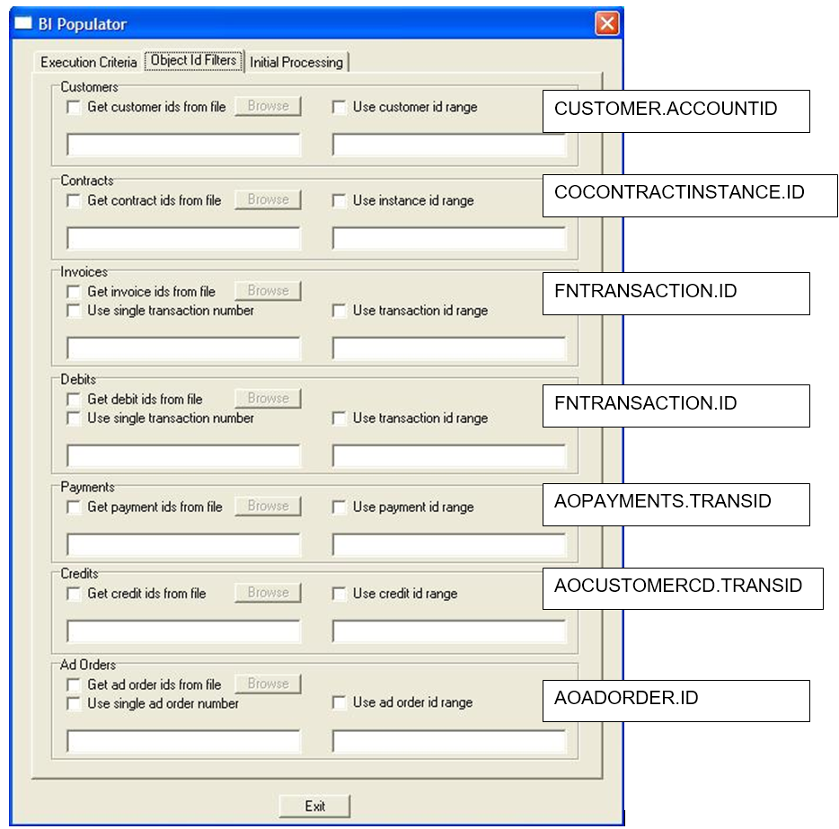

- [BI Populator Command Line Arguments](#bi-populator-command-line-arguments)
- [dmUser SysAdmin Setting](#dmuser-sysadmin-setting)
- [Spread Logic may Cause Large Spread Amount](#spread-logic-may-cause-large-spread-amount)
- [BI Populator Object Id Filter Mapping](#bi-populator-object-id-filter-mapping)

## BI Populator Command Line Arguments

The following command line arguments may be used to run the BI Populator from the command line prompt or to schedule the BI Populator to run using Schedule Admin. 

In the table, parameters are enclosed to indicate information that needs to be supplied by the user. When entering the actual parameter (e.g., the user name), do not use the <> symbols. For example, to enter the user name and password for a particular user and schedule an automatic run, you would type the following.

`-U username -P password –auto –date 01/01/2006`

| Argument 

 | Description                                                  |
| :--------------------------------------- | ------------------------------------------------------------ |
| -U \<username\>                          | Identifies the user for automatic login. Enter the AdBase User name to login. |
| -P \<password\>                          | Provides the password for automatic login. Enter the AdBase password to login. |
| -auto                                    | Runs the BI Populator in automatic mode. This means that the BI Populator executes automatically without a user having to click the Populate button. Once processing is complete, the BI Populator will automatically exit. This argument is primarily for use in Schedule Admin. |
| -continuous                              | Runs the BI Populator in automatic mode. This means that the BI Populator executes automatically without a user having to click the Populate button. Unlike the -auto argument, once the process is complete, the BI Populator continues to |
| -date \<start date\>                     | Specifies the start date in the absolute date format (mm/dd/yyyy). |
| -D \<# days in future\>                  | Specifies the start date as the number of days from the current date. |
| -duration \<# days\>                     | Specifies the end date as the number of days after the start date. |
| -crdate                                  | Specifies selection by the create date, rather than the last edit date. Using this argument is essentially the same as checking the Use create date box in the BI Populator window. When using this argument, do not specify a date. NOTE: If you do not use the crdate or ledate argument in the command line, BI Populator will run using whichever setting was selected the last time the utility was exited. |
| -ledate                                  | Specifies selection by the last edit date, rather than the create date. Using this argument is essentially the same as checking the Use last edit date box in the BI Populator window. When using this argument, do not specify a date. |
| -customer                                | Specifies customer population will be performed.             |
| -customerfile \<filepath\>               | Specifies a file containing a list of customer IDs to be populated. Note that if you use this argument, you do not have to use the -customer argument. The presence of the -customerfile argument specifies customer population will be performed. |
| -contract                                | Specifies contract population will be performed.             |
| -contractfile \<file path\>              | Specifies a file containing a list of contract IDs to be populated. Note that if you use this argument, you do not have to use the -contract argument. The presence of the -contractfile argument specifies that contract population will be performed. |
| -gl                                      | Specifies GL population will be performed.                   |
| -invoicefile \<file path\>               | Specifies a file containing a list of invoice IDs to be populated. Note that if you use this argument, you do not have to use the -gl argument. The presence of the -invoicefile argument specifies that invoice population will be performed. |
| -debitfile \<file path\>                 | Specifies a file containing a list of debit IDs to be populated. Note that if you use this argument, you do not have to use the -gl argument. The presence of the -debitfile argument specifies that debit population will be performed. |
| -paymentfile \<file path\>               | Specifies a file containing a list of payment IDs to be populated. Note that if you use this argument, you do not have to use the -gl argument. The presence of the -paymentfile argument specifies that payment population will be performed. |
| -creditfile \<file path\>                | Specifies a file containing a list of credit IDs to be populated. Note that if you use this argument, you do not have to use the -gl argument. The presence of the -creditfile argument specifies that credit population will be performed. |
| -adorder                                 | Specifies ad order population will be performed.             |
| -adorderfile \<file path\>               | Specifies a file containing a list of ad order IDs to be populated. Note that if you use this argument, you do not have to use the -adorder argument. The presence of the -adorderfile argument specifies that credit population will be performed. |
| -leavesettings                           | If you run two copies of the BI Populator, they interfere with each other’s settings. A copy of the BI Populator called with this argument will avoid updating the settings, leaving the original copy of the BI Populator alone. |

---

## dmUser SysAdmin Setting

A setting in System Admin &#129106;  Tools/System Level Information &#129106; Other Settings tab called “Update Existing dmUser Entry” is used to control when a user is moved to a new sales team, region, territory or company.

### Update Existing dmUser Entry - CHECKED

When this option is checked, any change made to the sales rep’s Team, Region, Territory or Company within system admin is reflected by updating the existing row in the dmUser table. 

### Update Existing dmUser Entry - UNCHECKED

If this option is not checked, than when a change is made to a sales rep’s Team, Region, Territory or Company a new row is created in dmUser for that sales rep, but his old row still exists. 

**What Does This Mean**

These options affect how the Sold By rep’s transactions are able to be reported.

Every transaction (ad taken) has a Sold By sales rep attached to it.  This is a field that is set in Adbooker.   

When this option is Unchecked it will effectively let the Sold By rep’s transactions “move” with him when he moves to a new sales team, territory or region.  

For example, Rep JDoe is on Team Alpha in '17 and in Dec '17 he sold 10 ads in which he was the rep in the Sold By field in Ad Booker.  If we were to run a report for Dec '17 for Team Alpha, Rep JDoe’s sales would be included in the total.    

If in Jan ’18 Rep JDoe was moved to Team Beta and Option 1 was set in System Admin, the same report, Dec '17 for Team Alpha, Rep JDoe’s sales would NO longer be included in the total.  

However if this option is checked in System Admin, the above report would be the same both before and after Rep JDoe was moved to Team Beta.  

Be aware the Rep JDoe always is the Sold By rep on the ads.  This just allows you to choose what Team, Region, Territory or Company those ads should show up in.

---

## Spread Logic may Cause Large Spread Amount

> First seen in 2009

First and foremost this is not a bug in the sense that there is an error in the code.  As you will see it is caused by how the spread is calculated.

The spread algorithm is designed to spread an amount, like order level charges, credits, etc, across all other charges and distribute a weighted amount to each.  

Here is how the algorithm figures the weights:

Assume we are spreading a $50 Order Level charge across an ad with 3 revenue entries

1.	Add all the revenue amounts together that we are going to spread the order level charge across.  (Amount Column)
2.	Divide each line item amount by the total amount to get a weighted percentage of how much of the spread amount to allocate to this line item.
3.	Multiply the Spread Amount by the calculated percentage found in step 2 to get the spread amount allocation.

This works fine until you run into a situation with line items as follows:

You can see that because the final total is a small number our percentages are very high, but in the end add to a total of 100% and the spread amount add to the correct number.

This is most commonly seen in Till forbid ads.

---

## BI Populator Object Id Filter Mapping

The BI Populator allows you to manually populate individual records from the Object Id Filters tab.  Below is a mapping to the fields that are being referenced on this tab.

