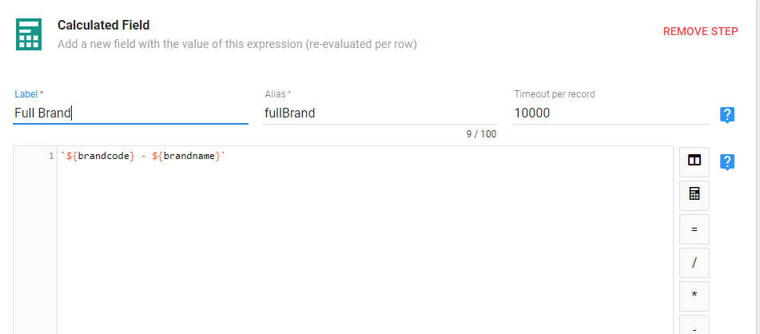
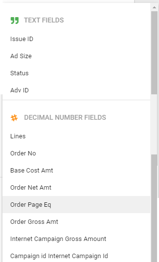
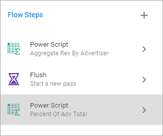

There are two primary ways that you can use JavaScript in Informer to enhance your data.  Both of these ways come in the form of **Flow Steps**.

You can add **Flow Steps** to either a *Ad Hoc Report* or a *Dataset*.  They will act the same, however all examples in this document will be on *Datasets*.

The two Flow Steps that you use JavaScript in are **Calculated Fields** and **Power Scripts**.  

> NOTE: If a Calculated Field is acting irrationally, copy the script text, remove the flow step and recreate it.  This is after you have concluded that the issue is not in the logic of your script.

A **Calculated Field** will allow you to use JavaScript to define a single field.  This can use existing fields in the logic as well.

A **Powerscript** is different from a Calculated Field in that it will allow you to create multiple fields with a single script.  

## Calculated Fields

To add a Calculated Field to a Dataset, you will first need to Edit the Dataset that you want to add the field to.

Once in the Edit screen click on the plus sign by the **Flow Steps**.  You will be presented with a menu where you will choose **Add Field/Calculated Field**. 


You will be presented with the Calculate Field window below:


1. **Label** - This will be the new field name that your calculated field will create.  The Alias will be created for you automatically.
2. **Code Window** - This is where you will put your JavaScript code for the new field
3. **Helper Buttons** - These buttons are just helpers.  The only one you really need is the first one.  This is the *inputs* buttons.  It will allow you to choose the existing fields in your dataset to use in your calculation of the new field.

It is important to understand how Informer uses the JavaScript in your calculated field.  

Understand that the **Dataset** is like a query in that it will return a number of rows.  Each of those rows will have the same fields (obviously, each row will have different values for the fields).

Informer will take each row of fields from the dataset and pass it to the **Calculated Field** code.

Informer will then evaluate all the JavaScript code that you enter and the actual field value will be the whatever is returned by the last expression in the code.

So now that we know that each row of data is passed to the **Calculated Field Flow Step**, then it follows that we have access to all the fields and their values in our calculated field code.

That means we can use field values to make decisions on what to output as our new calculated field.

Before we get into examples, there is one other concept to understand.  The actual field value of the calculated field will be the whatever is returned by the last expression in the code.  

For example, if you put the following in the Code Window:

```javascript
'one'
'two'
'this is what the field will be'
```

The last string *'this is what the field will be'* is what will be returned for the field value.

## Calculated Field Examples

While the following examples are contrived, each of them will try to show some of the most useful JavaScript features that you can use within **Calculated Fields**.

### Calculated Fields with Multi-value Fields

When working with a field that is Multi-Valued within a Calculated field, you will get an JavaScript array to work with.  

For example, if you have the following data:

| Order # | Customer | OrderAmounts |
| ------- | -------- | ------------ |
| 1       | Cust_01  | 120,250, 75  |
| 2       | Cust_02  | 50           |
| 3       | Cust_03  |              |

When you access the *Order Amounts* field in your calculated field you will get the following for each row:

| Order # | Value in Calc Field for OrderAmounts |
| ------- | ------------------------------------ |
| 1       | [120, 250, 75]                       |
| 2       | [50]                                 |
| 3       | []                                   |

Once you understand this, then you can effectively work with Multi-Valued fields within Calculated fields.

Let's say that you want to take the above data and get a total for each multi-valued field.

You could use this code:

```javascript
orderAmounts.reduce((sum, val) => sum += val, 0)
```

You may want to read up on the [Array's reduce](https://developer.mozilla.org/en-US/docs/Web/JavaScript/Reference/Global_Objects/Array/reduce) function.

The main takeaway here is that multi-valued fields are represented as JavaScript arrays in Calculated fields (and Power Scripts).

### Field Concatenation using + and Template Literals

This first example is simply going to concatenate two fields together into a new field.  However, we are going to do it two ways.  The first, easiest way will show you how JavaScript concatenation works.  The second way is going to use [Template Literals](https://developer.mozilla.org/en-US/docs/Web/JavaScript/Reference/Template_literals) a powerful new way to create and concatenate strings in JavaScript.

In this example, we will concatenate the Brand Id and Brand Name with a hyphen separating them.  The new field will be called "Full Brand"

**Easy String Concatenation**

To start with, you will need the field names.  It is best to use the Input button to the right of the code window.  When you press it, it will show you a list of fields from you dataset.  Here we will choose *Brand Id*.


This will insert the field name into our code window.  Be aware that the field name shown in the code may be different that what is shown in the input button's drop down.  This is because sometimes fields have Aliases put on them to make them more human readable.  This is yet another reason to ALWAYS use the input button to get your field names.

To concatenate items in JavaScript, simply use the + operator.  This is what would appear in the Code Window.

```javascript
brandcode + '-' + brandname 
```

You may be wondering what happens if one of the values you are concatenating is a number.  This is important.  JavaScript will coerce the types when needed.  For example, if you had two numbers `1 + 2` this will actually add the numbers together and return `3`. However, if you have a mixture of string and numbers  concatenated by a + operator, then the numbers will be coerced to string and thus be concatenated.

**Template Literal Concatenation**

[Template Literals](https://developer.mozilla.org/en-US/docs/Web/JavaScript/Reference/Template_literals) are very cool!  First, if the above explanation about coerced values confused you, then take heart, because with Template Literals, you do not have to worry about this.

Here is the same example as above, but with template literals.

```javascript
`${brandcode} - ${brandname}`
```

Lets go over the syntax.

A template literal is enclosed in back ticks.  Not a single quote, but a back tick, usually located on the same key as the tilde (~).

Next, if you need to include a field value, you will use a dollar sign followed by curly braces with the field value inside of the curly braces.  This just tells the template literal to evaluate what is inside those curly braces.  In our example, that means returning the value that is in the field.

Here is what it looks like in Informer:



### SQL Case When in JavaScript

A common thing to do in SQL when you want to modify your output based on the value of a field is to use a CASE ... WHEN statement.

In JavaScript, this can be accomplished with [**if...then...else**](https://developer.mozilla.org/en-US/docs/Web/JavaScript/Reference/Statements/if...else) statements or a [**switch**](https://developer.mozilla.org/en-US/docs/Web/JavaScript/Reference/Statements/switch) statement.  

Both accomplish the same thing, however if you have many cases you want to check for, then the **switch** statement can sometimes be more readable.  

### Wildcard Searching

Sometimes the field you are creating will be based on if another field is like some value.  Usually we would call this a wildcard search and use an asterisks (*) to denote the "wildcard".  

In JavaScript you will instead use [String Functions](https://developer.mozilla.org/en-US/docs/Web/JavaScript/Reference/Global_Objects/String) to search within strings.  The easiest to use in the [includes](https://developer.mozilla.org/en-US/docs/Web/JavaScript/Reference/Global_Objects/String/includes) function.  Other useful functions are [startsWith](https://developer.mozilla.org/en-US/docs/Web/JavaScript/Reference/Global_Objects/String/startsWith) and [endsWith](https://developer.mozilla.org/en-US/docs/Web/JavaScript/Reference/Global_Objects/String/endsWith).

Each of these functions (*includes, startsWith* and *endsWith*) return a Boolean (true or false).  You can then use this return value to decide what to do.

**includes Example**

This example will use the includes string function to see if the Brand Name has any spaces in it.  If it does, then we will return the brandname with the spaces removed, otherwise just return the brandname.

```javascript
if (brandname.includes(' ')) {
  'Includes Spaces'
} else {
  'NO Spaces'
}
```

The **brandname** is a String field.  This is important, as the *includes* function only works on string fields.

How can you tell what is a "string", when you click on the *inputs* button on the right of the *Code Window* you will see a drop down that displays the fields in your dataset.  Informer is nice to you and tells you exactly what data types the fields are.  You will see strings ("TEXT FIELDS"), Numbers and Dates.



I'm sure you asking, what if I have a field that is a number data type, but I want to search in it like a string?  For example, the Order No field above is a number, but maybe you want to search it with the *includes* function.  You can do this!

```javascript
if (orderno.toString().includes('1')) {
  'Includes 1'
} else {
  'Does not include 1'
}
```

You can use the *toString()* function to convert the number to a string so that you can use the *includes* function on it.

The *startsWith* and *endsWith* work just the same as includes, except they look for the search string at either the start or the end of the field value.

### Replacing Values in a String

In this example, you will replace all occurrences of a space in a fields value.  To do this you will use the [replace](https://developer.mozilla.org/en-US/docs/Web/JavaScript/Reference/Global_Objects/String/replace) function that each string has access to.

```javascript
brandname.replace(/\s/g, '')
```

The replace function has two arguments, the first is what do I search for to replace and the second is the string to replace what I found of the first argument.

The first argument can be either a string value or a regular expression.  

> If you use a String for the first argument, it will only replace the FIRST occurrence of the string pattern that is found.  This usually is not what you are looking for when using the replace function.  Therefore, you will probably want to use a regular expression.

Regular expressions can be bit tricky.  There are books written on how to use and create them. If you want to explore regular expression deeper, just search google and you will find a lot.

I will give you two patterns that should answer most of your replace needs.

> The regex expression is found inside the `/.../` forward slashes.  The characters after the final forward slash will be can either `g` or `i` or both.  `g` means global.  So search the whole string and find all matches.  The `i` means ignore case when doing your search.

1. **Replace Spaces** - `/\s/g`  the stuff inside the forward slashes will be the regular expression. Here the \s is stating the we want to match any whitespace (spaces, tabs, new line characters and carriage returns).
   If you want to replace whitespace only where there are more than a certain number, you can modify your regex like this:
    `/\s{3}/g` 
   Now it will only replace if it finds 3 whitespace characters in a succession. 
2. **Replace Words** - `brandname.replace(/ABC/gi, 'CBA')` Notice the the regex expression is just the text you want to look for with NO quotes.  I have also add the `gi` switches so that it searches and replaces all occurrences and ignores case while doing it.


### Mimicking the IN keyword

In JavaScript there is not an "IN" keyword like there is in SQL.  However, the technique shown below will help you mimic this feature.

You use the "IN" keyword when you have a question like:

> Return all the customers whose name matches one of "a list of customer names..."

In SQL, it would look like `customername IN ('name1', 'name2', 'name3')`

To do this in an Informer Calculated Field, you will create an Array that holds all of the values you are looking for and then use the Array's prototype function **includes** to determine if a field is in those array values.

#### Match Full

```javascript
var matchCodes = ['Luxottica USA', 'Audi UK', 'Google']

if (matchCodes.includes(advname)) {
    'Full Match'
} else {
    'Criteria Not Met'
}
```

You have seen the **includes** function used on a string field.  Here we are using it on an Array looking to see if any of the values stored in `matchCodes` matches the `advname` field value.  If it does, `true` will be returned.

> NOTE: When you use the **includes** function on a *string* you get the effect of a Wild Card search.  Meaning that if any part of the string matches your search it returns true.
>
> However, when using the **includes** function on an *array*, it will search for items in the array that are an exact match to what you are searching for.  To do wild card searches on arrays, see the [Wild Match Array Values](#wild-match-array-values)

However, this will look for full matches, not partial.  To enable "wildcard" searches against a list of values, you need to change the above up a little bit.

#### Wild Match Array Values

```javascript
var wildMatchCodes = ['Luxottica USA', 'Audi UK', 'Google', 'AMC']

if (wildMatchCodes.some(wildValue => advname.includes(wildValue))) {
    'Wild Match'
} else {
    'Criteria Not Met'
}
```

In the above example, we used the [some](https://developer.mozilla.org/en-US/docs/Web/JavaScript/Reference/Global_Objects/Array/some) Array function, which accepts a function as an argument.  What the some function does, is send each value in the array, one at a time, through the passed function `wildValue => advname.includes(wildValue)`

That function will run once for every item in the **wildMatchCodes** array.  We will then use the **includes** string function to see if the **advname** field value *includes* the wildValue.  [See Wildcard Searching](#wildcard-searching) for details on using the includes with string values.

> To change any of these to be NOT IN, simply add the JavaScript not operator- ! to the return value.


### Building a Complex Example

You can combine all of the above techniques to get the final result that you need.  In this example we will be working with the `campaignCode` and `billNameId` fields.

When building complex scenarios it is very important that before you start to code anything, you have a clear written plan of what your scenario is.

I find it is best to work backwards.  So start with what will the final values be in your field.  Then define what criteria must be met for each of the values to become the selected value.

This process is best understood with an example, so let's get started.

#### Define The Final Field

First, we need to name our final field.  It will be called **FinalOrderType**. 

**Define our final Values**

Before we can even start with criteria, we must know what the final options for the values can be.

These values are

- Corporate
- Private
- Unknown

Next, define what criteria must be met for each of these to "win" at being the final value for our new field.

I find it make it easier to understand if we define these criteria in a table listing the field the criteria applies to, the Operation and the Detail.

#### Define Requirements

The requirements for **Corporate** becoming the final value are:

| Field        | Operation           | Detail                                                       |
| ------------ | ------------------- | ------------------------------------------------------------ |
| campaignCode | Starts With         | '3' OR 'P'                                                   |
| campaignCode | Must Not Match      | '3C11CUDO','3C11CDOP','3C11CDOS',<br />'P1203CUD','P1207CUD','P1BETOP','P1BEAWW',<br />'P1303BLK','3C17WWG2', 'PIAGENT' |
| campaignCode | Must Not Start With | 'PHW','PWW','HW1','HWK','PM1','PK5','PMB',<br />'PMR','PF5','PMS','PFB','HRI','PRI','PKM','PM6','PM7',<br /> 'PI', 'PWWW' |

The requirements for **Private** becoming the final value are much simpler, but we still keep our table format:

| Field      | Operation    | Detail |
| ---------- | ------------ | ------ |
| billNameId | Greater than | 3      |

The requirements for **Unknown** becoming the final value is the easiest and doesn’t require a table.

| Requirement                                                  |
| ------------------------------------------------------------ |
| **Unknown** is the default value if no other conditions are met for the other values. |

#### Build your Code

Now we can start coding.  Since the criteria for the first value (Corporate) is complex, we will code each of the requirements and store the result in a variable.  These variables can then be combined later.

We will start with the **first criteria** requirement.

| Field        | Operation   | Detail     |
| ------------ | ----------- | ---------- |
| campaignCode | Starts With | '3' OR 'P' |

```javascript
// Returns true for any row where the campaignCode starts with 3 or P
var criteria_startWith = campaignCode.startsWith('3') || campaignCode.toLowerCase().startsWith('p') 
```

We have created a variable **criteria_startWith** that holds the result of either **true** or **false**.

It will hold true if the current rows campaignCode value starts with either a '3' or 'P'.

The **next requirement**:

| Field        | Operation      | Detail                                                       |
| ------------ | -------------- | ------------------------------------------------------------ |
| campaignCode | Must Not Match | '3C11CUDO','3C11CDOP','3C11CDOS',<br />'P1203CUD','P1207CUD','P1BETOP','P1BEAWW',<br />'P1303BLK','3C17WWG2', 'PIAGENT' |

```javascript
var campCodeMatchList = ['3C11CUDO','3C11CDOP','3C11CDOS','P1203CUD','P1207CUD','P1BETOP','P1BEAWW','P1303BLK','3C17WWG2', 'PIAGENT']
// Returns true for any row where campaignCode is NOT IN the campCodeMatchList
var criteria_CCNotIn = !campCodeMatchList.includes(campaignCode)

```

To check this criteria, we must first create an array with all of the values that the campaignCode must NOT match.  Then we use the [Match Full](#match-full) technique to see if the current campaignCode matches and values in the array.  But, since this is a must NOT match criteria, we throw the not operator (!) in front of the expression: `!campCodeMatchList.includes(campaignCode)`

The **last requirement:**

| Field        | Operation           | Detail                                                       |
| ------------ | ------------------- | ------------------------------------------------------------ |
| campaignCode | Must Not Start With | 'PHW','PWW','HW1','HWK','PM1','PK5','PMB',<br />'PMR','PF5','PMS','PFB','HRI','PRI','PKM','PM6','PM7',<br /> 'PI', 'PWWW' |

```javascript
// Returns true for any row where the campaignCode does NOT start with a value from the campCodeNOTStartsWithList.
var campCodeNOTStartsWithList = ['PHW','PWW','HW1','HWK','PM1','PK5','PMB','PMR','PF5','PMS','PFB','HRI','PRI','PKM','PM6','PM7', 'PI', 'PWWW'] 
var criteria_CCNotStartsWith = !campCodeNOTStartsWithList.some(swValue => campaignCode.startsWith(swValue))
```

To check this criteria, we must first create an array with all of the values that the campaignCode must NOT START with.   Then we use the [Wild Match Array Values](#Wild-Match-Array-Values) technique to campaignCode's that start with the values in our array.  Lastly, since this is a NOT condition, we apply the JavaScript not (!) operator to the result.

Now we have three variables that will each tell us if the campaignCode for the given row complies with one of the conditions set forth in our table.  Since all conditions must be true for the campaignCode to "pass", we will combine these variable in an if statement.

```javascript
if (criteria_startWith && criteria_CCNotIn && campCodeNOTStartsWithList) {
    'Corporate'
} else ...
```

We are using the JavaScript **&&** operator to find out if all of these variables are true.  It is equivalent to saying 

*If criteria_startWith is true and criteria_CCNotIn is true and campCodeNOTStartsWithList then ...*

We can test for the **second requirement** by taking on another if statement to the else and the final else will handle everything that doesn't match the first two requirements.  

**Final If Statement**

```javascript
if (criteria_startWith && criteria_CCNotIn && campCodeNOTStartsWithList) {
    'Corporate'
} else 
  // This if would check the billing status, but I don't know where that field is  
  if (billNameId > 3) {
    'Freen'
} else {
    'Grace Status'
}
```

#### Final Code

```javascript
// Returns true for any row where the campaignCode starts with 3 or P
var criteria_startWith = campaignCode.startsWith('3') || campaignCode.toLowerCase().startsWith('p') 

var campCodeMatchList = ['3C11CUDO','3C11CDOP','3C11CDOS','P1203CUD','P1207CUD','P1BETOP','P1BEAWW','P1303BLK','3C17WWG2', 'PIAGENT']
// Returns true for any row where campaignCode is NOT IN the campCodeMatchList
var criteria_CCNotIn = !campCodeMatchList.includes(campaignCode)

// Returns true for any row where the campaignCode does NOT start with a value from the campCodeNOTStartsWithList.
var campCodeNOTStartsWithList = ['PHW','PWW','HW1','HWK','PM1','PK5','PMB','PMR','PF5','PMS','PFB','HRI','PRI','PKM','PM6','PM7', 'PI', 'PWWW'] 
var criteria_CCNotStartsWith = !campCodeNOTStartsWithList.some(swValue => campaignCode.startsWith(swValue))

//------Billing Status check ---//

if (criteria_startWith && criteria_CCNotIn && campCodeNOTStartsWithList) {
    'Corporate'
} else 
  // This if would check the billing status, but I don't know where that field is  
  if (billNameId > 3) {
    'Freen'
} else {
    'Grace Status'
}
```

## Powerscripts

Power Scripts are advanced scripts (JavaScript) that gives you complete control over the data.  A Power Script is JavaScript with a sandboxed script context

Here are the predefined keywords you can use in your Power Script. [Informer Docs](https://informer5.zendesk.com/hc/en-us/articles/115005113823)

| Keyword | Type            | Desc                                                         |
| ------- | --------------- | ------------------------------------------------------------ |
| $record | object          | The current row. You may modify this row.                    |
| $index  | number          | The current row number (row 1 = index 0)                     |
| $omit() | function        | When called, removes the current row                         |
| $fields | object          | Field metadata                                               |
| $field  | function        | Function to describe a field: $field('location').label('Loc') |
| $inputs | object          | User Inputs                                                  |
| $local  | object          | Variable that is not cleared from on record to the next      |
| _       | object/function | Lodash v3 library. [lodash](https://lodash.com)              |
| moment  | function        | moment date manipulation library. [momentjs](https://momentjs.com) |

To declare a variable use the `var` keyword. 

```javascript
var gtp = $inputs['greaterThanPrice'] || 0;
if($record.baseCost >= gtp) {
    $record.isGreaterThan = true
} else {
    $record.isGreaterThan = false
}
```

Do not `return` anything from the Power Script.  Simply change the value of what you want.

You can create multiple fields in a single Power Script.

### Using $local

The $local keyword is very powerful in that it persists throughout the load process.  First thing to understand is that it is an Object.  Which means, you can declare multiple local persistent variables using the $local keyword:

```javascript
$local.count = 0;
$local.otherVariable = "x";
```

However, if you were to declare the $local variables as above, they would be reset every time.  To declare these types of variables, you must first check if they exists, if they do, continue, if they don't, then create them:

```javascript
if(!$local.count) { // if this var doesn't exist then
  $local.count = 0 // initialize it
}
// Another method that does the same thing
$local.count = ($local.count) ? $local.count : 0

// Last way to do the same thing
$local.count = ($local.hasOwnProperty('count')) ? $local.count : 0
```

If you wanted to create a row count variable, you would pick one of the above methods to perform the initialization and then increment the count and store in a `$record` variable.

```javascript
if(!$local.count) { // if this var doesn't exist then
  $local.count = 0 // initialize it
}
//This will create a rowCount record for every row
//the ++ at the end of the $local.count will increment AFTER it assigns 
//whatever is in $local.count.  This just means your first row will be 0.
$record.rowCount = $local.count++
```

### Numbers and Other Gotchas

You must be aware of the data type of the fields you are using and if there are any *Null* values in the fields you are using.

For Example, if you wanted to get a running total by Customer (AdvName) and the field you were using to get this running total (priceActAmt) had null values in it, you would need to take that into account in your script.

### Delete a column

Use the keyword **delete** followed by the column you want removed.

```javascript
delete $record.columnToDelete
```


## Powerscript Examples

### Getting Total By Advertiser and % of Total By Advertiser

The `$local` variable can be very powerful by itself, but when used in conjunction with the **Flush** flow step, you can do a number of other things.

It is important to understand that the `$local` object will persist between running a Power Script and a **Flush** flow step.

**Goal**

The goal is to get a field that sums the revenue for an advertiser and then uses that to calculate the percentage of total for every row.

>  This is vastly different from the **Percent of Total** flow step as this is based on the Grand Total versus totals by advertiser.

To do this we need three flow steps.

1. **Power Script Flow Step** - used to calculate the Total Revenue for each Advertiser.  This information will have to be stored in the `$local` object so that it is persisted.
2. **Flush** - Starts a new pass of the data with our `$local` object intact.
3. **Power Script Flow Step** - used to calculate the % of Total Revenue per Advertiser and create the fields 
   - **$record.percentOfTotalByAdv** - This is the field we want, the % of Total Revenue by Advertiser.
   - **$record.TotalByAdv** - This is the subtotal for each advertiser.  We really don't need to expose this as a record, but it is useful for testing.

Here is what the Flow steps look like:



**Power Script - Aggregate Rev By Advertiser**

```javascript
// The usual initialization code
if (!$local[$record.advCode]) {
	$local[$record.advCode] = 0    
}
// Add current records amount to the running total
$local[$record.advCode] = $local[$record.advCode] + $record.orderNetAmt 
```

The unique thing that is happening in the **Aggregate Rev By Advertiser** Power Script, is that we are create a different object property on the `$local` object for each advCode (advertiser).  This allows us to keep a different total for each Advertiser.

Next we just run the **Flush** Flow step.

**Power Script - Percent Of Adv Total**

```javascript
$record.percentOfTotalByAdv = ($record.orderNetAmt / $local[$record.advCode])
$record.TotalByAdv = $local[$record.advCode]
```

This above code is simply creating the two new fields that we want.  

### Proper Aggregations in Normalized data

I will start by saying this code is not recommended for large datasets.  It slows down the load considerably.  However, it is always worth a try to see if will help.

The scenario that call for this is a dataset that is loading a group of fields that includes some **multivalued** fields and that also runs a **Normalize** flow step on these multivalued fields.

This results in "duplication" of the data in non-multivalued fields.  Makes sense and works fine, unless you have a numeric NON multivalued field that you want to aggregate on.  This results in an over aggregation of this field.

For example, if we had a dataset that contained the following:

| Field Name        | Multivalued? |
| ----------------- | ------------ |
| Order ID          | NO           |
| Order Total       | NO           |
| Order Line Number | YES          |
| Order Line Amount | YES          |

Then the normalized dataset would look like this:

| Order ID | Order Total | Order Line Number | Order Line Amount |
| -------- | ----------- | ----------------- | ----------------- |
| A        | 100         | A001              | 50                |
| A        | 100         | A002              | 50                |
| B        | 500         | B001              | 500               |
| C        | 600         | C001              | 200               |
| C        | 600         | C002              | 300               |
| C        | 600         | C003              | 100               |

If you try to aggregate on the Order Total field you will get the incorrect amount because that line has been "duplicated" because of the normalization.

> NOTE: This is as intended and is to be expected.

Since this is how Informer works, we will need to get around this another way.  This is can be accomplished via a Powerscript.

What we are trying to do is to get the dataset to look like this:

| Order ID | Order Total | Order Line Number | Order Line Amount |
| -------- | ----------- | ----------------- | ----------------- |
| A        | 100         | A001              | 50                |
| A        | 0           | A002              | 50                |
| B        | 500         | B001              | 500               |
| C        | 600         | C001              | 200               |
| C        | 0           | C002              | 300               |
| C        | 0           | C003              | 100               |

To do this, we will need to do two things.  First, you must add a counter to your Dataset and name it **preCounter**


The counter creation will be the first Flow step.

Next do any other flow steps that need to happen before the Normalize (it is Ok if it is none), then do the Normalize Flow step.

Lastly, create a Powerscript called "OneToManyFix" (or whatever you want to call it).

Past the following code in the Powerscript.

```javascript
// Initialize "prevCounter" in the local object if undefined
if (!$local["prevCounter"]) {
    $local["prevCounter"] = 1
}
// Check to see if our stored counter variable is the same as the current one
// If it is, then this is a "Duplicate" and we should zero out any numeric
// variables that we want to aggregate
if ($record.preCounter === $local["prevCounter"]) {
    $record.beforeTaxAmt = 0
}
// update our local copy of the counter to the current one.
$local["prevCounter"] = $record.preCounter
```

You are not done yet!  You need to customize the contents of the second if statement

```javascript
if ($record.preCounter === $local["prevCounter"]) {
// These will be all the fields that you do not want to be duplicated.
// These fields will be numeric fields
    $record.beforeTaxAmt = 0
    // add yours here
}
```

