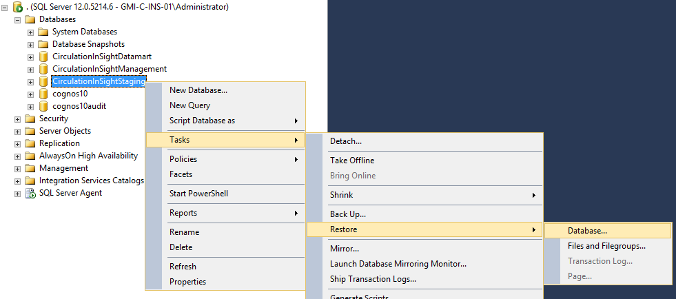

## Export Control Query

Use the below query to determine what the run control needs to be set to for the next load.

```sql
SELECT ec_processname, 
	     ec_db_Desc,
       CONVERT(VARCHAR, ec_processstamp, 1)   DateDone, 
       CONVERT(VARCHAR, ec_processstamp, 108) TimeDone 
FROM   circulationinsightstaging..stg_dim_exportcontrol
ORDER BY ec_db_Desc, ec_ProcessName desc
```


## Restoring InSight Staging Database

It is important to keep the Staging database in sync with the export files that are coming over from the Circulation system.  

Normally, this happens automatically.  As data is loaded, each subsequent day's export files have the correct data to keep everything in sync.

However, if there is a load failure, the InSight Staging database must be restored to a previous point in time so that the export files can be loaded.

Once you have restored the Staging database, you must run the following query to find out what data the next set of Circulation export files must contain.

```sql
SELECT ec_processname, 
	     ec_db_Desc,
       CONVERT(VARCHAR, ec_processstamp, 1)   DateDone, 
       CONVERT(VARCHAR, ec_processstamp, 108) TimeDone 
FROM   circulationinsightstaging..stg_dim_exportcontrol
ORDER BY ec_db_Desc, ec_ProcessName desc
```

This information is what is needed to set the Circulation Run Control properly.

To restore the InSight Staging database you must first log into SQL Server on the server with the issue.

Right click on the **CirculationInSightStaging** database, choose Tasks/Restore/Database



The next screen you see in SQL Server after choosing to restore a database will be:


In the name of the Staging database backup you will see the date of the backup expressed as **YYYYMMDD**.

Now you must choose the appropriate backup to restore.  Most of the time this will be the last backup created and will be auto populated.  However, sometimes you may need to choose an earlier backup.  Just be aware of which backup you are restoring.

Usually the backups are stored on the E drive. `E:\Backups\Databases\CirculationInSightStaging`.  You can view the options you have to restore there or use the **Timeline** button in the SQL Server Restore Database dialog.

## Manually Mark Load as Complete

Sometimes a load will make it through the publish of the Database only to fail on building cubes or making backups.  Neither of these issues require a reload of that days data, but instead, if it is cubes that fail, simply reload cubes.  If it is a backup that failed, simply run the backups manually.

However, this will still leave you with the a load that is failed, waiting to be restarted.  

At this point, you have two options.  Either delete the load (clicking on the X by the load) or manually marking the load as complete.

Marking the load as complete usually is the best option.  This leaves record of the load and what the issue was, however, it clear it so that the next load will run.

To manually mark a load as complete, you will need to use the `insightctl.exe` program.

- Go to `C:\Program Files\CirculationInSight\bin\insightctl` and start the `insightctl.exe` program.
- In the command line that launches, type the following:
  - su
  - changeeventstatus xxxx "Complete".
  - exit
  - exit

> Note: Step 2 above, replace the xxxx with the Event ID from the InSight Web Admin of the load you want to mark as complete.

Here is what it will look like with an incorrect entry first:


## Restart with Run Control Reset

if you ever see that green play button, it means that the load failed. All subsequent “Pending” messages just mean they are waiting for the previous error to be fixed.

 

If you even see this, it means that the load have been in a failed state for more than one day, which means run control will NEED to be set before a reload can happen.

To get the load back on track when you are in this state, you will need to do the following:

**Delete Data Files**

Go to the `E:\CirculationInSight\Data\DataFiles` directory and delete any files that exist in that directory. 

There probably won’t be any, but if there are, they will be `*.asc` or `*.tmp` files. 

Then you must delete any folders that conform to the format in the image below. YYYMMDD-n.

You need to do this so that when we delete the jobs, the load won't immediately start again.  Instead it will wait for the next set of ASC files.


**Delete The Suspended Jobs**

Next, you will need to go to the Circulation InSight Admin panel and click on the "x" by each pending or failed job.


After you have deleted each job, you screen should look something like this:


**Restore the Staging Database**

[Next restore the staging database](#restoring-insight-staging-database)

**Run Control Setting**

Lastly, you will need to find the appropriate run control settings and reset the run control.

If the site is NOT McClatchy, you can simply run this query in after the database has been restored:

```sql
SELECT ec_processname, 
	     ec_db_Desc,
       CONVERT(VARCHAR, ec_processstamp, 1)   DateDone, 
       CONVERT(VARCHAR, ec_processstamp, 108) TimeDone 
FROM   circulationinsightstaging..stg_dim_exportcontrol
ORDER BY ec_db_Desc, ec_ProcessName desc
```

If it is McClatchy follow the [McClatchy Run Control Settings](#McClatchy-Run-Control-Settings)

## McClatchy 

### Run Control Settings

For all three McClatchy InSight servers, you cannot run the standard query to get run control information.  This is because McClatchy has multiple sites/companies sending data over to each server.  It was set up in such a way that if one of those companies didn't send over data, the others would still load.  This means that not all companies run control information will be the same.

To find the run control information, you must get it for each site.  This information is located in the following directory - `E:\CirculationInSight\Data\DataFiles\backups\`

This directory will contains Zip files of each days loads.  The tricky part is to find the correct zip file to pull the run control information from.

A good rule of thumb is look at the date of the Staging Database Backup file that you restored.


This is the backup that I restored, it is dated 4/4/2020 at 3:53am.

Now, go into the backups directory and look at the zip files.  The zip file that is needed is the first one dated prior to the backup that was just restored.

You can see the one data 4/3/2020 at 9:54 pm is the first zip file before our backup data.


Next, open up the zip file and navigate to `pbs\exchange`. In this directory you will find one folder for each site that you need to pull run control information for.

You must go to each of these sites folders, expand and navigate to `sitename\cm\insight`  and then open the **cmExportControl.asc** file and copy that information to a new notepad.


You final list will look something like this:

```
"MCCCM-BLX"|"InSight Export"|04/03/20|"21:01:32"|no|5
"MCCCM-BLX"|"InSight Draw"|04/04/20|"24:00:00"|no|5

"MCCCM-BRD"|"InSight Export"|04/03/20|"21:03:02"|no|5
"MCCCM-BRD"|"InSight Draw"|04/04/20|"24:00:00"|no|5

"MCCCM-CLB"|"InSight Export"|04/03/20|"21:07:32"|no|5
"MCCCM-CLB"|"InSight Draw"|04/04/20|"24:00:00"|no|5

"MCCCM-CLT"|"InSight Export"|04/03/20|"21:06:02"|no|5
"MCCCM-CLT"|"InSight Draw"|04/04/20|"24:00:00"|no|5

"MCCCM-COL"|"InSight Export"|04/03/20|"21:00:47"|no|5
"MCCCM-COL"|"InSight Draw"|04/04/20|"24:00:00"|no|5

"MCCCM-HHI"|"InSight Export"|04/03/20|"20:00:08"|no|5
"MCCCM-HHI"|"InSight Draw"|04/04/20|"24:00:00"|no|5

"MCCCM-MAC"|"InSight Export"|04/03/20|"21:08:17"|no|5
"MCCCM-MAC"|"InSight Draw"|04/04/20|"24:00:00"|no|5

"MCCCM-MIA"|"InSight Export"|04/03/20|"21:00:10"|no|5
"MCCCM-MIA"|"InSight Draw"|04/04/20|"24:00:00"|no|5

"MCCCM-MYB"|"InSight Export"|04/03/20|"21:02:17"|no|5
"MCCCM-MYB"|"InSight Draw"|04/04/20|"24:00:00"|no|5

"MCCCM-RAL"|"InSight Export"|04/03/20|"21:03:47"|no|5
"MCCCM-RAL"|"InSight Draw"|04/04/20|"24:00:00"|no|5

"MCCCM-RHL"|"InSight Export"|04/03/20|"21:06:47"|no|5
"MCCCM-RHL"|"InSight Draw"|04/04/20|"24:00:00"|no|5

"MCCCM-STC"|"InSight Export"|04/03/20|"21:04:32"|no|5
"MCCCM-STC"|"InSight Draw"|04/04/20|"24:00:00"|no|5
```

### Connecting to MCC Servers

When you click on the Dashboard icon on one of the McClatchy servers, it launches IE with a localhost based URL, but for some reason McClatchy sites need to use the host name.
Below are the links for each site.
[MCC Central - http://mcc-c-ins-cst-01.mcc.loc/ibmcognos](http://mcc-c-ins-cst-01.mcc.loc/ibmcognos)
[MCC East - http://mcc-c-ins-01.mcc.loc/ibmcognos](http://mcc-c-ins-01.mcc.loc/ibmcognos)
[MCC West - http://mcc-c-ins-wst-01.mcc.loc/ibmcognos](http://mcc-c-ins-wst-01.mcc.loc/ibmcognos)

## IBM Cognos Service won't Start / Cubes won't Build

The first thing to check if the cubes don't build is the **IBM Cognos** Service:

If the the service isn't started, try to start it.  It is starts, rerun the Cube build.  If, however, the **IBM Cognos** service will not start, then you will need to check the IBM Cognos Configuration application.

To do this, find the  **IBM Cognos Configuration** application and start it.

You may see two Icons when you search for the **IBM Cognos Configuration** app.  If the one you choose, doesn't look like the image below, try the other one.

You will need to go to "Data Access -> Content Manager -> cognos10".  Click in the "User ID and password" section and click on the edit button.

 

When you do this, you will be presented with a dialog that will allow you to enter the credentials to log into the SQL Server database.  Update these to be correct.


Once done, choose File / Save and then File / Exit.  It will ask if you want to start the service.  Say yes.

### cognos10 / cognos10audit DBs corrupt

Another reason for the IBM Cognos service to not start is because the cognos10 and cognos10audit databases are corrupted.  This usually only happens on a new install.

> Be aware if you follow these steps on an existing installation you will loose the information stored in these cognos databases.  Not sure exactly what this is, but it could be user security settings or other information that would be difficult to restore.  Just be aware

**Step 1**

Drop the cognos10 and cognos10audit databases from the SQL Server Management studio query window.

```sql
USE [master]
GO

DROP DATABASE [cognos10]
GO
DROP DATABASE [cognos10audit]
GO

```

Exit and restart SQL Server Management Studio.

**Step 2**

Go to the location of the databases, usually `e:\databases` and delete the following:

- cognos10.mdf
- cognos10_log.ldf
- cognos10audit.mdf
- cognos10audit_log.ldf


**Step 3**

Create two new databases.

First let's create the **cognos10** database:


This will bring up the **New Database** dialog.


On the **General** page set the following

1. Fill in the database name with **cognos10**
2. Add the insightd user as the owner
3. Set the initial size of the database to be 18 MB
4. Make sure the path is directed to the database directory.

On the **Options** page set the following:


1. Collation to SQL_Latin1_General_CP1_CI_AS
2. Recovery Model to Simple

**Click OK**

Now, do the same thing for the **cognos10audit** database.

**General Page settings for cognos10audit**


**Options Page settings for cognos10audit**


**Step 4**

Open **Cognos Configuration** application and reset the credentials for these two new databases.

First, under the ***Environment / Logging / Database /cognosaudit10*** node, reenter the databases login information.  This should be 

**username:** sa

**password: **Ins1ght


Do the same thing for the ***Data Access / Content Manager / cognos10*** node


**Step 6**

Save the configuration and the start or restart the IBM Cognos service.


## Error In Transformer

**Transformer can't read the database**

Found this was caused when a new InSight 2014 server was built and then reports from an InSight V10 were imported into this server.  

The easiest solution was to restore the **cognos10** SQL Server database back to before the reports were imported.

## InSight Objects not Showing in Circulation Dashboard

We have had a few AWS servers that were previously set up, however, when logging into the Circulation dashboard, you are presented with a screen that looks like this:


If you go to My Home or any other "My Content", you will find nothing.  This does NOT mean that anything needs to be reinstalled.  We found a couple of things that need to be done to fix this issue.

**Step One**

Restore a backup of the Cognos10 database in SQL Server.


You can test after restoring the Database, but you will most likely need to go through the next steps.

**Step Two**

Start the **IBM Cognos Configuration** application.

In here we need to make sure that the security is setup properly for the domain of the site we are working with.

You will navigate to Security/Authentication/**domain of site**.  On the pane the displays to the right, you will click on Binding Credentials and enter the user **insight.app** with the CORRECT password.  

Obviously, the password needs to be correct.  You can test the password by right clicking on the domain and choosing test.


## User Access to InSight

When you setup a new system.  The *insight.app* user is given system admin privileges.  The users however need to be give **BI Professional** rights.

Log into the Cognos Admin and go to Security/User, Groups, and Roles/Cognos.  Then click on the "More..." by BI Professional.


Choose **Set Members**.  You will see the screen below, where you will click on **Add...**


From the Add screen navigate to the Users or Groups that you want to add.

## Information To Gather on Stalled / Failed Load

Check the event log to find out if the server was restarted.  To do this, filter the Windows Logs / System events by the following event ids:

41, 1074, 6006, 6008

Check the task manager to log the resources consumed by insightd service & SQL Server.  That will help to figure out the culprit. 

Run `sp_whoisactive` to check the queries running at that time and the resource consumption and save to csv.****