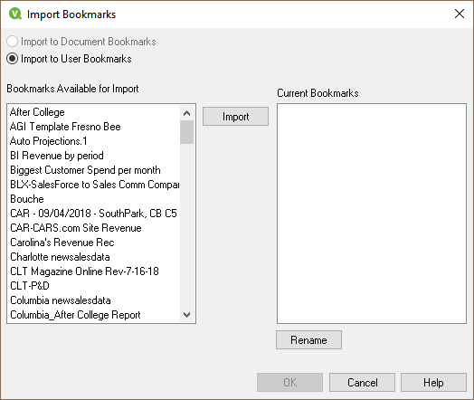

[Optional Header]: # "Qlikview Bookmark Management"

---

- [Exporting and Importing Bookmarks using IE Plugin](#exporting-and-importing-bookmarks-using-ie-plugin)
- [Removing User Objects](#removing-user-objects)

---

## Exporting and Importing Bookmarks using IE Plugin

### Exporting Bookmarks

Start by going to the Bookmarks menu and choosing More…

This will bring up the bookmarks dialog.  Go to the **Document Bookmarks** tab and click on the **“Export”** button.

This will bring up the Export Bookmarks dialog. Here it will allow you to choose which bookmarks to export. 

> The **Export** button is only available on the *Document Bookmarks* tab, however, it will bring up a dialog that shows all bookmarks available to export.  These will include the bookmarks that you have created PLUS all of the shared bookmarks.  Unfortunately, there is no easy way to uncheck everything and just check your own bookmarks.  Also, if you have not prefixed your bookmarks with your intials, they may be hard to fine.  
>
> Be aware, that if you export all of the bookmarks, when you import them, the *shared* bookmarks will become your bookmarks.

Click on each one that you want to export and click OK.

This will bring up a Save As dialog. Enter a destination and name for your bookmark file (Remember where it is, you will need it when you import!!) and click OK.  The file will be create with an **\*.BM.xml** extension

You are done exporting bookmarks.

### Importing Bookmarks

Start by going to the Bookmarks menu and choosing More…

This will bring up the bookmarks dialog.  Go to the **User Bookmarks** tab and click on the **“Import”** button.

Choose the bookmark file you want to import and click OK.  It will have an extension of **\*.BM.xml**.

This will bring up the *Import Bookmarks* dialog. Here it will allow you to choose which bookmarks to import. Click on each one that you want to import and click on Import.  If you want to deselect a bookmark, hold the control key and click on the bookmark to deselect.

Once you have the bookmarks you want to move selected, click on the import button.  This will not import them yet, but will move them to the **Current Bookmarks** area.

If you would like to rename any of the bookmarks before importing them, simply hight the bookmark to rename, then click on the **Rename button**.  Once finished, click on OK to import the bookmarks.

What you have done is import all of the selected bookmarks into your **User Bookmarks** area.  These bookmarks are stored on the local computer you are running Analytix on.  The desired outcome is to have these bookmarks stored on the server, under your user.

This is easily accomplished.  Make sure you are on the **User Bookmarks** tab, then click on the **"Move Local User Bookmarks to Server"** link.

> When you move bookmarks to the server, it is all or none.  You cannot just pick certain bookmarks.  This is ok because having all a user's bookmarks on the server makes it so they can be accessed from any computer.

 Your bookmarks will be removed from the local repository to the server repository.

------

## Removing User Objects

It seems like an easy task to remove a cloned object from an Analytix file. Simply Right click on the object and select Remove.

This will remove the object from the sheet, but the underlying cloned object still will exist in your Server Object Pane.

So, to really fully remove an cloned object from the application you need to click on the “Server Objects icon” or press **F2** to open up the **Server Objects Pane**.

Once in the **Server Objects Pane**, find the object that you want to remove permanently.

> You can only remove items from the “My Objects” section.

Right click on the object you want to remove and select Remove.

You will be prompted if you want to remove the object. Removing an object will also remove any instances of that object on your sheets. But that’s OK, because you want to get rid of it!