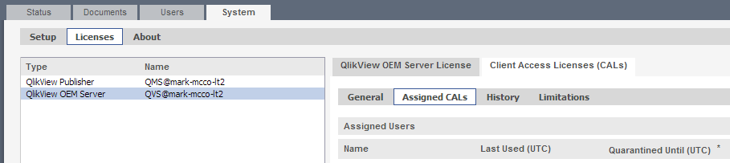

[Optional Header]: # "Qlikview License Management"

---

- [Clearing CAL Data from QMC](#clearing-cal-data-from-qmc)
- [Assigning Document CALs and Full Use (Named User) CALs](#assigning-document-cals-and-full-use-(named-user)-cals)

---

## Clearing CAL Data from QMC

This is an extreme measure in that you are removing the CAL license pgo file.  However, shared information will be retained in the **.shared** files. 

To clear all CAL data from the system, start the QMC and go to **System\Setup\Qlikview Servers\Folders** tab:

Look for the Root Folder location (see circled path above) and open up a Windows Explorer at this location.

You should see a number of **\*.pgo** files.

Next stop all Qlikview Services and then delete the **CalData.pgo** file.  

When you look at the license screen in the QMC, you should see an empty list of in the **Assigned CALs** area by going to **System\Licenses\QlikView OEM Server\Client Access Licenses(CALs)\Assigned CALs**

------

## Assigning Document CALs and Full Use (Named User) CALs

A **Document CAL** allows one user to open one Analytix document. So this would allow a Sales Rep to view all the reports that exist in the SalesFlash.qvw. The license is perpetual and will allow the user to open and use all the reports that exist within a single document. When a user opens an Analytix Document and consumes a Document CAL the user will be stored and linked with the Analytix Document.

A **Full Use CAL** allows one user to open any Analytix document. The license is perpetual and will the user to open any document until the license is revoked.

The first thing to understand are the two ways that licenses can be assigned to end users:

1. **Dynamic CAL Assignment** – This lets Qlikview server assign licenses on a first come first serve basis. The hierarchy to this assignment is as follows:
   - If a Full Use CAL is available, it will be used.
   - If a Document CAL is available, it will be used.
2. **Manual CAL Assignment** – A Qlikview administrator manually assigns an end user a Full Use or Document CAL.

You can see that the **Dynamic CAL** assignment method does not work well when you have both Document and Full Use CALs. In this case it is probably best to turn OFF dynamic CAL assignment and instead manually assign users to CALs.

### Turning OFF Dynamic CAL Assignment

To turn off Dynamic CAL Assignment, go to the **QMC -> System tab -> Licenses -> Qlikview Server -> Client Access Licenses (CALs) -> General tab** and UNCHECK the “Allow dynamic CAL assignment” checkbox:

### Manually Assign Full Use Licenses

To manually assign Full Use licenses to end users, go to the **QMC -> System tab -> Licenses -> Qlikview Server -> Client Access Licenses (CALs) -> Assigned CALs** tab:

Once on this tab, click on the icon located in the right hand corner ->

This will bring up a "Manage Users" dialog.

In this dialog you can add the users who will be getting Full Use licenses. You may do this by searching for them, using the “Search for Users and Groups” box or by manually entering the *domain\usernames* of those users who are going to get a full use license.  

**NOTE:** You may not be able to find the users by searching depending on how the domains have been set up.  If this is the case, use the manual entry method.

You may enter multiple users in this input box by simply separating them with a semicolon: 

*Domain\User1;Domain\User2*

### Manual Assignment of Document CALs

Documents CALs are assigned from the Documents->User Documents tab.

You assign user directly to the document you want them to have access to.

To do this, simply click on the document and then in the right hand side of the screen choose the **“Document CALs”** tab.

Follow these steps:

1. In the “Number of CALs allocated to this Document” input box, enter the number of users who you are going to assign to have access to this document
2. Click on the Icon to the right of the screen in the Assigned Users section and enter the Domain\Usernames of the users who will have access to this doc and click OK.
3. When done make sure to click on the Apply button.

Follows these steps for each document that you are assigning Document CALs to.

### Options

If you do not want to assign all the document CALs manually, you could instead just manually assign the Full Use CALs and then for each document that you want other users to have access to, assign the number of CALs for each document and the check the **“Allow Dynamic CAL assignment”** checkbox.

