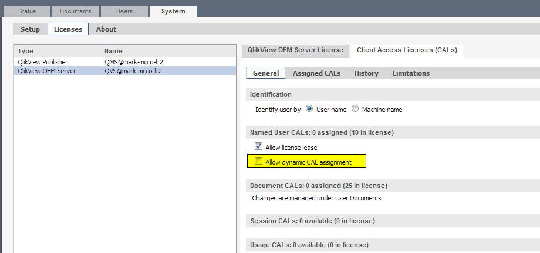

[Optional Header]: # "Qlikview License Management"

---

- [Qlikview Licensing Options](#qlikview-licensing-options)
- [Assigning Document CALs and Full Use (Named User) CALs](#assigning-document-cals-and-full-use-(named-user)-cals)
- [Revoke A User License](#revoke-a-user-license)
- [Clearing CAL Data from QMC](#clearing-cal-data-from-qmc)
- [Add Or Update Qlikview Server License](#add-or-update-qlikview-server-license)
- [Licensing Qlikview Developer Client](#licensing-qlikview-developer-client)

---

##  Qlikview Licensing Options

- **Standard User CAL (Client Access License)** – This is a named user license, giving one user the right to access as many of our Analytix Applications as they want.  
  Currently we have 4 primary Analytix applications: Advertising Analytix, Sales Flash, AR Analytix, Contract Analytix. 
  Standard User CALs can also be **leased**.  Which at its most basic means that a user with a standard CAL can license a the Qlikview developer application.  

  > Every site must have at least one Standard User CAL 

- **Document User CAL (Client Access License)** – This is a named user license, giving one user the right to access only **ONE** named document.  For example, if Rep A has a doc license, the Qlikview administrator would need to go into the QV admin area and assign this Document CAL to a User and a Single document.

> When a site purchases additional license keys, they get added to the users Qlikview license key.  To get those new licenses active on the users system, they will need to update their [Qlikview Server License](#update-qlikview-server-license)

---

## Assigning Document CALs and Full Use (Named User) CALs

A **Document CAL** allows one user to open one Analytix document. So this would allow a Sales Rep to view all the reports that exist in the SalesFlash.qvw. The license is perpetual and will allow the user to open and use all the reports that exist within a single document. When a user opens an Analytix Document and consumes a Document CAL the user will be stored and linked with the Analytix Document.

A **Full Use CAL** allows one user to open any Analytix document. The license is perpetual and will the user to open any document until the license is revoked.

The first thing to understand are the two ways that licenses can be assigned to end users:

1. **Dynamic CAL Assignment** – This lets Qlikview server assign licenses on a first come first serve basis. The hierarchy to this assignment is as follows:
   - If a Full Use CAL is available, it will be used.
   - If a Document CAL is available, it will be used.
2. **Manual CAL Assignment** – A Qlikview administrator manually assigns an end user a Full Use or Document CAL.

You can see that the **Dynamic CAL** assignment method does not work well when you have both Document and Full Use CALs. In this case it is probably best to turn OFF dynamic CAL assignment and instead manually assign users to CALs.

### Turning OFF Dynamic CAL Assignment

To turn off Dynamic CAL Assignment, go to the **QMC -> System tab -> Licenses -> Qlikview Server -> Client Access Licenses (CALs) -> General tab** and UNCHECK the “Allow dynamic CAL assignment” checkbox:

### Manually Assign Full Use Licenses

To manually assign Full Use licenses to end users, go to the **QMC -> System tab -> Licenses -> Qlikview Server -> Client Access Licenses (CALs) -> Assigned CALs** tab:

Once on this tab, click on the icon located in the right hand corner ->

This will bring up a "Manage Users" dialog.

In this dialog you can add the users who will be getting Full Use licenses. You may do this by searching for them, using the “Search for Users and Groups” box or by manually entering the *domain\usernames* of those users who are going to get a full use license.  

**NOTE:** You may not be able to find the users by searching depending on how the domains have been set up.  If this is the case, use the manual entry method.

You may enter multiple users in this input box by simply separating them with a semicolon: 

*Domain\User1;Domain\User2*

### Manual Assignment of Document CALs

Documents CALs are assigned from the Documents->User Documents tab.

You assign user directly to the document you want them to have access to.

To do this, simply click on the document and then in the right hand side of the screen choose the **“Document CALs”** tab.

Follow these steps:

1. In the “Number of CALs allocated to this Document” input box, enter the number of users who you are going to assign to have access to this document
2. Click on the Icon to the right of the screen in the Assigned Users section and enter the Domain\Usernames of the users who will have access to this doc and click OK.
3. When done make sure to click on the Apply button.

Follows these steps for each document that you are assigning Document CALs to.

---

## Revoke A User License

Qlikview licenses are each associated with a single user name.  If you would like to free up a license, you will need to remove it from a user.

There is a 7 day quarantine period when removing a license from a user.  The 7 days starts from the last time that the user viewed a Qlikview application.  

### How To

Open the QMC (Qlikview Management Console) and go to the System/Licenses tab:

Click on Qlikview Server and in the right hand pane select Client Access Licenses (CALs), then select the
Assigned CALs tab.

To delete a user from a CAL, simply click on the red X on the right side of the user’s row. This will put it in Quarantine for up to 7 days (QV12+) from the **last time** the user used Analytix.

Make sure to click the Apply button to apply the changes. Once applied, the license will be cleared and available for use once the quarantine period has been met.

Usually you will be removing defunct users who have not used Analytix for longer than the quarantine period and thus the license will be available to assign immediately.

---

## Clearing CAL Data from QMC

This is an extreme measure in that you are removing the CAL license pgo file.  However, shared information will be retained in the **.shared** files. 

To clear all CAL data from the system, start the QMC and go to **System\Setup\Qlikview Servers\Folders** tab:

Look for the Root Folder location (see circled path above) and open up a Windows Explorer at this location.

You should see a number of **\*.pgo** files.

Next stop all Qlikview Services and then delete the **CalData.pgo** file.  

When you look at the license screen in the QMC, you should see an empty list of in the **Assigned CALs** area by going to **System\Licenses\QlikView OEM Server\Client Access Licenses(CALs)\Assigned CALs**

------

### Options

If you do not want to assign all the document CALs manually, you could instead just manually assign the Full Use CALs and then for each document that you want other users to have access to, assign the number of CALs for each document and the check the **“Allow Dynamic CAL assignment”** checkbox.

---

## Add Or Update Qlikview Server License

Qlikview stores the CAL (Client Access License) information in your license key. So, when you purchase a license the number of users (CALs and Document CALs) are stored in the license key.

So, when you purchase more Qlikview licenses, Qlik will simply add those to your existing License key.

This makes adding and updating your Qlikview Server License very similar.

### Add New Qlikview Server License 

Open the QMC (Qlikview Management Console) and go to the System/Licenses tab:

Click on the QlikView Server type in the left hand side of the screen.

Click on the “Qlikview Server License” tab in the right hand of the screen:

Now you are ready to either update or add a new license key:

1. Enter your Serial Number and your Control number.
2. Enter the Owner information. (Doesn’t really matter what you put in here).
3. Click on the “Apply License” button.

### Updating Qlikview Server License

If you have purchased additional CALs, they will be added to your existing Qlikview License.  To get these to show up on you server, simply follow all the instructions for adding a new License, except on the last step, click **Update license From Server** button instead of the Apply License button.

---

## Licensing Qlikview Developer Client

Since Qlikview version 9, if you are a CAL holder on the server, you are able to license the desktop version of the Qlikview software with a full developer license.

Once you follow the instructions below you will have licensed your desktop client for 30 days after which you will need to go through these steps again to get another 30 day license.

**Follow the steps below:**

1. Start QlikView and choose” File/Open In Server” 
2. Enter the IP or Server name of the Qlikview server into the “Server” box. 
3. If your computer login is the same as your Qlikview server login (it usually is) then leave the NT Identity radio button selected. 
  If not, then choose the *Alternate Identity* radio button and enter in your User ID.  You will then be prompted for a password.
4. Click Connect.

After successfully connecting to the Qlikview server you will see a list of the directories that Qlikview has access to.  

To license the Qlikview Developer client, simply choose one of the QVW files and click Open.

The QVW file will be "opened in server".  This will then download a license lease for the machine you are on.

Your Qlikview client is now licensed as a developer.