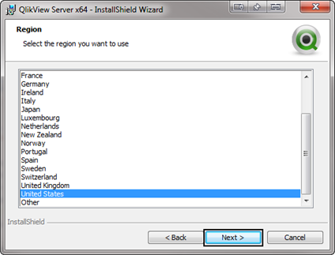
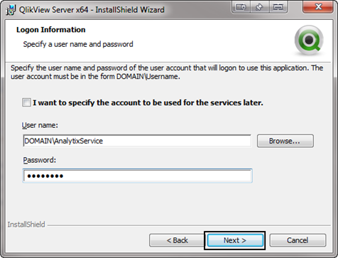
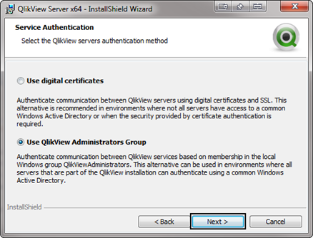
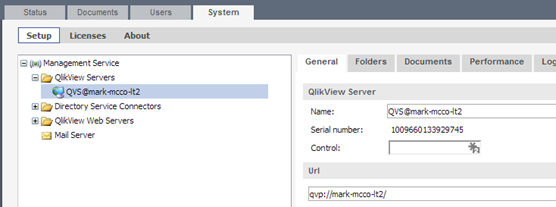
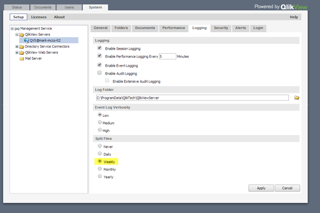
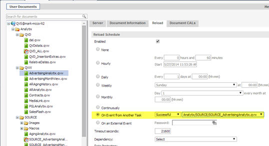
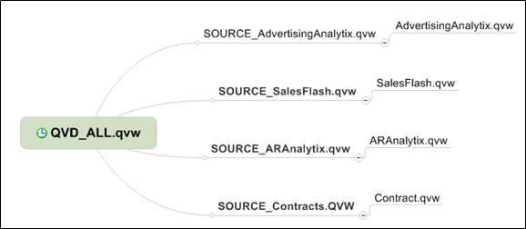
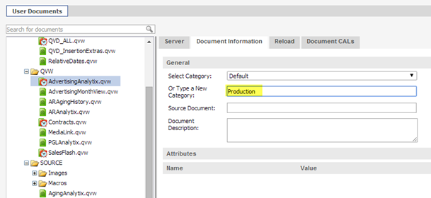
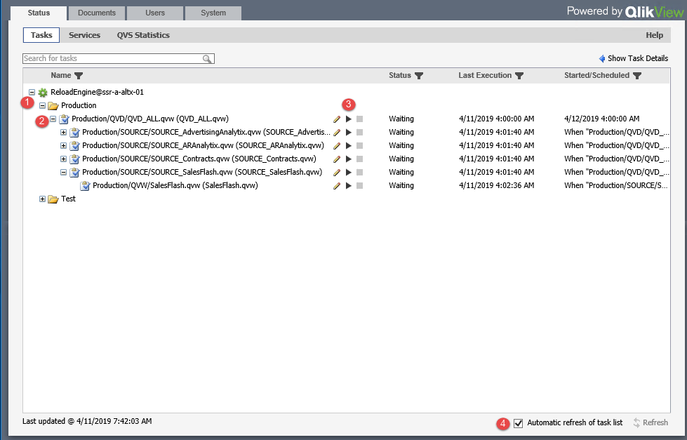
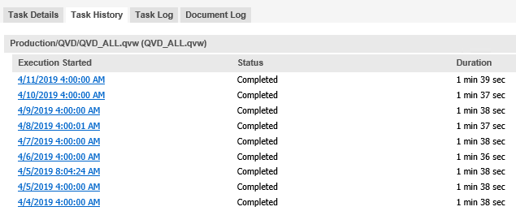

## Installation and Setup of Qlikview Server

### Install Qlikview Server

Run the QVServer install application applicable for your hardware.  

1. Click Next to get started:
   

2. Select your region and click Next:
   
3. Accept the license agreement and click Next:
   
4. Enter your customer information and click Next:
   
5. You will be presented with a default location to install Qlikview Server to.  The default is fine, but if you want to move it to a different drive, click the change button and make that modification, then click Next:
   
6. Next you will be presented with different install configurations.  The default for most sites is the “Full Installation, Single machine with Qlikview Webserver”.  This will install all components on a single machine.  For more complex installation where different components will be installed on different machines the site will need to have Qlikview Publisher which is an additional cost.
   Select your configuration and click Next:
   
7. You will now be asked to specify a user who will run the Qlikview services.  This user should have been created in the pre installation steps.  Make sure that you use the format of Domain\Username.
   
8. You will now select how you want Qlikview to authenticate users who will have access to the QMC (Qlikview Management Console).
   Always select “Use Qlikview Administrators Group”  this will create a new user group called Qlikview Administrators Group.  It will automatically add the user doing the install to this group.  You may add other users as you see fit after the installation.
   Click Next to continue.
   
9. Click on Install to being the installation
   
10. Click finish to complete the installation.
    
11. After this installation application finishes, you must start the services that installed created.  To do this go to start Services.msc.  You will see the five services shown below.  Start each one:
    

### Qlikview Management Console (QMC)

The QMC is the hub for managing all things Qlikview.  We use the QMC to view the status of the loads, to create the load schedule and to initially set up what files Analytix will load.

#### Initial QMC Setup

There are some initial setups that need to be completed before we schedule the loads.

First and foremost we must license Qlikview server so that it will allow us to make changes.

Licensing is done by going to the System tab, then the Licenses Sub tab and then clicking on the Qlikview Server option in the left hand side of the screen.  


Now, select the Qlikview Server License tab on the right hand side of the screen:


Here you will need to enter the Serial Number and Control number for this Qlikview installation.

Next Enter the Owner information section.  This will simply be the Name of the click and Organization.  This does not affect the licensing.  

Lastly, click Apply License and QV Server will access the Qlikview website and retrieve the Qlikview license servers.  If for some reason you do not have internet access, you can go to the Qlik.com website to get an LEF (License Enabler File) for the installation.

#### System - Qlikview Server Setup

1. Start by going to the System tab and then on the Setup sub tab, expand the Qlikview Servers section and click on the server name that is showing:
   

2. In the right hand panel go to the Folders tab.  Here we will set up where Qlikview is going to look for our Analytix files:

   

   The Root folder can be left to the default directory.  This is where all of the *.PGO files will be stored.  They are system files that keep track of licensing and session information.  It is best to keep them separate from the Analytix File.

   We now want to “Mount” the folder that contains our Analytix files.  This is usually in the root like C:, D:, etc. in an directory named Analytix.

   Give it a Name (Analytix) and then either click on the folder to browse for the path or type it in.
   Click Apply.

3. Next go to the Logging tab:
   

   Here we will just change the frequency with which Qlikview splits the log files.  I usually will set this to weekly.

   Click apply.

   We leave Audit logging off unless there is an issue.  Audit Logging will log all actions each users take when in a session.  These files can get large, so only use this if necessary.

4. Next go to the Security tab:

   

   Here we simply want to make sure that under the Authentication section that the Prohibit anonymous has been selected.

#### System - Qlikview Web Server Setup

1. In the System/Setup section go to the Qlikview Web Servers folder, expand it and select the Web server showing:
   

2. Go to the AccessPoint page and make sure the Default Preferred Client is set to IE Plugin and that the Plugin Download section has a check in the “Show link” check box.  This will ensure users can download the plugin.
   

   Click Apply.

## Scheduling Analytix Loads

Once Qlikview is set up and pointing to your Analytix files, you need to set up the load schedule so that your Analytix files have the latest data in them.

To start go to the QMC Documents tab:


The QVW files listed outside of the Analytix directory are sample files.  

These files are located in the C:\ProgramData\QlikTech\Documents directory.  You may simply go to this directory and delete them.

The files that we want to schedule are located in the Analytix folder in the Documents tab.

To start expand the Analytix directory and the QVD, QVW and SOURCE directories. 


On the left hand side you will see all of the files that are in the directories you specified.

On the right hand side you will see sub tabs with settings for the file selected on the left hand panel.  

To set the reload schedule we are interested in the “Reload” tab. Remember that the settings will affect the file selected.

Before we get into the settings of the Reload tab, I want to go over how the reloads work.

When we load Analytix, we must load the files in a certain sequence, because files are dependent upon other one being loaded with data.

Within QlikView you are able to schedule each file to run based on a number of options, one of them is on the successful completion of another files loading.  This is how we “string together” our files to load in a certain order.

So, we will schedule a single file to load at a certain time.  This is our driver file so to speak.  Once it finishes successfully there will be another file that will run based on the previous files completion.

Our driver file is QVD_ALL.qvw in the QVD directory.

Select the QVD_ALL.qvw file and then select the reload tab:


Select the Daily radio button and set it to run once a day at 4:00 AM.  Click Apply.

Now that we have are driver scheduled we will start setting up the load chain for the other files.

### Loading the Source Files

After **QVD_ALL** has finished we need to load the Analytix source files.  Right now, these include:

1. SOURCE_AdvertisingAnlaytix.qvw
2. SOURCE_SalesFlash.qvw
3. SOURCE_Contracts.qvw
4. SOURCE_ARAnalytix.qvw

 

If you are only going to give one of two final applications to your users, then only schedule those that you are going to be using.  There may be more that are added after this documentation is finished.  

First select **SOURCE_AdvertisingAnalytix.qvw** from the left hand pane and make sure you are in the reload tab on the right hand pane.


Select the “On event of Another Task” option and choose “Successful” in the first drop down and from the second drop down choose Analytix/QVD_ALL.qvw that you scheduled.

This says to only start loading the SOURCE file after the **QVD_ALL** file has been successfully loaded.

You now must do this same process for the rest of the SOURCE files.

Just like the files in the SOURCE directory need **QVD_ALL.qvw** to reload successfully before they can be reloaded, the files in the QVW directory cannot be reloaded until the files in the SOURCE directory are reloaded successfully.  

We will set up the files in the QVW directory the same way as the SOURCE directory.  Here is how the **AdvertisingAnalytix.qvw** reload tab would look:



### Visual Representation of Load Chain



**Here is a summary of how to create this load chain:**

1. Schedule **QVD_ALL.qvw** to load at a specified time of day (or multiple times if desired using the Hourly option.)

2. Schedule **SOURCE_AdvertisingAnalytix.qvw** to load when **QVD_ALL.qvw** has finished successfully.
   

   Click the **Apply** button!

3. Schedule SOURCE_SalesFlash.qvw to load when QVD_ALL.qvw has finished successfully.
   

   Click the **Apply** button!

4. Schedule SOURCE_Contracts.qvw to load when QVD_ALL.qvw has finished successfully.
   

   Click the **Apply** button!

5. Schedule SOURCE_ARAnalytix.qvw to load when QVD_ALL.qvw has finished successfully.
   

   Click the **Apply** button!

6. Schedule AdvertisingAnalytix.qvw to load when SOURCE_AdvertisingAnalytix.qvw finishes.
   

   Click the **Apply** button!

7. Schedule SalesFlash.qvw to load when SOURCE_SalesFlash.qvw finishes.
   

   Click the **Apply** button!

8. Schedule Contracts.qvw to load when SOURCE_Contracts.qvw finishes.
   

   Click the **Apply** button!

9. Schedule ARAnalytix.qvw to load when SOURCE_ARAnalytix.qvw finishes.
   
   Click the **Apply** button!

The other thing that you need to do for all the files in the QVW directory is to assign them a Category.  This will allow them to be singled out in AccessPoint.  

To do this you will select each of the files in the QVW directory just as we did when scheduling them, however, we will now be on the Document Information sub tab:



Simply type the name of the Category into the input box and press apply.  For subsequent files, just choose from the “Select Category” drop down.

## Using the QMC to Restart and Monitor Loads

After the setup has been completed, the main use of the QMC is to allow you to manually start a reload and to monitor the reload activity.  You will be able to view how long the loads take and if any error occurred.

First you will log into the QMC *http://yourservername:4780/qmc*.

You will be taken to the **Tasks** panel on the **Status** tab:



1. You will see one or more folders that contain the loads.  For Analytix, you should have a production load and potentially other folders that load data from another database like Test or Train.
2. These are actual QVW files that will be loaded. Notice the + sign.  This indicates that there are other loads that are dependent on the QVD_ALL being loaded.  If you want a full load, you just need to reload the QVD_ALL file and all QVW files below will be loaded.
3. To start the reloading of a particular QVW file, click on the &#9654; button corresponding to the QVW file that you want reloaded.  Do note that any file nested underneath the file you are reloading will also be reloaded.
4. Make sure the "Automatic refresh of task list" is checked.  This will avoid confusion and continuously update the display so that you know what state your load is in.

### Showing Task Details

If a task fails or if you would like more details on the running times of tasks, you can get this by clicking on the "Show Task Details" link in the upper right hand corner of the Tasks panel.


Note that in the above screenshot, the "Show Task Details" link has change to "Hide Task Details".

When you are in the Task Details sections, it will display details about the QVW selected in the left hand pane.  

In the Task Details pane (Right hand side), you have four tabs:

1. **Task Details** - Basic information about the selected QVW's load trigger and other information about the file.
2. **Task History** - Displays execution times, durations and status.  Use this pane to see how long reload are taking and if there were any errors.
   
3. **Task Log** - Displays a log of the last load.  If there was a failure, this is not the best log for finding the issue.  The better log is located in the QVW's directory and named the same as the QVW but with a ".log" extension.
   
4. **Document Log** - I do not use this.

### QVS Statistics

The QVS Statistics panel allows you see the active users who have a document open "Active Users" Panel.


---

## Stop / Start Qlikview Services Batch File

Sometimes it is useful to restart the Qlikview services every night.  The easiest way to do this is to create a scheduled task with Windows Task Scheduler that runs a simple batch file.

The batch file will contain the following commands:

```powershell
net stop "Qlikview Directory Service Connector"
net stop "Qlikview Distribution Service"
net stop "Qlikview Management Service"
net stop "Qlikview Server"
net stop "Qlikview Webserver"

net start "Qlikview Directory Service Connector"
net start "Qlikview Distribution Service"
net start "Qlikview Management Service"
net start "Qlikview Server"
net start "Qlikview Webserver"
```

These commands take less than a minute or two to run, but still make sure you do not schedule the task to run during a reload or during peak usage times for Qlikview.

---

<div style="page-break-after: always;"></div>

