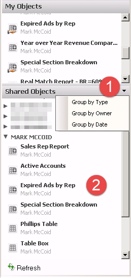
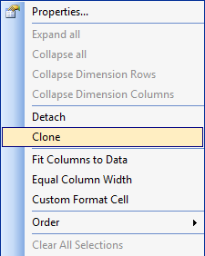

- [Share an Object](#share-an-object)

Qlikview makes it easy to create Bookmarks and Charts to fully customize your experience.  As an added benefits, you can also share those bookmarks and charts with other users.

## Share an Object

To share an object that you have created you first need to click on the “two headed icon” or press F2 to open up the Server Objects Pane.

The server objects pane will open up on the left side of your browser.

Once in the Server Objects Pane, find the object that you want to share (from the My Objects section).

Right click on the object you want to share and choose “**Share with Everyone**”.

## Copy a Shared Object

To copy a shared object you will first need to click on the “two headed icon” or press F2 to open up the Server Objects Pane.

The server objects pane will open up on the left side of your browser.

Once in the Server Objects Pane, find the object that you want to copy (from the Shared Objects section).

1. You can sort the shared objects by Type, Owner, or Date. Usually, you are looking for a chart from a specific Owner.
2. Once you find the owner you are looking for you can expand his node and see all the charts that he has shared.
3. When you have found the chart you are looking for, left click on the chart and drag it onto a sheet in Analytix.
4. Next, right click on the new chart and choose “Clone”. This will create a copy of the chart that is now yours.
   
5. The last step is to delete the shared chart you copied. Simply right click on the shared chart that is on your sheet and choose “Remove”.